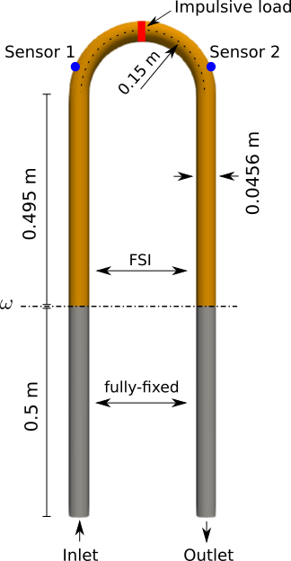
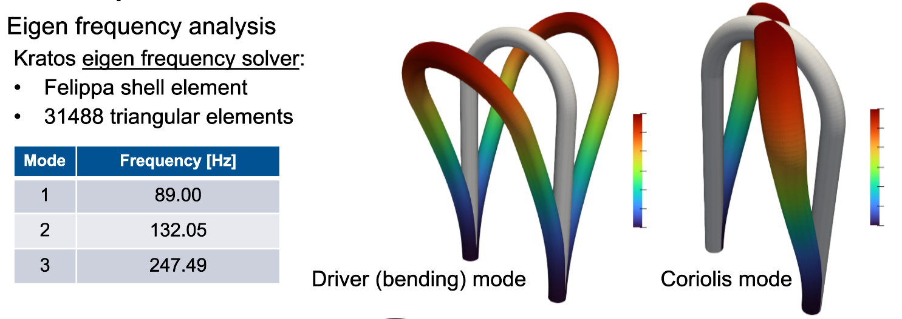
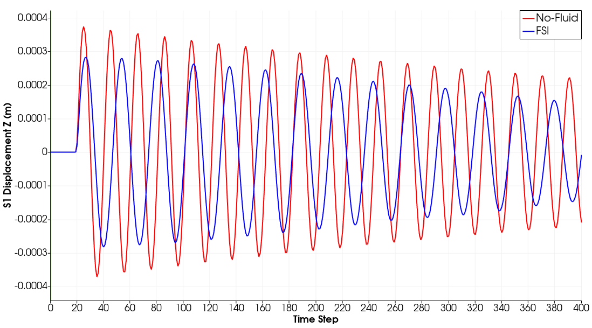

# U-shaped Coriolis mass flow meter

**Authors:** [Reza Najian Asl](https://github.com/RezaNajian) & [A.K. Birjandi](https://github.com/Maziarb)

**Kratos version:** 9.3

**Source files:** [fsi Coriolis mass flow meter](https://github.com/KratosMultiphysics/Examples/tree/master/co_simulation/use_cases/fsi_Coriolis_mass_flow_meter/source)

**Fluid restart file:** [FluidModelPart_6000.rest](https://1drv.ms/u/s!AkrOhpK6P2FWhtkJ8_7LlF_lctmyJQ?e=ucN0x3) (Please download the required file and place it in the source folder, specifically under the FluidModelPart__restart_files directory)

## Case Specification

Here you will find the source and result files of the 3D full-scale partinioed FSI (Fluid-Structure Interaction) simulation of a U-shaped Coriolis mass flow meter. A U-shaped Coriolis mass flow meter is a device used to measure the mass flow rate of a fluid by utilizing the Coriolis effect. The U-shaped tube through which the fluid flows is set into oscillation at its bending natural resonant frequency. This oscillation is typically driven by an actuator. As the fluid flows through the oscillating U-shaped tube, the fluid induces a force on the structure due to the Coriolis effect that causes the tube to twist. The amount of this twisting is directly proportional to the mass flow rate of the fluid. For more information on how Coriolis mass flow meters work, please check this publication [Birjandi, A. K., et al 2022](https://www.sciencedirect.com/science/article/abs/pii/S0889974622000068).

You can find the schematic description of the problem and its properties in the following:

<table>
  <tr>
    <td></td>
    <td></td>
  </tr>
  <tr>
    <td>Figure 1: Problem setup of a U-shaped Coriolis mass flow meter.</td>
    <td>Figure 2: Fluid & structrure properties.</td>
  </tr>
</table>

Sensors for detecting the tube's motion are positioned at strategic points on the U-tube. They measure the displacement/velocity of the tube. As the tube twists due to the Coriolis force, there is a phase shift between the motions at these two points. Finally, the phase shift is directly proportional to the mass flow rate of the fluid.

The U-tube structure is modeled here using linear triangular shell elements. Eigenfrequency analysis was performed to obtain the driver (bending) and Coriolis eigenvalues and modes. Refer to the figure below:

  

Furthermore, an impulsive load was applied to the indicated red area to excite the first bending mode. The free vibration analysis was performed with the StructuralMechanicsApplication using the Bossak time integration scheme, and the simulation lasted for 20 periods, with each period divided into 20 time steps. The peak frequency (bending frequency) was calculated to be 89.64 Hz using a sine function fitting as well as a discrete Fourier transform.

Having studied the structural properties, a transient fluid simulation was performed using the VMS Galerkin solver of Kratos, with 1,338,240 cells utilized. The averaged Y+ value is around 6, and a time step of 0.00056179775 s was used, which is in agreement with the CFL condition. The fluid flow is at Reynolds number 65,208. A couple of time steps are visualized in the following:

The FSI simulation was performed after achieving developed fluid flow, reached following 6,000 time steps. This means the FSI begins at 4.294488 seconds and continues for 20 periods, with each period divided into 20 time steps. The CoSimulation and Mapping applications within Kratos were utilized for the FSI simulation. Aitken relaxation served as the convergence accelerator in the partitioned strong coupling iteration of the Gauss-Seidel scheme. Since the interface meshes of the fluid and structure were matching, the nearest neighbor mapper was utilized.

The displacement response at point S1 is plotted and demonstrated for free vibration (without interaction with fluid) and with strong interaction (FSI). The influence of the coupling is clearly visible in the magnitude and frequency of the response.

  

Lastly, the phase shift between displacements at S1 and S2 was calculated to be 7.2763 μs. The vibration of the tube under FSI and impulsive load is presented in the following:

## References
Birjandi, A. K., et al. "Development of a high-fidelity partitioned Fluid–Structure Interaction model of an Omega-shaped Coriolis Mass Meter and comparison with experimental data." Journal of Fluids and Structures 110 (2022): 103510. (https://www.sciencedirect.com/science/article/abs/pii/S0889974622000068)
