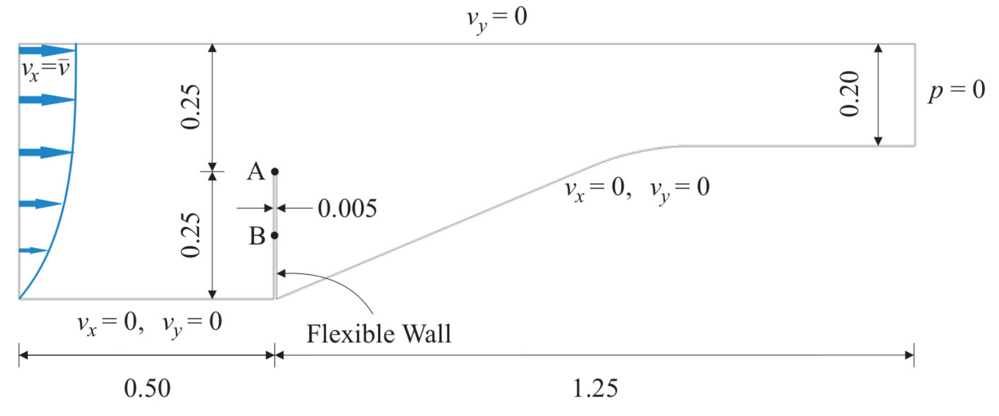
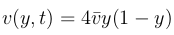
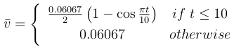
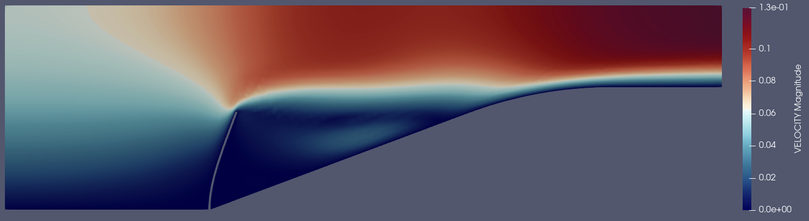
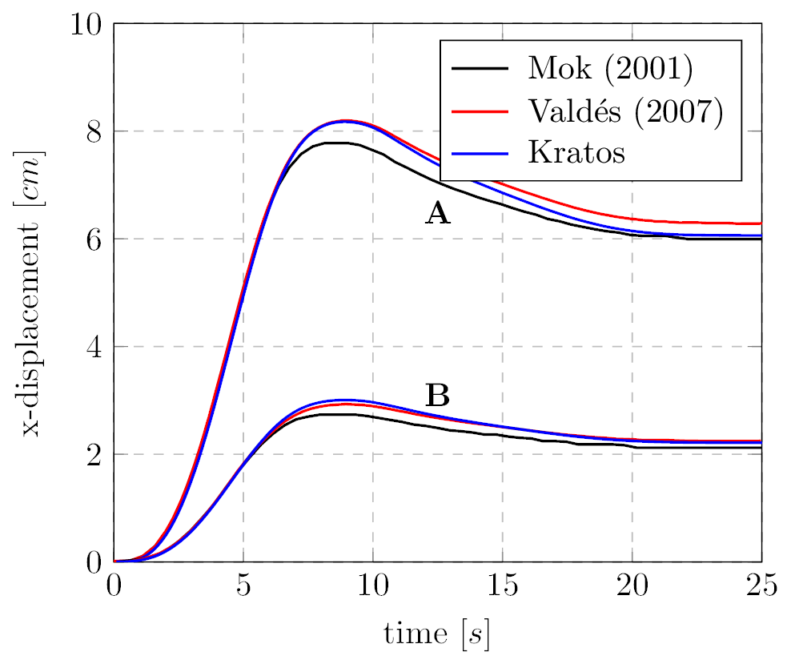

# Mok FSI benchmark

**Author:** [Juan Ignacio Camarotti](https://github.com/juancamarotti)

**Kratos version:** 10.2

**Source files:** [FSI-Mok IGA-FEM](https://github.com/KratosMultiphysics/Examples/tree/master/co_simulation/validation/fsi_mok_iga_fem/source)

## Case Specification

This is a 2D FSI simulation of the Mok benchmark test. It consists in a 2D convergent fluid channel that contains a flexible wall structure attached to its bottom wall. The main challenge of the test is that the densities of the fluid and the structure have a similar order of magnitude, leading to a strongly coupled problem in where large interaction between the two fields appears. The reference solutions have been taken from  Mok (2001) and Valdés (2007). The following applications of Kratos are used:
* CoSimulationApplication
* MappingApplication
* MeshMovingApplication
* FluidDynamicsApplication
* StructuralMechanicsApplication
* IgaApplication
* LinearSolversApplication

The problem geometry as well as the boundary conditions are sketched below.

  

Regarding the inlet velocity, the next parabolic profile is imposed

  

where the time dependent reference velocity is defined as

  

A Newtonian constitutive law is considered in the fluid domain. The fluid characteristic parameters are:
* Density (&rho;): 956 _Kg/m3_
* Kinematic viscosity (&nu;): 0.145 _m2/s_

On the other hand, a linear elastic plane stress constitutive law with unit thickness is considered in the structure domain. The structure characteristic parameters are
* Density (&rho;): 1500 _Kg/m3_
* Elastic modulus (E):  2.30000E+06 _Pa_
* Poisson ratio (&nu;): 0.45

The time step is 0.1 seconds, while the total simulation time is 25.0 seconds.

The mesh was created with the [KratosSalomePlugin](https://github.com/KratosMultiphysics/KratosSalomePlugin/tree/master/tui_examples/mok_fsi). Check this example which can be easily adapted to different mesh sizes.

The mapping strategy employed in this simulation is the nearest neighbor mapper, specifically tailored for partitioned IGA-FEM simulations.

## Results
The structural domain for the problem described above was discretized using an IBRA mesh with Kirchhoff-Love shell elements (3-parameter formulation). For the fluid domain, a mesh consisting of approximately 6000 linear triangular elements was employed. The resulting velocity field, along with the deformed geometry, is presented below. 

  

  

## References
D.P. Mok. Partitionierte Lösungsansätze in der Strukturdynamik und der Fluid−Struktur−Interaktion. PhD thesis: Institut für Baustatik, Universität Stuttgart, 2001. [http://dx.doi.org/10.18419/opus-147](http://dx.doi.org/10.18419/opus-147)

G. Valdés. Nonlinear Analysis of Orthotropic Membrane and Shell Structures Including Fluid-Structure Interaction. PhD thesis: Universitat Politècnica de Catalunya, 2007. [http://www.tdx.cat/handle/10803/6866](http://www.tdx.cat/handle/10803/6866)
