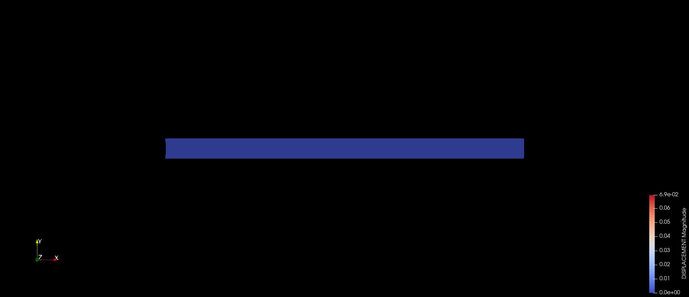

# [Turek benchmark - FSI2](https://github.com/KratosMultiphysics/Examples/tree/master/fluid_structure_interaction/validation/fsi_turek_FSI2)

**Author:** [Juan Ignacio Camarotti](https://github.com/juancamarotti)

**Kratos version:** 9.4

**Source files:** [Turek benchmark - FSI2](https://github.com/KratosMultiphysics/Examples/tree/master/co_simulation/validation/fsi_turek_FSI2/source)

## Case Specification

This is a 2D simulation of the well-known Turek FSI benchmark. It consists in a 2D fluid channel that contains a cylinder to which flexible flag is attached. In this case, the FSI2 set-up is taken into account. The main challenge of such FSI2 test is the large oscillations of the flexible flag associated to the fluid-structure interaction mechanisms. It is therefore considered as a challenging test for the coupling algorithms. The main reference of the test can be found in [Turek et. al. (2006)](https://doi.org/10.1007/3-540-34596-5_15). The following applications of Kratos are used:
* CoSimulationApplication
* MappingApplication
* MeshMovingApplication
* FluidDynamicsApplication
* StructuralMechanicsApplication
* ConstitutiveLawsApplication
* LinearSolversApplication

The problem geometry as well as the boundary conditions are sketched below (image from Turek et. al. (2006).

  

A Newtonian constitutive law is considered in the fluid domain. The fluid characteristic parameters are:
* Density (&rho;): 1.0E+03 _Kg/m3_
* Kinematic viscosity (&nu;): 1.0 _m2/s_

On the other hand, a Kirchhoff - Saint Venant plane strain constitutive law with is used in the structure domain. The structure mechanical parameters are
* Density (&rho;): 1.0E+04 _Kg/m3_
* Elastic modulus (E):  1.4E+06 _Pa_
* Poisson ratio (&nu;): 0.4

The time step is 0.002 seconds, which is small enough to capture the oscillation peak values. The total simulation time is 20.0 seconds.

## Results

The structural mechanics problem is solved using a FE structured mesh conformed by around 3.3k linear quadrilateral elements implementing a Total Lagrangian formulation. On the other hand, the fluid dynamics problem is solved using a FE unstructured mesh of around 30k linear triangular elements implementing an ALE ASGS Navier-Stokes formulation. The obtained fluid velocity and structure displacement fields, together with the deformed geometry, are shown below. The obtained results are in agreement to the ones in the reference publication.

  

  

## References
Turek S., Hron J. (2006) Proposal for Numerical Benchmarking of Fluid-Structure Interaction between an Elastic Object and Laminar Incompressible Flow. In: Bungartz HJ., Schäfer M. (eds) Fluid-Structure Interaction. Lecture Notes in Computational Science and Engineering, vol 53. Springer, Berlin, Heidelberg [https://doi.org/10.1007/3-540-34596-5_15](https://doi.org/10.1007/3-540-34596-5_15)
