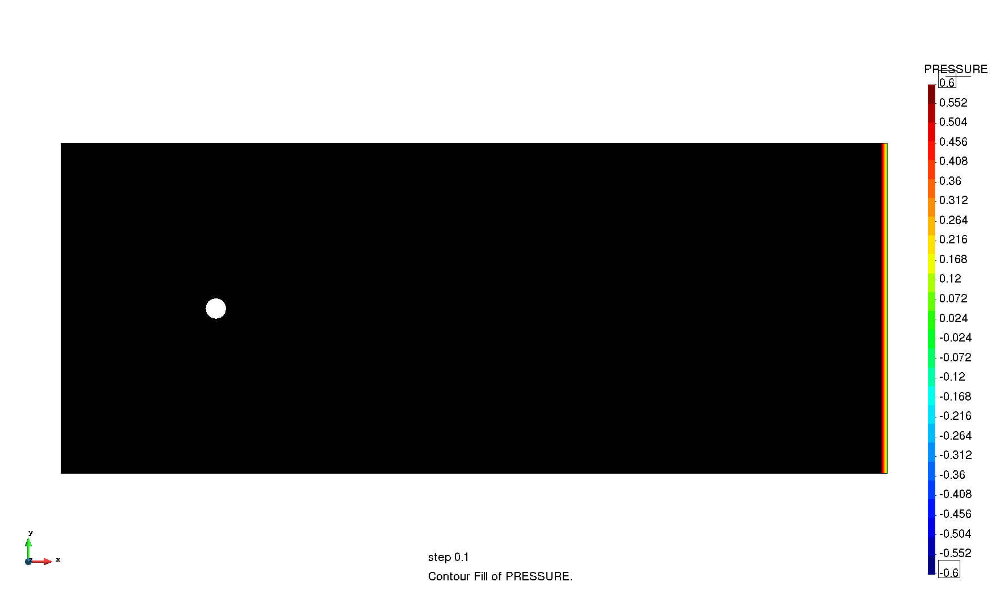

# Cylinder cooling Re = 100 and Pr = 2

**Author:** [Rubén Zorrilla](https://github.com/rubenzorrilla)

**Kratos version:** 7.0

**Source files:** [Cylinder cooling Re = 100 and Pr = 2](https://github.com/KratosMultiphysics/Examples/tree/master/conjugate_heat_transfer/validation/cylinder_cooling_Re100_Pr2/source)

## Case Specification
This is a 2D Conjugate Heat Transfer (CHT) simulation of a cylinder cooling procedure. The flow and material parameters are set such that the Reynolds number is 100 while the Prandtl one is 2.

The geometry consists in a 5 x 2 m channel inside which the cylinder is placed. The center of the cylinder is placed in (0.9375,1.0) coordinates and its radius is 0.0625 m. For the CFD problem, the cylinder is considered to be no-slip while the top and bottom walls are slip. The pressure is fixed along the right edge. A constant inlet equal to 1.0 m/s, is set in the left edge. Concerning the thermal problem, the temperature is fixed to 0 K in the CFD domain left edge while an initial temperature of 1 K is set in the entire cylinder (solid) domain.

Concerning the material properties, a Newtonian constitutive law is used in the CFD problem. Considering that the cylinder diameter is 0.125 m and the mean velocity is 1 m/s, the fluid characteristic parameters to obtain a 100 Re flow are:
* Density (&rho;): 1.0 _Kg/m3_
* Kinematic viscosity (&mu;): 1.25E-03 _Kg/ms_

For the coupled thermal problem, the properties are set such that the difusivity as well as the volumetric heat capacity of both materials is the same. This is achieved by setting the fluid values to
* Conductivity (&kappa;): 6.25E-01 _W/m2K_
* Specific heat (c<inf>p</inf>): 1.0E+03 _J/Kg·K_
and the solid values to
* Density (&rho;): 4.0 _Kg/m3_
* Conductivity (&kappa;): 2.0E+03 _W/m2K_
* Specific heat (cp): 2.5E+02 _J/Kg·K_

The time step is 0.1 seconds, while the total simulation time is 15.0 seconds. 

## Results
The obtained velocity, pressure and temperature fields are shown in the animations below. As can be observed, the expected 100 Re Von Karman vortex street is developed in the downstream region of the cylinder. The affectation of the velocity solution periodicity can be also observed in the fluid temperature field. Furthermore, the correctness of the thermal coupling is also proved since no temperature discontinuities can be noted in the fluid-solid interface.

  

  

  

## References
Wang, Zimeng & Colin, Fabrice & Le, Guigao & Zhang, Junfeng. (2017). Counter-Extrapolation Method for Conjugate Heat and Mass Transfer with Interfacial Discontinuity. International Journal of Numerical Methods for Heat and Fluid Flow. 27. 2231-2258. 10.1108/HFF-10-2016-0422. [Link to the publication](https://www.researchgate.net/publication/311681538_Counter-Extrapolation_Method_for_Conjugate_Heat_and_Mass_Transfer_with_Interfacial_Discontinuity)
