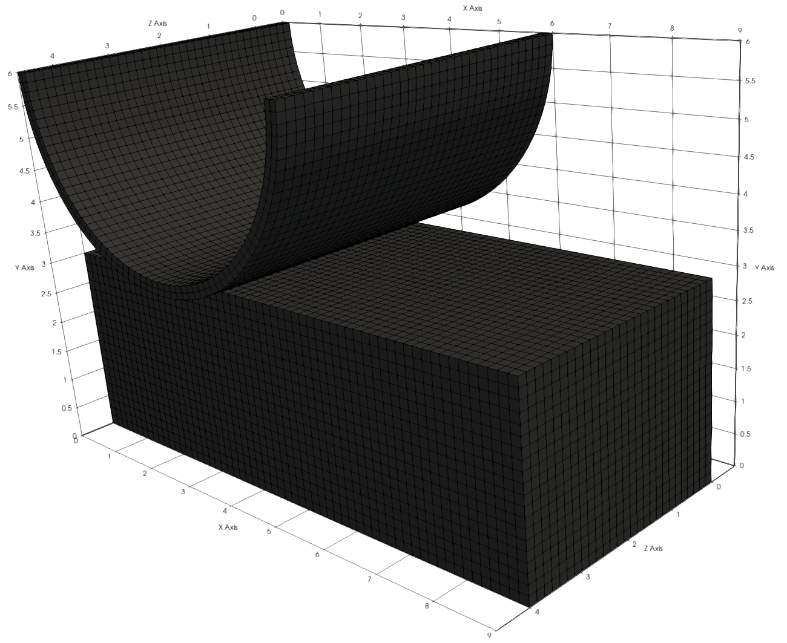

# Arc-block

**Author:** Vicente Mataix Ferrándiz

**Kratos version:** Current head

**Source files:** [Arc-block](https://github.com/KratosMultiphysics/Examples/tree/master/contact_structural_mechanics/use_cases/arc_block/source)

## Case Specification

The problem consists in an arc and a block. The arc is pressed againts the block.

*The mesh*:

  

The displacement imposed is uy = t, with t = [0.0, 1.0] for the two first cases,  t = [0.0, 1.775] for the rigid arc

Three different combinations of materials has been tested:

- *Rigid block*:
	- Arc:
		- HyperElastic3DLaw (*Neo-Hookean*)
		- E: 68.96e8
		- &nu; 0.32
	- Block:
		- HyperElastic3DLaw (*Neo-Hookean*)
		- E: 68.96e7
		- &nu; 0.32
- *Deformable block*:
	- Arc:
		- HyperElastic3DLaw (*Neo-Hookean*)
		- E: 68.96e8
		- &nu; 0.32
	- Block:
		- HyperElastic3DLaw (*Neo-Hookean*)
		- E: 68.96e5
		- &nu; 0.32
		
- *Deformable block-Rigid arc*:
	- Arc:
		- HyperElastic3DLaw (*Neo-Hookean*)
		- E: 68.96e9
		- &nu; 0.32
	- Block:
		- HyperElastic3DLaw (*Neo-Hookean*)
		- E: 68.96e5
		- &nu; 0.32
		
## Results

### Rigid block

### Deformable block

### Deformable block-rigid arc

## References

