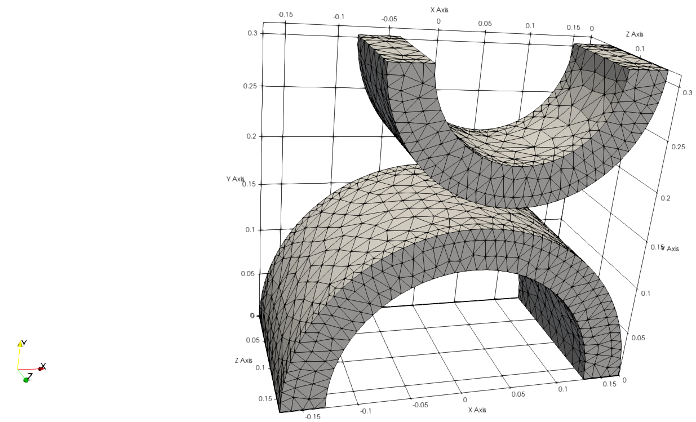
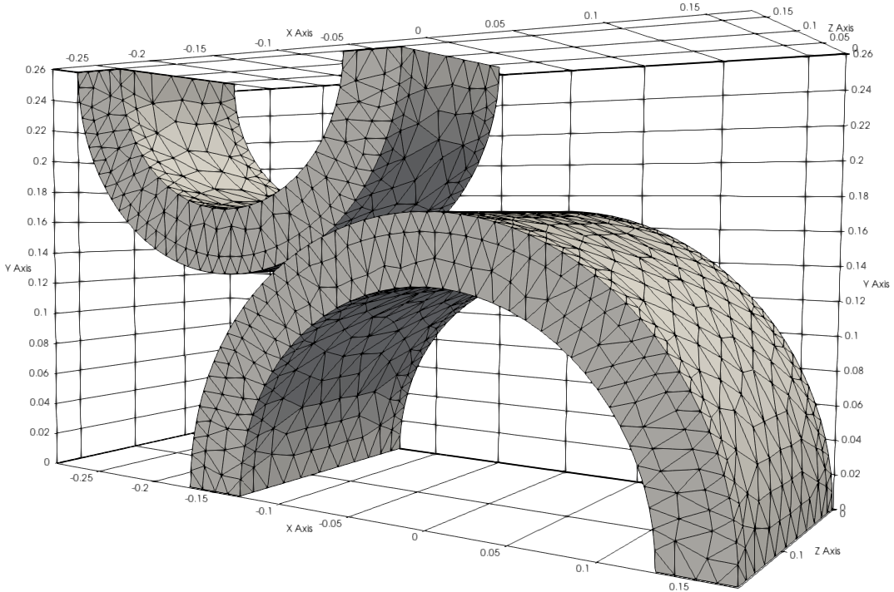

# Double arch benchmark

**Author:** Vicente Mataix Ferrándiz/Alejandro Cornejo Velázquez

**Kratos version:** Development branch. **Expected 7.1**

**Source files:** [Cylinders](https://github.com/KratosMultiphysics/Examples/tree/master/contact_structural_mechanics/use_cases/cylinders/source)

## Case Specification

The problem consists in three different meshes with threee different movements.

- *Vertical movement mesh*:

  

- *Horizontal movement (I) mesh*:

  

- *Horizontal movement (II) mesh*:

  

## Results

### Vertical movement

### Horizontal movement (I)

### Horizontal movement (II)

## References

