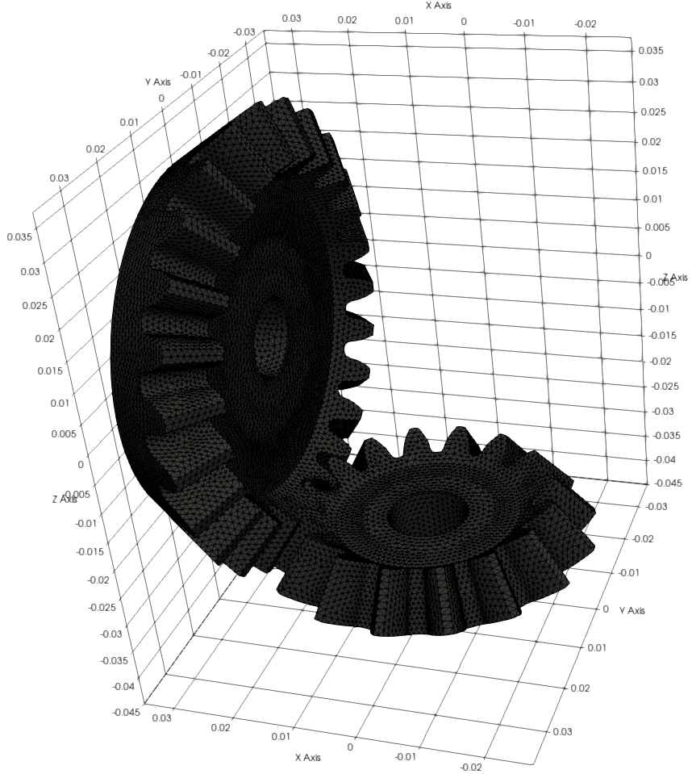
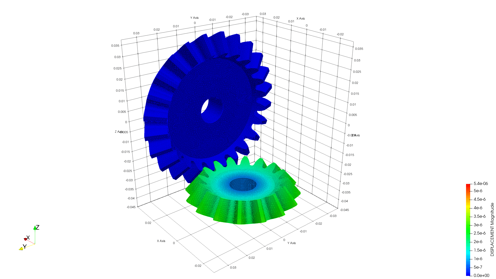
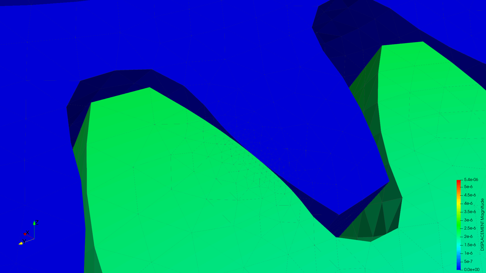
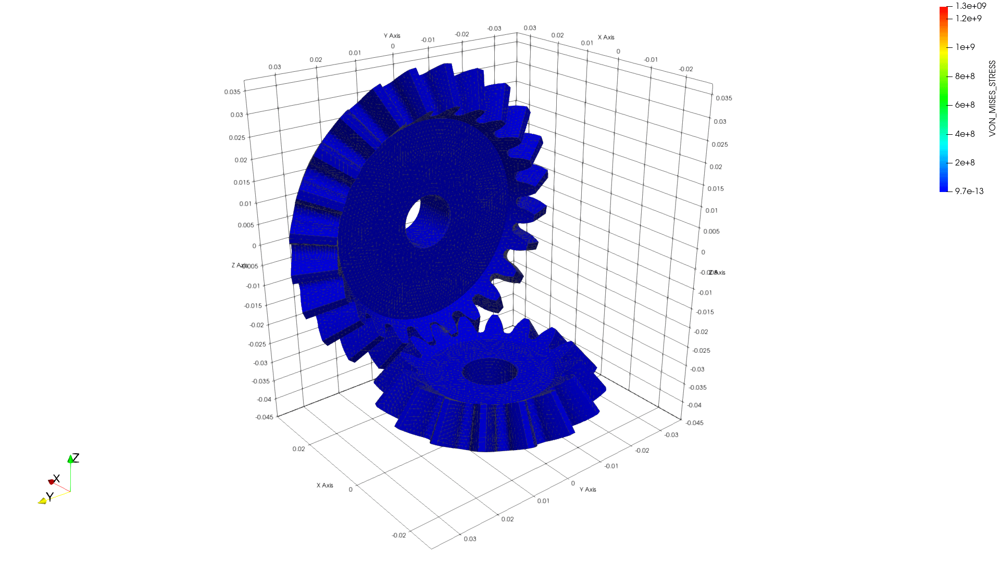
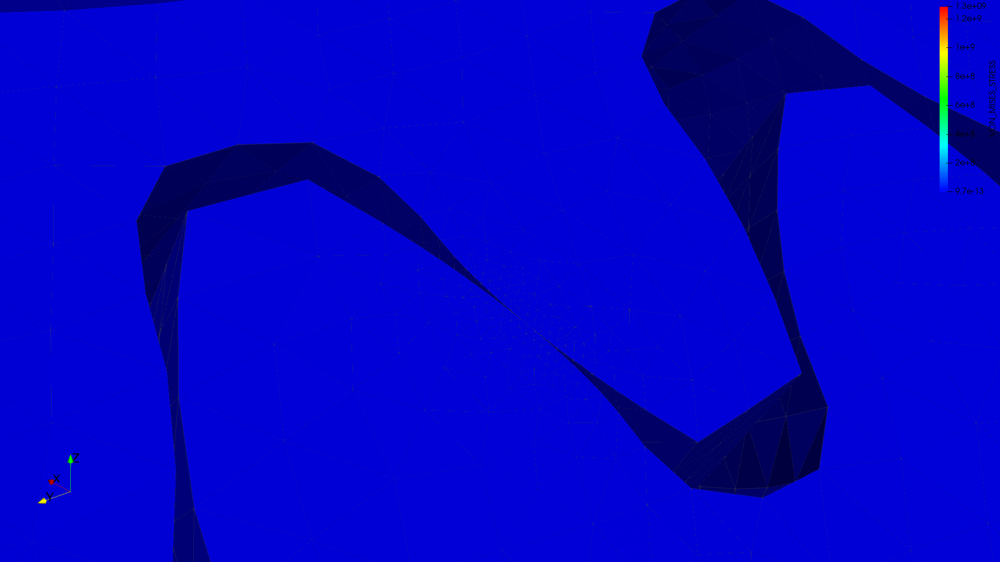
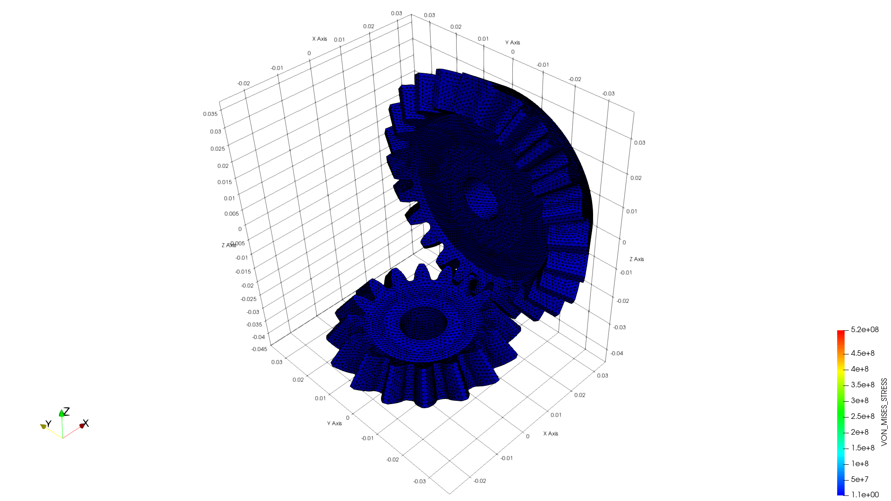

# Gears

**Author:** Vicente Mataix Ferrándiz

**Kratos version:** Current head

**Source files:** [Gears](https://github.com/KratosMultiphysics/Examples/tree/master/contact_structural_mechanics/use_cases/gears/source)

## Case Specification

The problem consists in two gears, one is fixed, the other has a rotational movement imposed.

*The mesh*:

  

The displacement imposed is ux= x0 - R cos(atan(y0/x0) - w*t) uy = y0 - R sin(atan(y0/x0) - w*t) 

Two different combinations of materials has been tested:

- *Linear elastic*:
	- Gear1:
		- LinearElastic3DLaw
		- E: 210e9
		- &nu; 0.29
	- Gear2:
		- LinearElastic3DLaw
		- E: 210e9
		- &nu; 0.29
- *Elastic-plastic*:
	- Gear1:
		- LinearElastic3DLaw
		- E: 210e9
		- &nu; 0.29
	- Gear2:
		- LinearElastic3DLaw
		- E: 210e9
		- &nu; 0.29
	- Contact zone (elastic-perfectly plastic):
		- SmallStrainIsotropicPlasticityVonMisesVonMises
		- E: 210e9
		- &nu; 0.29
		- Fracture energy: 1.0e8
		- Yield stress: 525MPa
		- Hardening curve: 3
		
## Results

### Linear elastic

- **Displacement**:

	- *General*:

  

	- *Detail*:

  

- **VM**:

	- *General*:

  

	- *Detail*:

  

### Elastic-plastic

- **Displacement**:

	- *General*:

  

	- *Detail*:

  

- **VM**:

	- *General*:

  

	- *Detail*:

  

- **Plastic dissipation**:

	- *Detail*:

  

## References

