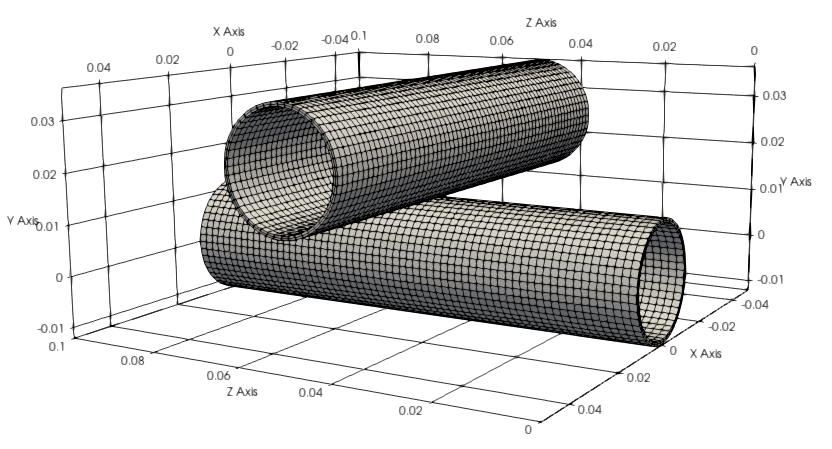

# Hyperelastic tubes contacting

**Author:** Vicente Mataix Ferrándiz

**Kratos version:** Current head

**Source files:** [Hyperelastic tubes contacting](https://github.com/KratosMultiphysics/Examples/tree/master/contact_structural_mechanics/use_cases/hyperelastic_tubes/source)

## Case Specification

The problem consists in two cylinders with hyperelastic behaviour, We impose a vertical displacement in the upper cylinder. The two cylinders become into contact and deal with self-contact in the inner ring of the upper cylinder.

  

**Materials**:
- *Upper Cylinder*. E=10000 &nu;=0.3
- *Lower Cylinder*. E=100000 &nu;=0.3

## Results

### Final state

**Displacement**:

  

**VM stress**:

  

### Animation

**Displacement**:

  

  

**VM stress**:

  

## References

- [Poulios, Konstantinos] An unconstrained integral approximation of large sliding frictional contact between deformable solids.
