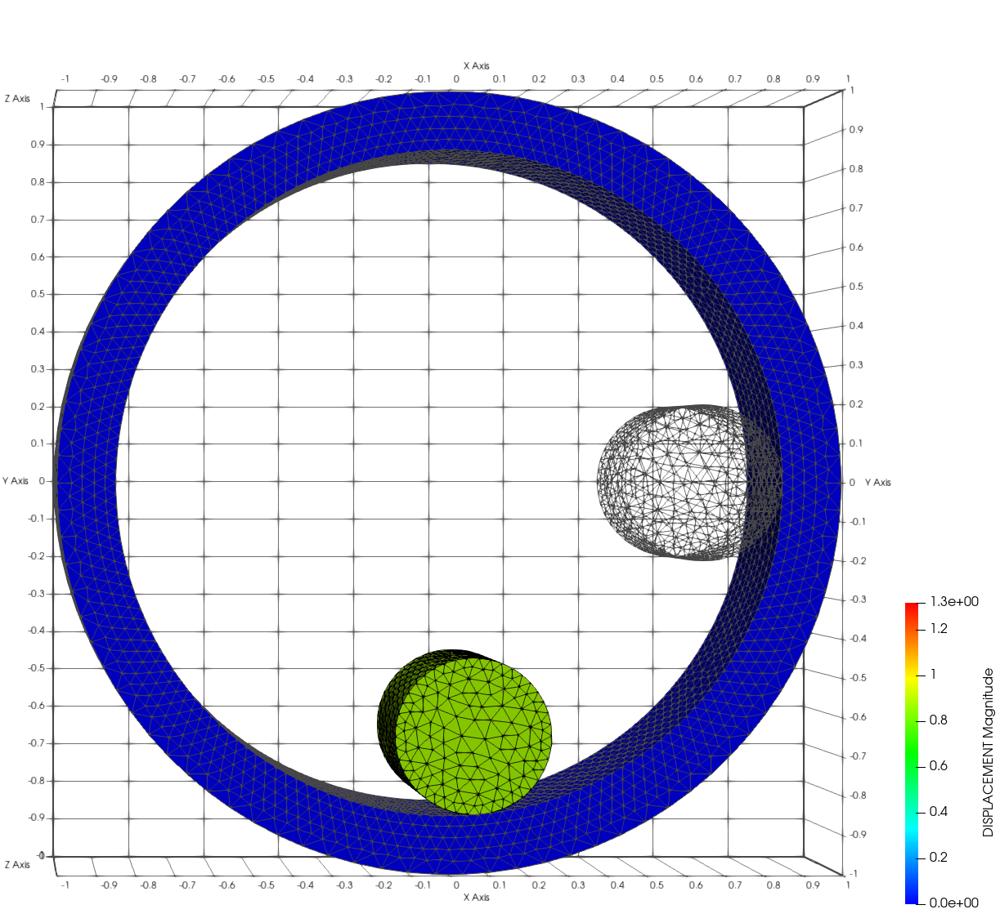
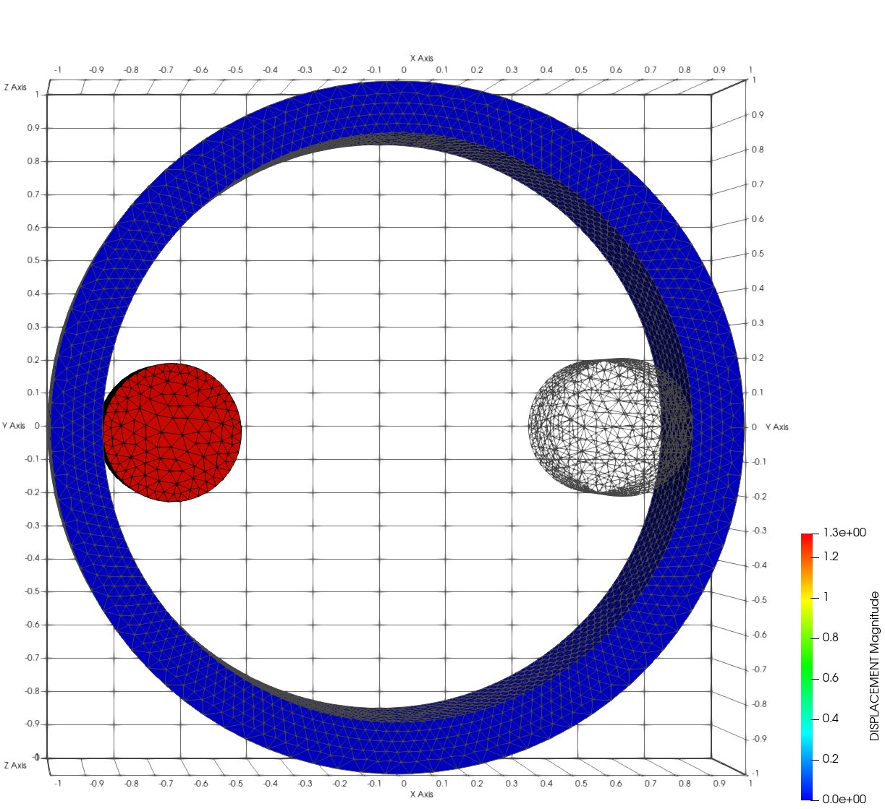

# Cylinder in ring

**Author:** Vicente Mataix Ferrándiz

**Kratos version:** Current head

**Source files:** [Cylinder in ring](https://github.com/KratosMultiphysics/Examples/tree/master/contact_structural_mechanics/use_cases/in_ring/source)

## Case Specification

The problem consists in a cylinder inside a ring. The idea of this example is to probe the energy conservation during the contact simulation.

## Results

- t= 0.0 s:

- t = 0.99 s:

- t = 1.98 s:

- t = 2.97 s:

- t = 3.96 s:

- Animated:

## References

