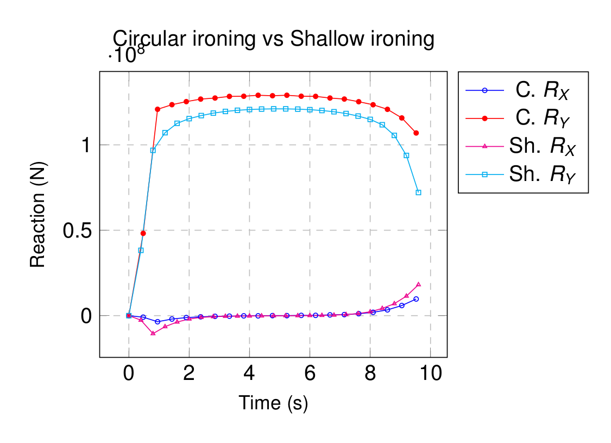

# Ironing with die

**Author:** Vicente Mataix Ferrándiz

**Kratos version:** Current head

**Source files:** [Ironing with die](https://github.com/KratosMultiphysics/Examples/tree/master/contact_structural_mechanics/use_cases/ironing_with_die_3D/source)

## Case Specification

The problem consists in an ironing problem. In this case instead of a partial circular die, we have a fully circular die.

## Results

### Comparison with shallow ironing

The following shows the different solution obtained with respect the shallow ironing example:

### Animation

## References

