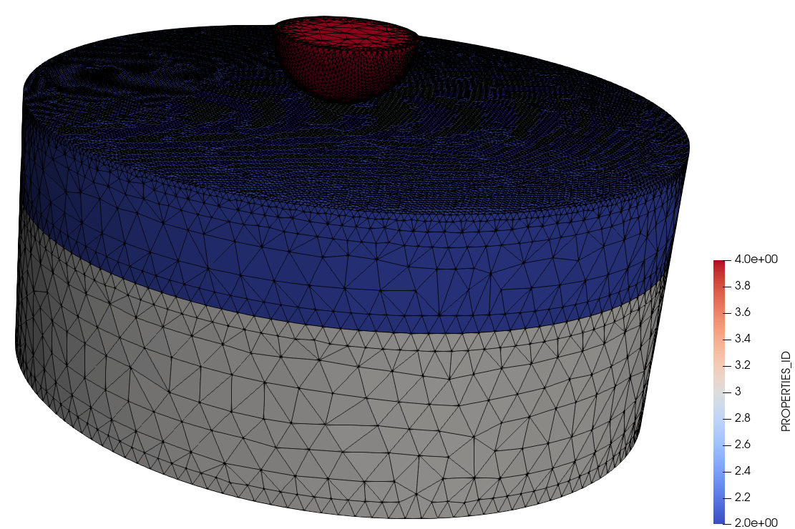
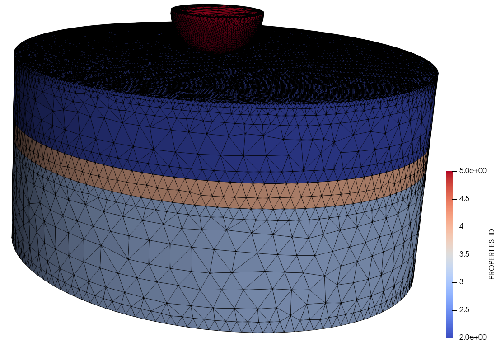
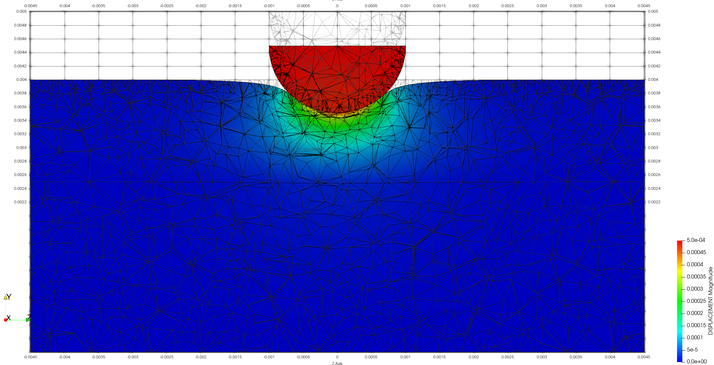
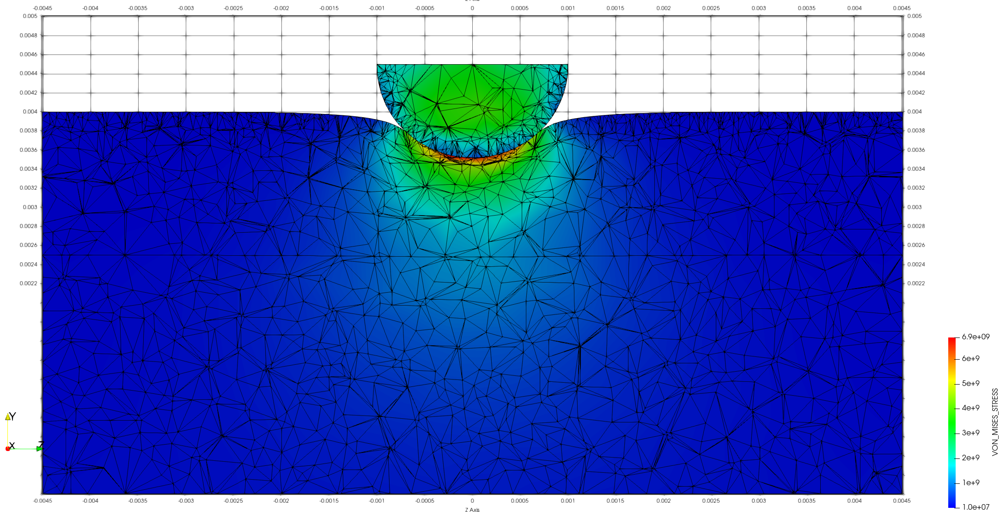
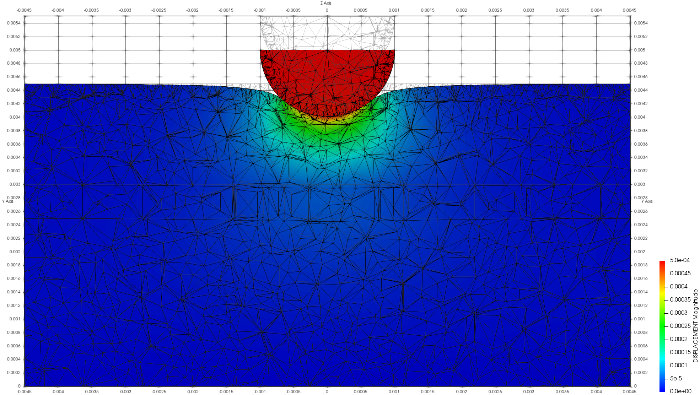
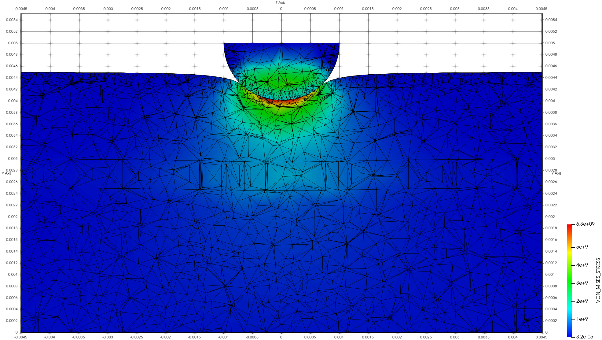

# Tooth model

**Author:** Vicente Mataix Ferrándiz

**Kratos version:** Current head

**Source files:** [Tooth model](https://github.com/KratosMultiphysics/Examples/tree/master/contact_structural_mechanics/use_cases/tooth_model/source)

## Case Specification

The problem consists in a simplified model of a tooth with different types of layers.

The model with **enamel+composite**:

  

**Layers**:
- *Composite*. Color 2: density=3.2e5 E=1.03e10 &nu;=0.3
- *Enamel*. Color 3: density=3.2e5 E=8.0e10 &nu;=0.3
- *Press*. Color 4: density=7.85e3 E=2.069e11 &nu;=0.29

The model with **enamel+dentine+composite**:

  

**Layers**:
- *Composite*. Color 2: density=3.2e5 E=1.03e10 &nu;=0.3
- *Enamel*. Color 3: density=3.2e5 E=8.0e10 &nu;=0.3
- *Dentine*. Color 4: density=3.2e5 E=2.0e10 &nu;=0.3
- *Press*. Color 5: density=7.85e3 E=2.069e11 &nu;=0.29

## Results

### Enamel + Composite

**Displacement**:

  

**VM**:

  

### Enamel + Dentine + Composite

**Displacement**:

  

**VM**:

  

## References

