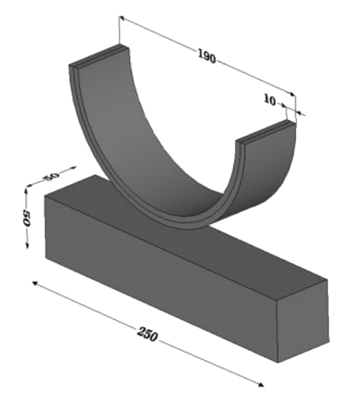
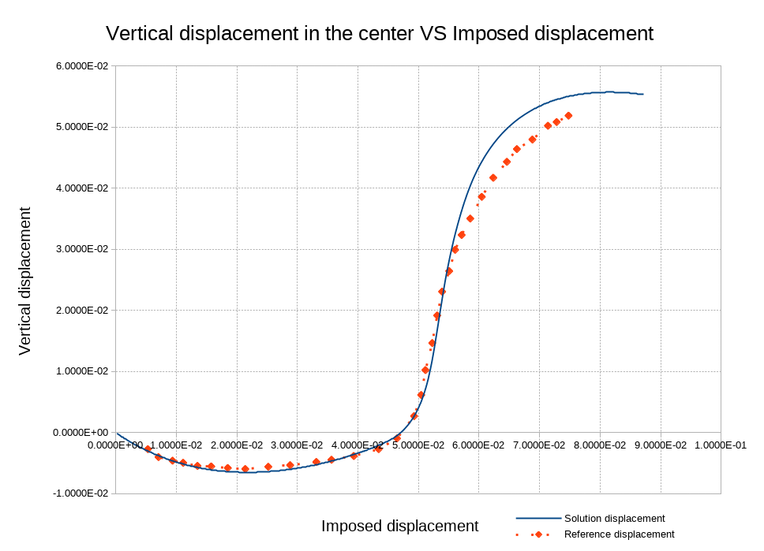

# Double arch benchmark

**Author:** Vicente Mataix Ferrándiz

**Kratos version:** Development branch. **Expected 5.3**

**Source files:** [Double  Arch](https://github.com/KratosMultiphysics/Examples/tree/master/contact_structural_mechanics/validation/double_arch/source)

## Case Specification

In this test case, we will consider the crushing of a hyper-elastic bi-material half-ring on a hyper-elastic base. This test makes it possible to take into account large displacements, large deformations and large landslides coupled to contact / non-contact transitions.

The reference solutions have been taken from  *G. Drouet*. (2015) and *K.Poulios & Y.Renard* (2015). 

The following applications of Kratos are used:
- *StructuralMechanicsApplication*
- *ContactStructuralMechanicsApplication*

The problem geometry as well as the boundary conditions are sketched below. 

  

We consider a hyper-elastic half-ring composed of two materials (external 190mm and inner 170mm diameters) and a hyper-elastic base of length 250mm and height 50mm, see Figure. A vertical displacement of -90mm is imposed at each end of the half-ring and the base of the base is recessed. Two variables of interest are considered mainly: the displacement of the middle of the half-ring as a function of the loading pitch (60 steps of loading from the contact is used, ie about 1.16 mm per loading step) and the contact pressure.

On the other hand, an hyper elastic Neo-Hookean constitutive law is considered in both materials. The structure characteristic parameters are for the first ring:

- Elastic modulus (E):   3.0E+08 _Pa_
- Poisson ratio (&nu;): 0.3 
And for the second:
- Elastic modulus (E):   1.0E+09 _Pa_
- Poisson ratio (&nu;): 0.3
For the support material:
- Elastic modulus (E):  1.0E+11 _Pa_
- Poisson ratio (&nu;): 0.3

The time step is *0.0005* seconds, while the total simulation time is *0.2* seconds. With an increment of the imposed displacement wual to *0.4t*.

## Results
The problem stated above has been solved using an unstructured mesh of tetrahedron. The resulting deformation can be seen in the following image.

  

As well as the comparation with the reference solution (we have a deviation from the reference solution for the last steps, where we have a larger deformation and finally a stabilization of the deformation):

  

## References
*G. Drouet*. Méthode locale de type mortar pour le contact dans le cas de maillages incompatibles de degré élevé. DOCTORAT DE L’UNIVERSITÉ DE TOULOUSE, 2015. [https://tel.archives-ouvertes.fr/tel-01356080/document](https://tel.archives-ouvertes.fr/tel-01356080/document)

 *K. Poulios and Y. Renard*. An unconstrained integral approximation of large sliding frictional contact between deformable solids. Computers & Structures, 153 :75–90, 2015.[http://www.sciencedirect.com/science/article/pii/S0045794915000656?via%3Dihub](http://www.sciencedirect.com/science/article/pii/S0045794915000656?via%3Dihub)
