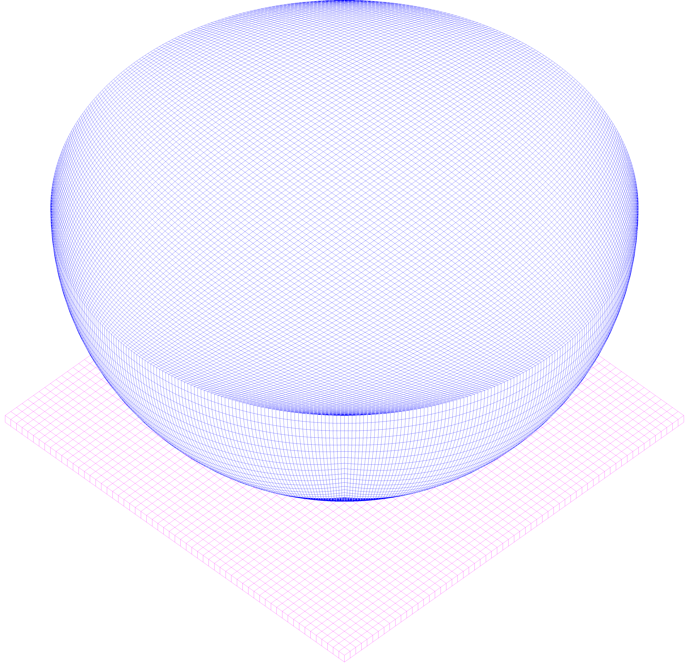
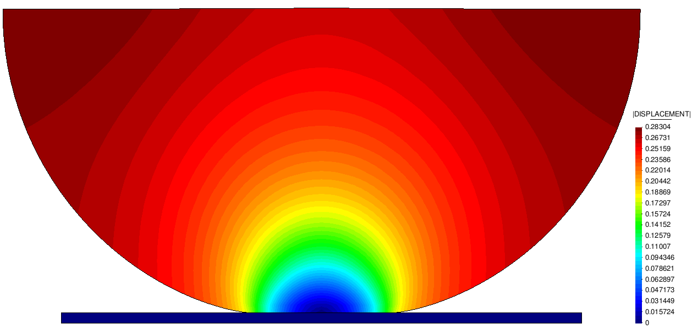
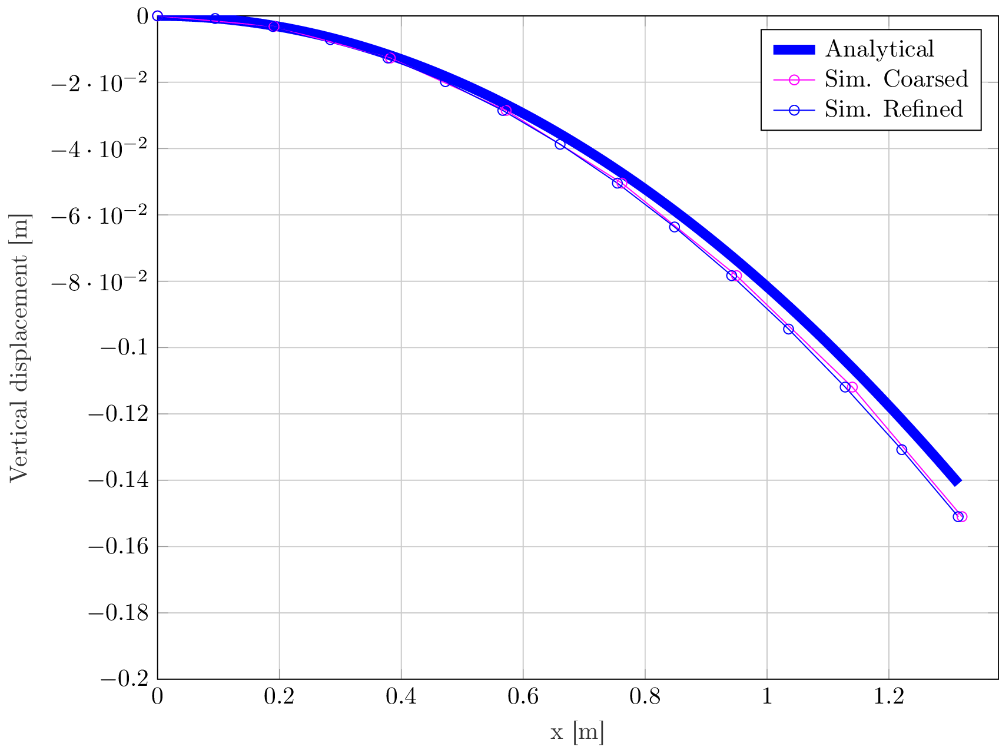
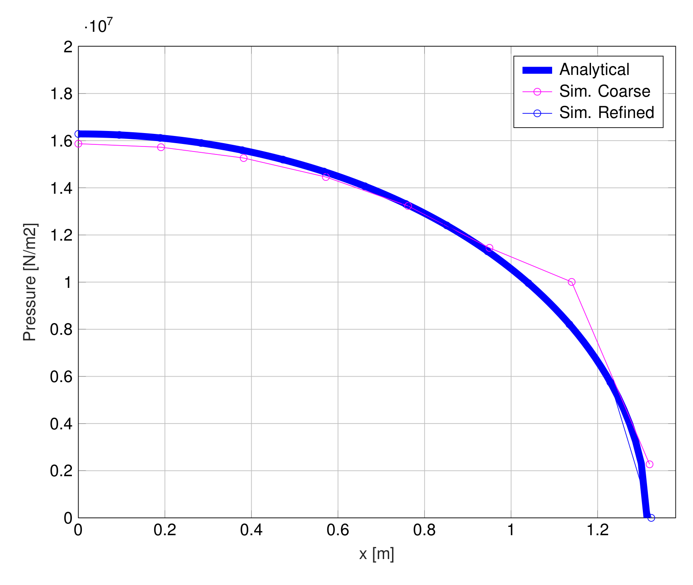
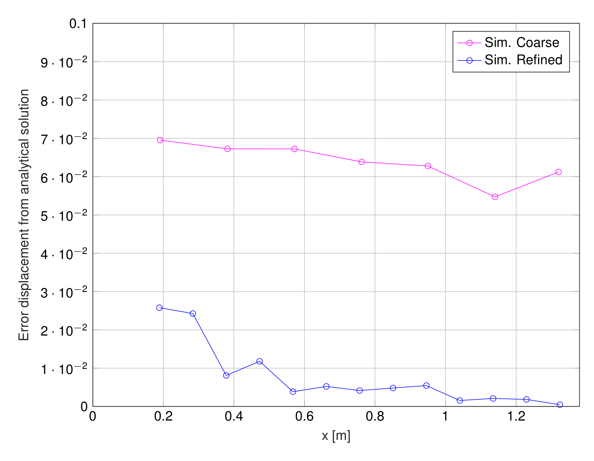
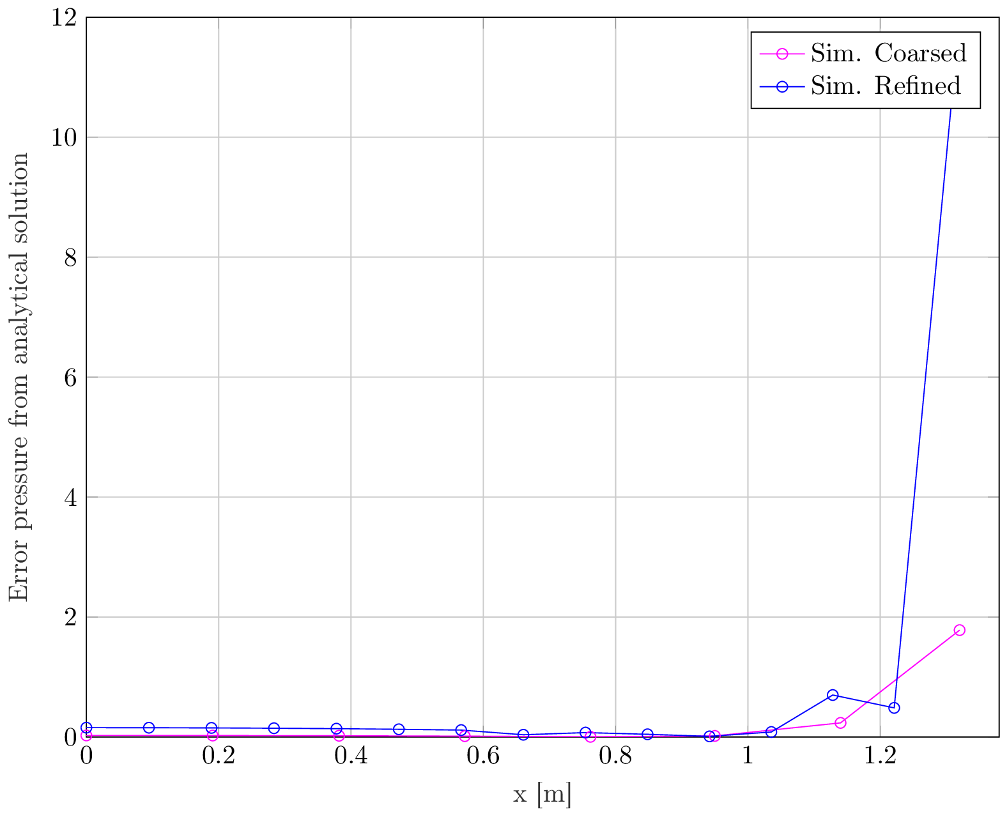

# Hertz benchmark

**Author:** Vicente Mataix Ferrándiz

**Kratos version:** Current head

**Source files:** [Hertz](https://github.com/KratosMultiphysics/Examples/tree/master/contact_structural_mechanics/validation/hertz/source)

Two meshes are avalaible, a fine mesh as well as a coarser one.

## Case Specification

In this test case, we will consider the contact between a demi-sphere and a rigid plane, what is known as *Hertz* benchmark test. The reference solutions have been taken from the analytical solution of *Hertz*'s work that can be found in the reference section.

The following applications of Kratos are used:
- *StructuralMechanicsApplication*
- *ContactStructuralMechanicsApplication*

The problem geometry as well as the boundary conditions are sketched below. 

  

The refined mesh:

  

We consider the a sphere of 12.2474 *meters* of diameter with a load of 5.0e5 *Pa*.

The structure characteristic parameters are for the sphere (the plane is rigid):
- Elastic modulus (E):  1.0E+08 _Pa_
- Poisson ratio (&nu;): 0.29

The calculation is done in just one static step.

## Results
The problem stated above has been solved using an structured mesh of hexahedron. The resulting deformation can be seen in the following image.

  

As well as the comparation with the reference solution. For the displacement we got a very good agreement with the analytical solution in both cases, in the case of the contact preassure we got a better approach with in the coarser case. A very  antiintuitive conlcusion we can extract from this result, for contact problems a finer mesh doesn't mean necessarily a better result:

  
  

  
  

## References
[Hertz Contact Calculator](http://www.tribonet.org/cmdownloads/hertz-contact-calculator/)

[Introduction to Elasticity/Hertz contact](https://en.wikiversity.org/wiki/Introduction_to_Elasticity/Hertz_contact)
