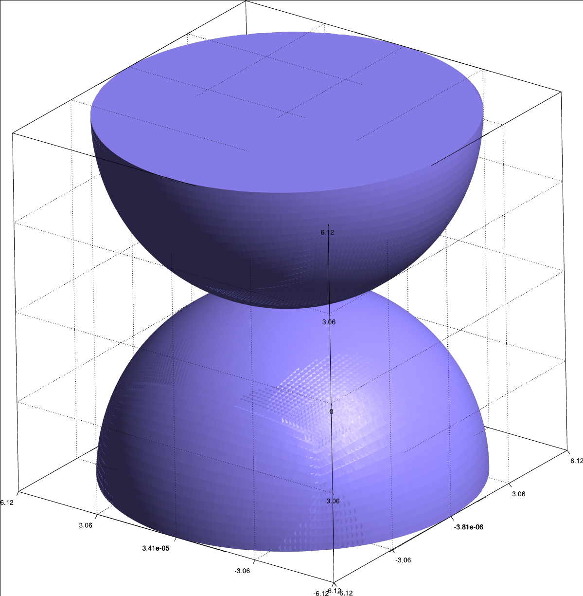
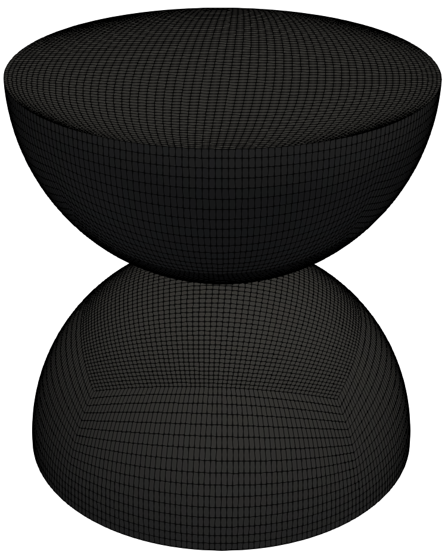
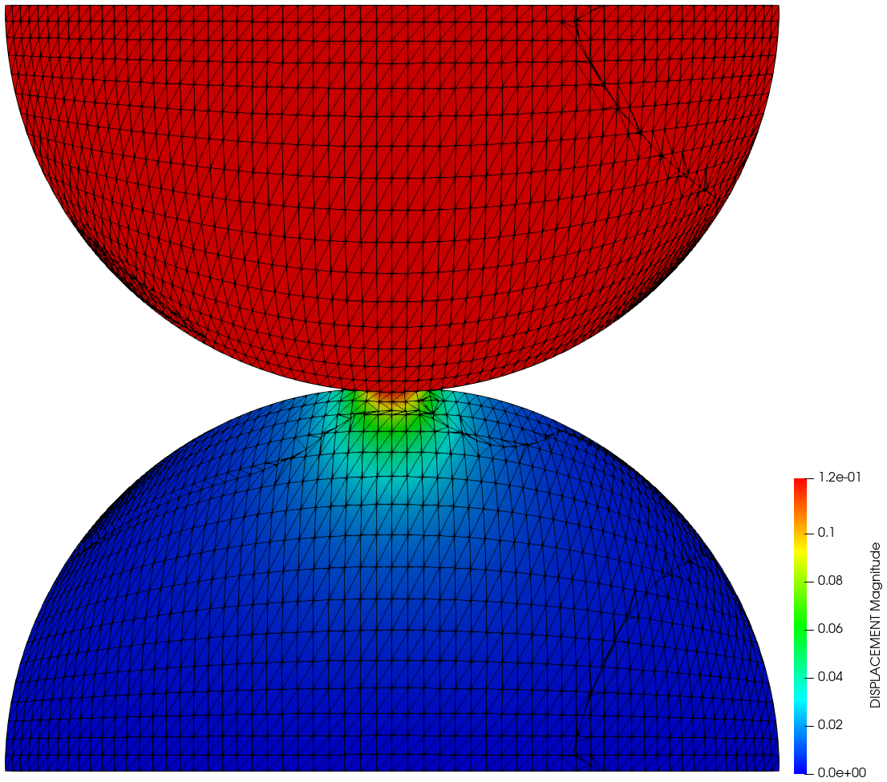
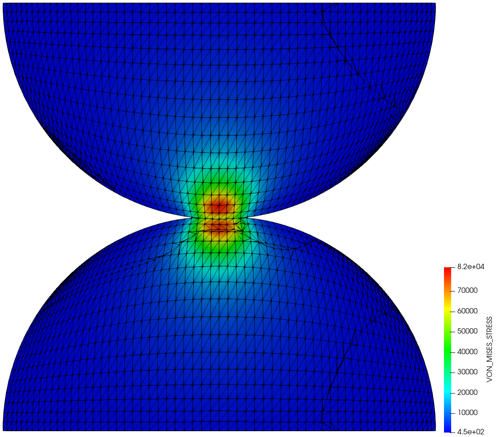
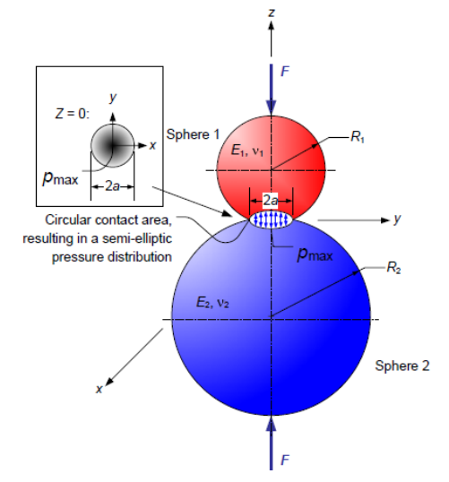
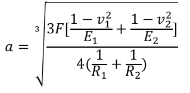
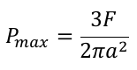

# Full Hertz benchmark

**Author:** Vicente Mataix Ferrándiz

**Kratos version:** Current head

**Source files:** [Full Hertz](https://github.com/KratosMultiphysics/Examples/tree/master/contact_structural_mechanics/validation/hertz_full/source)

Two meshes are avalaible, a fine mesh as well as a coarser one.

## Case Specification

In this test case, we will consider the contact between a demi-sphere and a rigid plane, what is known as *Hertz* benchmark test. The reference solutions have been taken from the analytical solution of *Hertz*'s work that can be found in the reference section.

The following applications of Kratos are used:
- *StructuralMechanicsApplication*
- *ContactStructuralMechanicsApplication*

The problem geometry as well as the boundary conditions are sketched below. 

  

The mesh:

  

We consider the a sphere of 12.2474 *meters* of diameter with a load of 1.0e3 *Pa*.

The structure characteristic parameters are for the sphere (the plane is rigid):
- Elastic modulus upper body (E1):  1.0E+08 _Pa_
- Poisson ratio  upper body(&nu;1): 0.29
- Elastic modulus lower body (E2):  1.0E+06 _Pa_
- Poisson ratio lower body (&nu;)2: 0.29

The calculation is done in just one static step.

## Results
The problem stated above has been solved using an structured mesh of hexahedron. The resulting deformation can be seen in the following image.

  

  

As well as the comparation with the reference solution. We will compare the the radius of the contact area and the maximum contact pressure.

- F:  1.0e3 · &pi; · 12.2474^2 = 150000/4 · &pi; = 117808,787 N
- a: 0.6301 vs 0.627 -> 0.5% error
- Pmax: 1.41641e5 vs 1.435467 -> 1.3% error

## References
[Hertz Contact Calculator](http://www.tribonet.org/cmdownloads/hertz-contact-calculator/)

[Reference](data/OPTI-521-Tutorial-on-Hertz-contact-stress-Xiaoyin-Zhu.pdf)

[Introduction to Elasticity/Hertz contact](https://en.wikiversity.org/wiki/Introduction_to_Elasticity/Hertz_contact)
