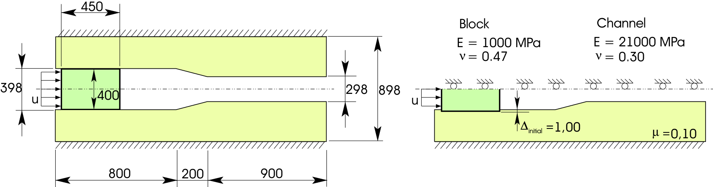
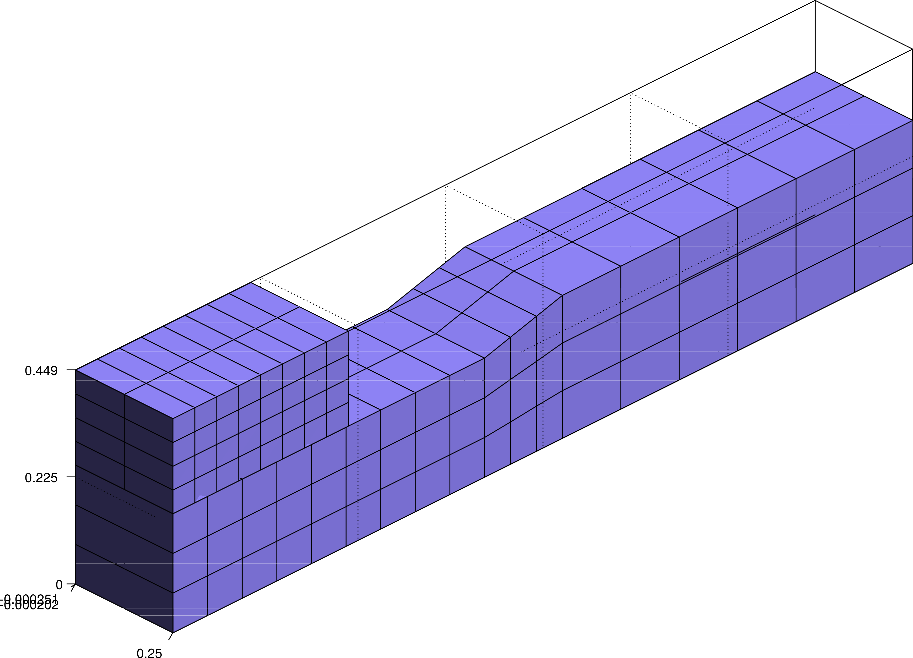
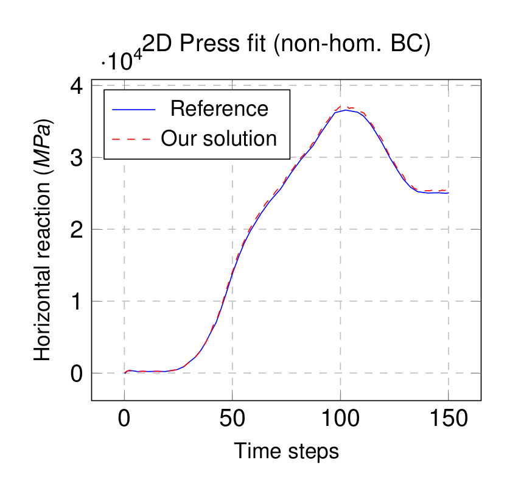
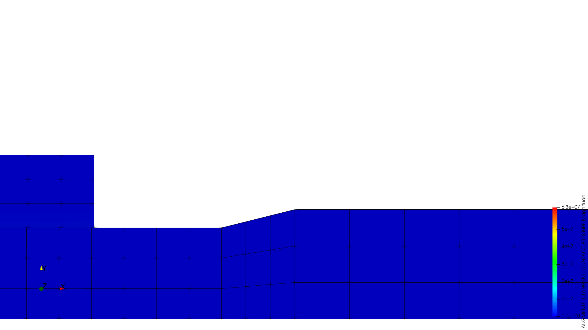
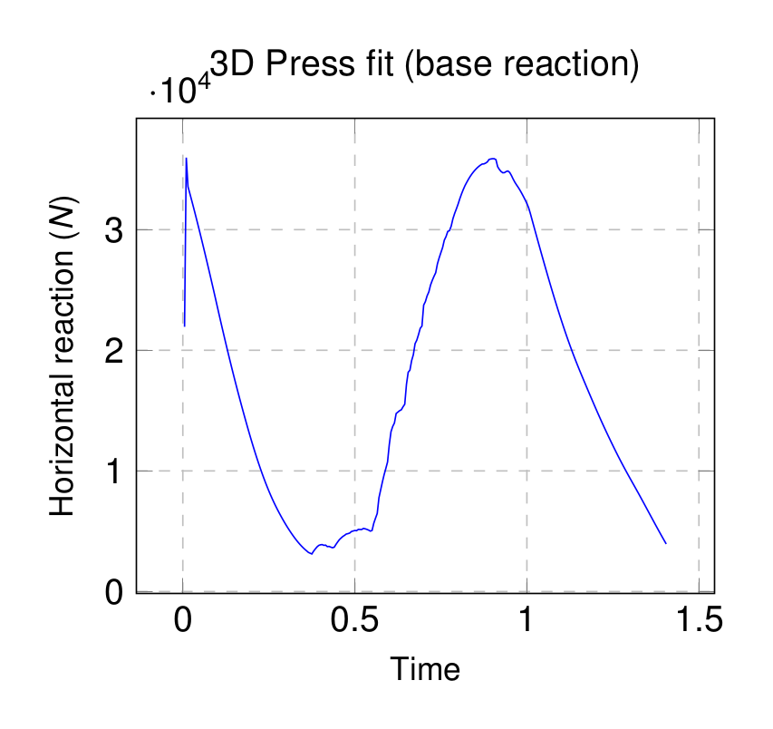

# Press fit

**Author:** Vicente Mataix Ferrándiz

**Kratos version:** Current head

**Source files:** [Press fit](https://github.com/KratosMultiphysics/Examples/tree/master/contact_structural_mechanics/use_cases/press_fit/source)

## Case Specification

The problem consists of the numerical simulation of a press-fit process of a block in a channel according to [1].
The geometric and material parameters are shown in the figures. It is considered Neo-Hookean compressible hyperelastic material for both components. It is possible to evaluate the behavior of the contact element in a friction contact problem with large deformation and sliding. The symmetry of the problem is used and only half of the domain is simulated.

The process is modeled by applying a non-homogeneous boundary condition u = 1000 mm in the left face of the block. The height of the block is greater than the channel, imposing to the problem an initial penetration ∆initial = 1 mm and consequently an initial contact stress. 

The first time step uses u = 0 and the program generates the normal stress necessary to the non-penetration condition, separating the bodies in contact. After this step, we employed a non-homogeneous boundary condition u = 1000 mm.  It is considered plane strain state and updated Lagrangian formulation.

Additionally a 3D setup is also evaluated, extruding 250 mm, but this one cannot be compared with any reference.

### Setup

  

### Mesh

#### 2D

  

#### 3D
	

  

## Results

### Literature setup (2D):

Comparing the results with the reference (slightly higher than in the reference):

  

The frictional stress evolution is:

### Custom setup (3D):

The reaction in the base support most wetern points is:

  

The frictional stress evolution is:

## References

- [Fischer, Kathrin A.,Wriggers, Peter] Mortar based frictional contact formulation for higher order interpolations using the moving friction cone
- [A.P.C. Dias] High-order mortar-based element applied to nonlinear analysis of structural contact mechanics
