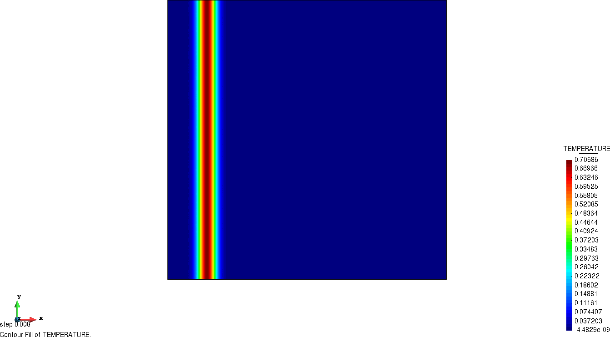

# Convection-diffusion of a Gaussian hill problem

**Author:** [Riccardo Tosi](https://github.com/riccardotosi)

**Kratos version:** 8.0

**Source files:** [source](source)

## Case Specification

This example is taken from [Donea, J., & Huerta, A. (2003). Finite Element Methods for Flow Problems. Section 5.6.1] and adapted to run on a two-dimensional mesh. We solve the transient convection diffusion equation
,
where specific initial conditions are set. We refer to the above reference for further details.

The problem is solved exploiting the **Runge-Kutta 4 time integration explicit method**, and it can be run with four different stabilizations:
* quasi-static algebraic subgrid scale (QSASGS)
* quasi-static orthogonal subgrid scale (QSOSS)
* dynamic algebraic subgrid scale (DASGS)
* dynamic orthogonal subgrid scale (DOSS)

## Results

We present the temporal evolution of  for the *DOSS* case.

  

We can observe the results we obtain are consistent with both the reference [Donea, J., & Huerta, A. (2003). Finite Element Methods for Flow Problems. Section 5.6.1].

Moreover, we also compared our numerical solution against the analytical solution , where , ,  the diffusivity, ,  the convective velocity and  the simulation time. All physical quantities unit measures are expressed according to the Convection Diffusion application and the `materials.json` file. The  norm we obtain is 0.001575 for the *DOSS* element.