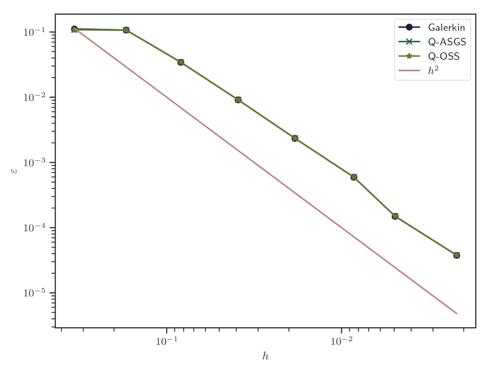
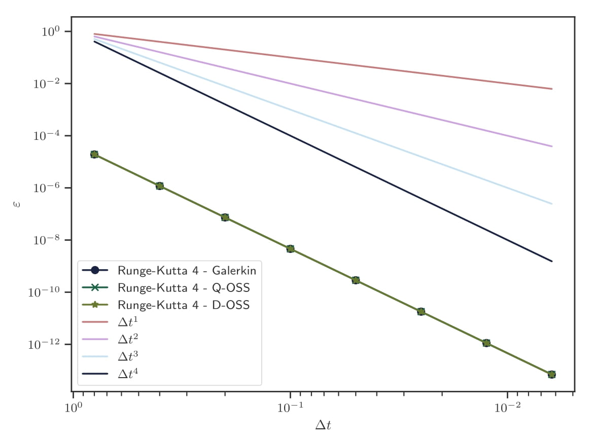

# Space and time convergence tests

**Author:** [Riccardo Tosi](https://github.com/riccardotosi)

**Kratos version:** 9.0

**Source files:** [section 2.7 of [1]](https://github.com/KratosMultiphysics/Documentation/blob/master/Resources_files/convection_diffusion_explicit_elements/Eulerian_convection_diffusion_explicit_element.pdf)

## Space convergence

We solve the transient convection diffusion equation
 and validate its reference implementation. We refer to section 2.7.1 of [1] for details.

We validate the implementation by computing the  norm of the error as , where  is the mesh size,  and  are the analytic and FEM solutions, respectively.

  

The figure shows that the error  converges as expected for both quasi-static ASGS and quasi-static OSS.

## Time convergence

We solve the transient convection diffusion equation
 and validate its reference implementation. We refer to section 2.7.2 of [1] for details.

The analytic solution at time  is . Therefore, it is possible to compute the  norm of the error as
, where  is the mesh size,  and  are the analytic and FEM solutions, respectively. It is expected to obtain an order four accuracy for the Runge-Kutta 4 time integration scheme.

  

The figure shows that the time accuracy is of order four, as expected.

## References

[1] Tosi, R. (2020). Eulerian convection diffusion explicit elements (p. 27). p. 27. Retrieved from https://github.com/KratosMultiphysics/Documentation/blob/master/Resources_files/convection_diffusion_explicit_elements/Eulerian_convection_diffusion_explicit_element.pdf