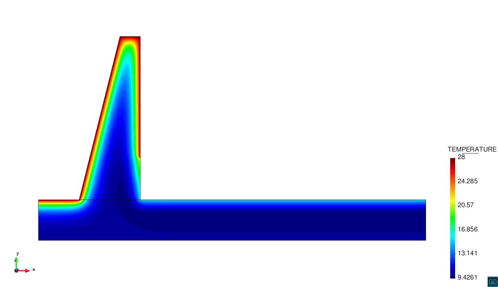
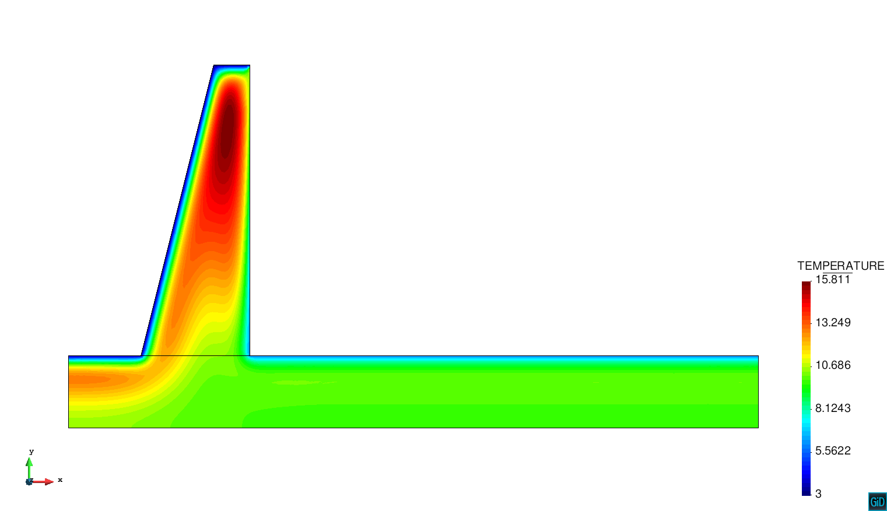

# 2D Thermo-mechanical Seasonal Effects Example

**Author:** Lorenzo Gracia

**Kratos version:** 5.2

**Source files:** [2D-ThermomechanicalSeasonalEffects](https://github.com/KratosMultiphysics/Examples/tree/master/dam/use_cases/2d_dam_thermo_mechanical/source)

## Case Specification

This is a 2D dam thermo-mechanical problem. The thermal problem is solved at dam body and using this temperature field it is possible to compute the gradients and the generated mechanical efforts (one way coupling).

A hydrostatic load is applied at the upstream wall (water level dependent). The temperature at the upstream wall is imposed using the formulation proposed by Bofang (1997). This formulation depends on the season and water level among others. The month (season) as weel as the water level are introduced through different tables.

The time step is 1 month, while the total simulation time is 12 months.

The following applications of Kratos are used:
* SolidMechanicsApplication
* PoromechanicsApplication 
* ConvectionDifussionApplication
* DamApplication

This type of simulation allows to the user to obtain a dam estimation movement depending on the season. This opens the possibility of computing large periods of analysis.

## Results

Some results depending on the season (month) are presented below.

## References
Z. Bofang. Prediction water temperature in deep reservoirs. Dam Eng. 8,1 13-25, 1997. 