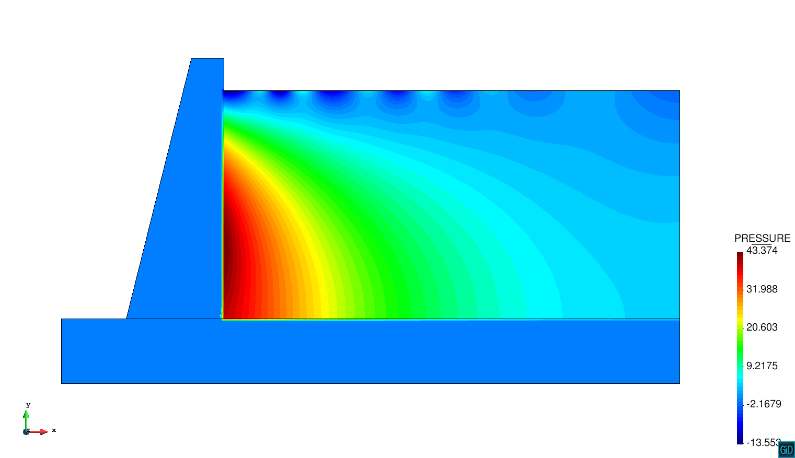
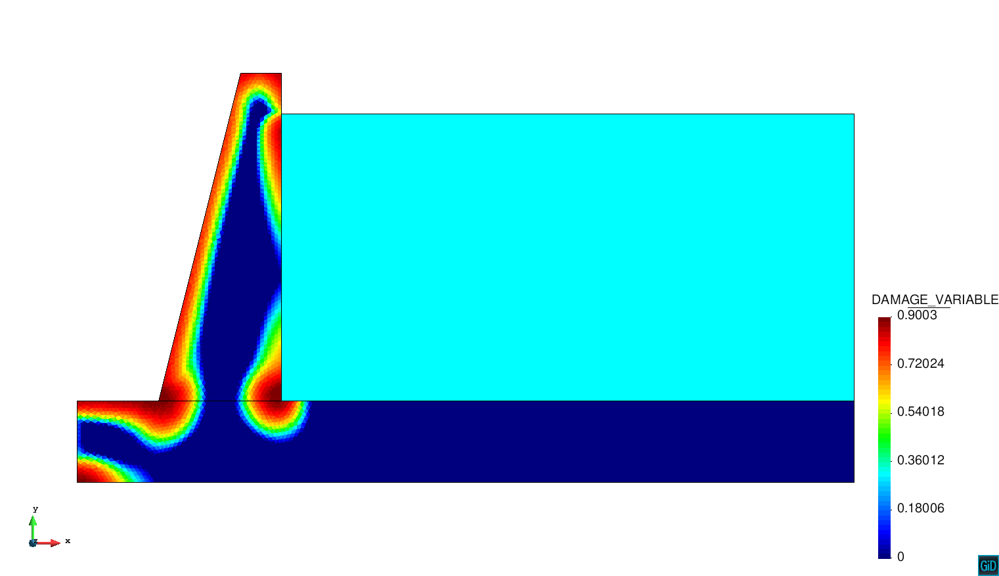

# 2D Thermo-mechanical Including Reservoir Effects Example

**Author:** Lorenzo Gracia

**Kratos version:** 5.2

**Source files:** [2D Thermo-mechanical Reservoir Nonlocal Damage](https://github.com/KratosMultiphysics/Examples/tree/master/dam/use_cases/2d_dam_thermo_mechanical_with_reservoir/source)

## Case Specification

This is a 2D dam thermo-mechanical problem considering the effects of the reservoir at dam. A coupled formulation for considering reservoir effects at the upstream wall is used. This formulation connects the pressure field at the reservoir with the accelerations at the body. The thermal problem is solved at dam body and, using the temperature gradients, it is possible to compute the generated mechanical efforts (one way coupling). The constitutive model for the mechanical problem is based on Simo Ju law applying a non-local regularization at damage internal variable.

At dam body a suface/volume acceleration is induced with the aim of simulating an earthquake. Since the concrete parameters have small diffusivity, the thermal values has been changed in order to appreciate the temperature evolution as well.

At the reservoir two specific conditions are used. At the free surface, a special condition for considering graviational effects is used. Also, for simulating an infinite domain, a boundary radiation condition is applied avoiding the wave reflexion.

The time step is 0.1 seconds, while the total simulation time is 25.0 seconds.

The following applications of Kratos are used:
* SolidMechanicsApplication
* PoromechanicsApplication 
* ConvectionDifussionApplication
* DamApplication

## Results

The problem stated above has been solved with a unstructured mesh composed by linear triangular elements in the solid domain. In the fluid domain (reservoir), a structured mesh composed by linear quadrilateral elements has been used. The obtained pressure, temperature and damage fields at the end of the simulation are presented below.
  

