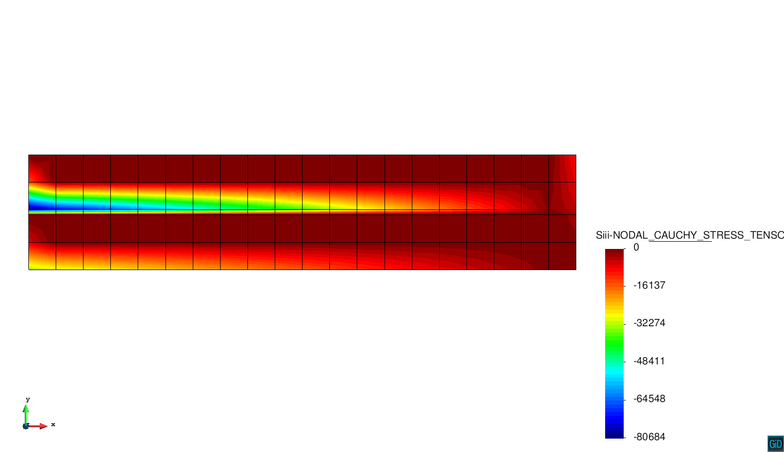

# 2D Joint Eeams Example

**Author:** Lorenzo Gracia

**Kratos version:** 5.2

**Source files:** [2D Joint Beams](https://github.com/KratosMultiphysics/Examples/tree/master/dam/use_cases/2d_joint_element/source)

## Case Specification

This is a 2D dam mechanical problem for showing one of the several application where the joint element can be applied. The joint element is a quasizero thcikness element which allows to capture some discontinuities. 

The following applications of Kratos are used:
* SolidMechanicsApplication
* PoromechanicsApplication 
* ConvectionDifussionApplication
* DamApplication

## Results

