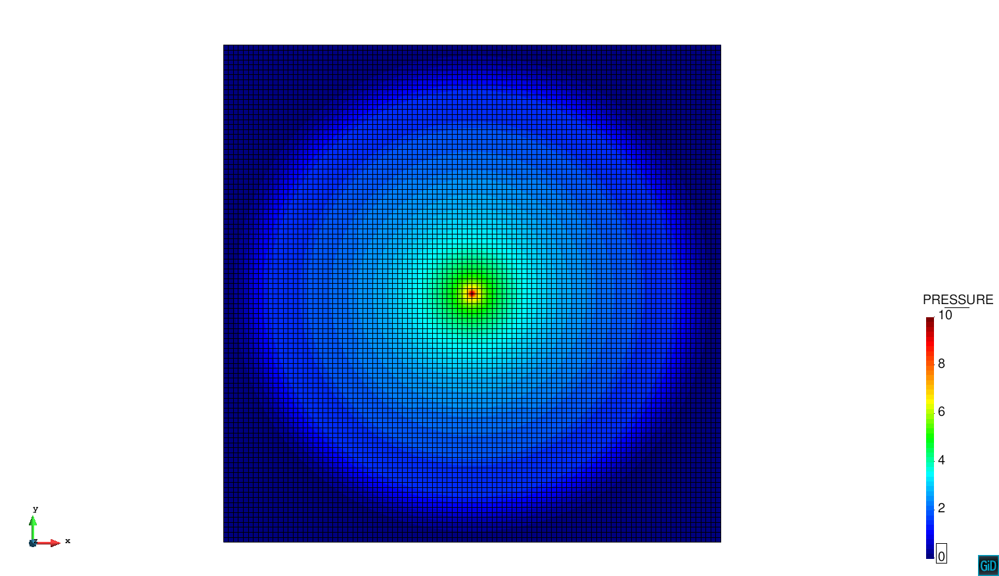

# 2D Acoustic Pulse Example

**Author:** Lorenzo Gracia

**Kratos version:** 5.2

**Source files:** [Acoustic](https://github.com/KratosMultiphysics/Examples/tree/master/dam/use_cases/Acoustic/source)

## Case Specification

This is an example of wave propagation problem. The problem solves the wave equation being the pressure the unknown. A constant pulse of value 10 is applied at the center of the geometry during all the simulation. In all sides of the quadrilateral the boundary radiation condition is applied, so there is no reflection of pressure.  

The time step is 0.0001 seconds, while the total simulation time is  0.01 seconds.

The following applications of Kratos are used:
* SolidMechanicsApplication
* PoromechanicsApplication 
* ConvectionDifussionApplication
* DamApplication

## Results

The problem stated above has been solved with a structured mesh composed by linear quadrilateral. The obtained pressure fields at time 0.003 of the simulation is presented below.

