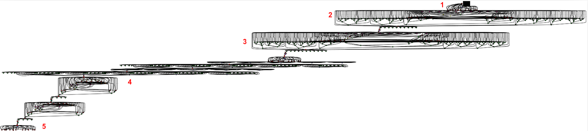
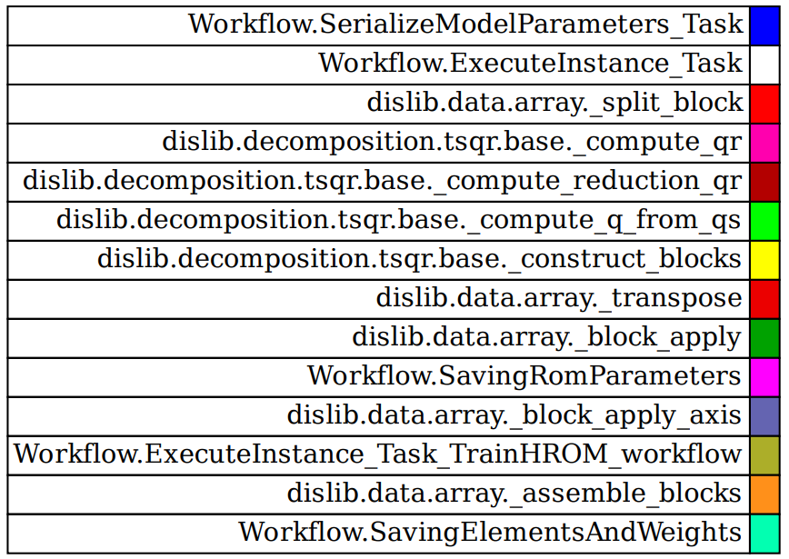

# Overview
This example presents the HPC workflow implemented using the [COMPSs](https://compss-doc.readthedocs.io/en/stable/) framework and the [dislib](https://dislib.readthedocs.io/en/release-0.7/) library for the training stage of a projection-based Reduced Order Model using the [RomApplication](https://github.com/KratosMultiphysics/Kratos/tree/master/applications/RomApplication) of Kratos.

# Content
* [Introducing the Workflow][presentation]
    * [Demo Model][example]
    * [The Reduced Order Model][rom]
    * [The Workflow][workflow]
    
* [Launching the example][launching]
    * [Requirements][requirements]
        * [Kratos][kratos]
        * [COMPSs][compss]
        * [dislib][dislib]
        * [EZyRB][EZyRB]       
    * [Launching in Local Machine][local]
    * [Launching in Cluster][cluster]
    * [Results][results]
    * [Running the RPM Interpolation Tool][interpolation]
    * [Launching Serial Model][serial]
    

[presentation]:https://github.com/KratosMultiphysics/Examples/tree/master/eFlows4HPC/Demo_ROM_workflow#introducing-the-workflow
[launching]:https://github.com/KratosMultiphysics/Examples/tree/master/eFlows4HPC/Demo_ROM_workflow#launching-the-example
[example]:https://github.com/KratosMultiphysics/Examples/tree/master/eFlows4HPC/Demo_ROM_workflow#demo-model
[rom]://https:github.com/KratosMultiphysics/Examples/tree/master/eFlows4HPC/Demo_ROM_workflow#the-reduced-order-model
[workflow]:https://github.com/KratosMultiphysics/Examples/tree/master/eFlows4HPC/Demo_ROM_workflow#the-workflow
[launching]:https://github.com/KratosMultiphysics/Examples/tree/master/eFlows4HPC/Demo_ROM_workflow#launching-the-example
[requirements]:https://github.com/KratosMultiphysics/Examples/tree/master/eFlows4HPC/Demo_ROM_workflow#requirements
[kratos]:https://github.com/KratosMultiphysics/Examples/tree/master/eFlows4HPC/Demo_ROM_workflow#kratos
[compss]:https://github.com/KratosMultiphysics/Examples/tree/master/eFlows4HPC/Demo_ROM_workflow#compss
[dislib]:https://github.com/KratosMultiphysics/Examples/tree/master/eFlows4HPC/Demo_ROM_workflow#dislib
[EZyRB]:https://github.com/KratosMultiphysics/Examples/tree/master/eFlows4HPC/Demo_ROM_workflow#ezyrb
[local]:https://github.com/KratosMultiphysics/Examples/tree/master/eFlows4HPC/Demo_ROM_workflow#launching-in-local-machine
[cluster]:https://github.com/KratosMultiphysics/Examples/tree/master/eFlows4HPC/Demo_ROM_workflow#launching-in-cluster
[results]:https://github.com/KratosMultiphysics/Examples/tree/master/eFlows4HPC/Demo_ROM_workflow#checking-the-results
[interpolation]:https://github.com/KratosMultiphysics/Examples/tree/master/eFlows4HPC/Demo_ROM_workflow#running-the-rpm-interpolation-tool
[serial]:https://github.com/KratosMultiphysics/Examples/tree/master/eFlows4HPC/Demo_ROM_workflow#launching-serial-model

# Introducing the Workflow

## Demo model

Our 2D stator-rotor model serves as a foundational representation of complex thermodynamic interactions within motor systems. Leveraging advanced computational methods, the model captures fluid dynamics and convection-diffusion processes. It's designed with precision to simulate real-world scenarios, providing insights into heat exchange and flow behaviors in motor assemblies. This 2D representation, while simplified, embodies key physical principles and serves as a robust starting point for more intricate 3D explorations.

<p align="center">
  
</p>

## The Reduced Order Model

The goal of the ROM is to cheaply and fastly evaluate the solution for a given parameter of interest $\boldsymbol{\mu}$ (in this example, the inlet velocity of the fluid) 

<p align=center></p>

In order to obtain such a ROM, a campaign of expensive Full Order Model FOM simulations should be launched, and the collected data should be analyzed.


## The workflow

We have defined 5 stages of the workflow, each of which finds a one-to-one correspondence to the functions included in the file [Workflow.py](./Workflow.py) 


<p align=center></p>

The simulations in Kratos using the CoSimulation capabilities aim to store the outputs:
<p align=center></p>

To accomplish parallelization on these simulations, Kratos simulations are done using [COMPSs](https://compss-doc.readthedocs.io/en/stable/)

<p align=center></p>

And the snapshots will be gathered in dislib ([dislib](https://dislib.readthedocs.io/en/release-0.7/) and can be found [here]) arrays:
<p align=center></p>

Moreover, a fixed-precision randomized svd (using tall and skinny QR decomposition) was used in this workflow to find the reduced basis and perform hyper-reduction. To delve into parallelization, partitioned hyper-reduction was implemented:
<p align=center></p>


# Launching the Example

## Requirements

### Kratos

This example requires the LinearSolversApplication, ConvectionDiffusionApplication, CoSimulationApplication, RomApplication, and the MappingApplication.

If you compiled Kratos, add all of these applications to the Kratos configure file. 

Linux:
```shell
add_app ${KRATOS_APP_DIR}/LinearSolversApplication
add_app ${KRATOS_APP_DIR}/ConvectionDiffusionApplication
add_app ${KRATOS_APP_DIR}/CoSimulationApplication
add_app ${KRATOS_APP_DIR}/RomApplication
add_app ${KRATOS_APP_DIR}/MappingApplication
```

Windows:
```shell
CALL :add_app %KRATOS_APP_DIR%/LinearSolversApplication
CALL :add_app %KRATOS_APP_DIR%/ConvectionDiffusionApplication
CALL :add_app %KRATOS_APP_DIR%/CoSimulationApplication
CALL :add_app %KRATOS_APP_DIR%/RomApplication
CALL :add_app %KRATOS_APP_DIR%/MappingApplication
```

If on the other hand, you are using the precompiled version of Kratos, do

pip:
```shell
pip install KratosLinearSolversApplication KratosConvectionDiffusionApplication KratosCoSimulationApplication KratosRomApplication KratosMappingApplication
```

### COMPSs

The latest version of COMPSs can be obtained [here](https://www.bsc.es/research-and-development/software-and-apps/software-list/comp-superscalar/downloads). 

Building it in your local machine can be a bit tricky, but a docker image is also available. 

In case of doubts, or to install in a cluster, get in touch with the developers Jorge Ejarque (jorge.ejarque@bsc.es), Rosa M. Badia (rosa.m.badia@bsc.es), Support mailing list (support-compss@bsc.es).


### Dislib

The latest version of dislib can be obtained from [here](https://github.com/bsc-wdc/dislib)

Else, you can use pip

```shell
pip install dislib
```

### EZyRB

The latest version of EZyRB can be obtained from [here](https://mathlab.github.io/EZyRB/)

The official distribution is on GitHub, and you can clone the repository using
```shell
git clone https://github.com/mathLab/EZyRB
```

To install the package just type:
```shell
python setup.py install
```

## Launching in Local Machine

In your own computer, use the `runcompss` command to launch the workflow. 

The [Workflow.py](./Workflow.py) expects the directory to be passed since COMPSs work with absolute paths.

Activate tracing `-t` and graph `-g` generation flags to better analyze the results

So, in order to launch the workflow, do

```shell
runcompss --lang=python --python_interpreter=python3 -g Workflow.py $PWD
```

## Launching in Cluster

In a cluster, use the `enqueue_compss` command with the appropriate flags. For example: 

```shell
enqueue_compss \
 --qos=$queue \
 -t -g \
 --log_level=info \
 --base_log_dir=${base_log_dir} \
 --worker_in_master_cpus=0 \
 --max_tasks_per_node=12 \
 --exec_time=$time_limit \
 --python_interpreter=python3 \
 --num_nodes=$num_nodes Workflow.py $PWD
 ```

## Checking the results

The graph of the job allows to see the execution order of the tasks.

In this example, the graph generated looks like this
<p align=center></p>

Where the colored circles represent the following tasks
<p align=center></p>

Here is an example trace:

<p align=center></p>

## Running the RPM Interpolation Tool

To run the RPM interpolation tool, use the following command:

```bash
python3 rpm_interpolation_tool.py [path_to_analysis_directory]
```

Replace [path_to_analysis_directory] with the path to your analysis directory or $PWD.

### Example
```bash
python3 rpm_interpolation_tool.py $PWD
```
## Launching Serial Model

To execute the `LaunchSerialModel.py` script and run a specific model (or set of models) in serial, follow the steps below:
### Run the script using the following command:

```bash
python LaunchSerialModel.py $PWD [<models_to_run>]
```

Where:

* `$PWD` represents the current directory path.
* `<models_to_run>` is an optional comma-separated list of models you'd like to run. Options include: FOM, ROM, HROM, and HHROM. If you don't specify this parameter, the script defaults to running all models.

For example, to run only the FOM and ROM models, use:

```bash
python LaunchSerialModel.py $PWD FOM,HHROM
```

If you'd like to run all models:

```bash
python LaunchSerialModel.py $PWD
```
