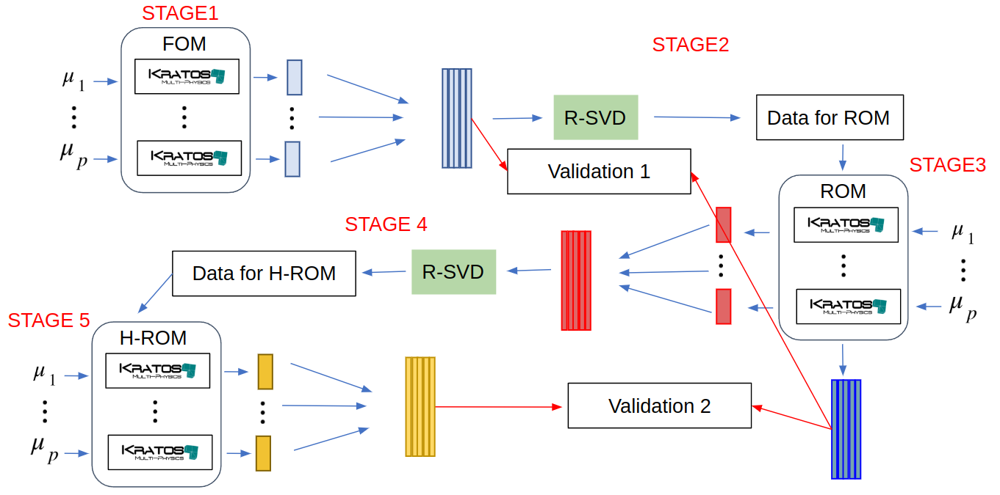

### This HPC Workflow uses [COMPSs](https://compss-doc.readthedocs.io/en/stable/) and [dislib](https://dislib.readthedocs.io/en/release-0.7/) for the parallelization of a projection-based Reduced Order Model using the [RomApplication](https://github.com/KratosMultiphysics/Kratos/tree/master/applications/RomApplication) of Kratos.

#### The toy model used for this example:

Flow pass a cylinder in 2D

<p align="center">
  
</p>

#### The Reduced Order Model

The goal of the ROM is to cheaply and fastly evaluate the solution for a given parameter of interest $\boldsymbol{\mu}$ (in this example, the inlet velocity of the fluid) 

<p align=center></p>

In oder to obtain such a ROM, a campain of expensive Full Order Model FOM simulations should be launched and the collected data should be analysed.


#### The workflow

We have defined 5 stages of the workflow, each of which finds a one-to-one correspondance to the functions included in the file [WorkflowExample.py](https://github.com/KratosMultiphysics/Examples/blob/eFlows4HPC_M20/eFlows4HPC/ROM_workflow/WorkflowExample.py)

~~~python
simulations_data = Stage0_GetDataForSimulations()
SnapshotsMatrix = Stage1_RunFOM(parameters, simulations_data)
Stage2_rSVD(SnapshotsMatrix, simulations_data)
SnapshotsMatrixROM = Stage3_RunROM(parameters, simulations_data)
compare_FOM_vs_ROM(SnapshotsMatrix, SnapshotsMatrixROM)
Stage4_TrainHROM(parameters, simulations_data)
SnapshotsMatrixHROM = Stage5_RunHROM(parameters,simulations_data)
compare_ROM_vs_HROM(SnapshotsMatrixROM, SnapshotsMatrixHROM)
~~~


<p align=center></p>


The parallelization of the Kratos simulations is done using [COMPSs](https://compss-doc.readthedocs.io/en/stable/)

<p align=center></p>


Moreover, the fixed-rank randomized svd used in this workflow is implemented using [dislib](https://dislib.readthedocs.io/en/release-0.7/) and can be found HERE (PUT HERE PATH TO PARALLEL SVD ONCE IT'S MERGED)


## How to launch the example

### Requirements

#### Kratos

This example requires the RomApplication and the FluidDynamicsApplication.

If you compiled Kratos, add both these application to the Kratos configure file. 

Linux:
```shell
add_app ${KRATOS_APP_DIR}/StructuralMechanicsApplication
add_app ${KRATOS_APP_DIR}/RomApplication
```

Windows:
```shell
CALL :add_app %KRATOS_APP_DIR%/StructuralMechanicsApplication
CALL :add_app %KRATOS_APP_DIR%/RomApplication
```

If on the other hand, you are using the precompiled version of Kratos, do

pip:
```shell
pip install KratosRomApplication KratosFluidDynamicsApplication
```

#### COMPSs

The latest version of COMPSs can be obtained [here](https://www.bsc.es/research-and-development/software-and-apps/software-list/comp-superscalar/downloads). 

Building it in your local machine is a bit tricky, but a docker image is also available. 

In case of doubts, or to install in a cluster, get in touch with the developers Jorge Ejarque (jorge.ejarque@bsc.es), Rosa M. Badia (rosa.m.badia@bsc.es), Support mailing list (support-compss@bsc.es).


#### Dislib

The latest version of dislib can be obtained from [here](https://github.com/bsc-wdc/dislib)

Else, you can use pip

```shell
pip install dislib
```


### Launching the example

#### Local machine

In you own computer, use the runcompss command to launch the workflow. 

The [WorkflowExample.py](https://github.com/KratosMultiphysics/Examples/blob/eFlows4HPC_M20/eFlows4HPC/ROM_workflow/WorkflowExample.py) expects the directory to be passed, since COMPSs works with absolute paths.

Activate tracing -t and graph -g generation flags to better analyse the results

So, in order to launch the workflow, do

```shell
runcompss --lang=python --python_interpreter=python3 -g WorkflowExample.py $PWD
```


#### Cluster

In a cluster, use the enqueue_compss command with the appropriate flags. For example: 

```shell
enqueue_compss \
 --qos=$queue \
 -t -g \
 --log_level=info \
 --base_log_dir=${base_log_dir} \
 --worker_in_master_cpus=0 \
 --max_tasks_per_node=12 \
 --exec_time=$time_limit \
 --python_interpreter=python3 \
 --num_nodes=$num_nodes WorkflowExample.py $PWD
 ```

### Checking the results


