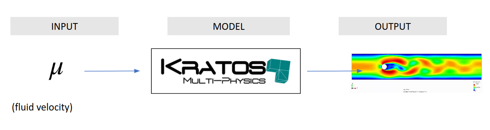

### This is a "How to?" example for using a MPI Randomized Singular Value Decomposition (rSVD).
To test the rSVD, it is needed to compile the [RomApplication](https://github.com/KratosMultiphysics/Kratos/tree/master/applications/RomApplication) of Kratos.

This tool can be tested through two options:
* Using Kratos Multiphysics.
  * Build and write the snapshots matrix with Kratos Multiphysics capabilities ([FluidDynamicsApplication (https://github.com/KratosMultiphysics/Kratos/tree/master/applications/FluidDynamicsApplication)). 
  * Read the snapshots matrix.
  * Perform the rSVD.
* As a blackbox.
  * Read the snapshots matrix.
  * Perform the rSVD.
#### The toy model used for this example:

Flow pass a cylinder in 2D (for more details [Body-fitted 100 Re cylinder](https://github.com/KratosMultiphysics/Examples/blob/master/fluid_dynamics/validation/body_fitted_cylinder_100Re/README.md))

<p align="center">
  
</p>

## How to launch the example
### Using Kratos Multiphysics

The goal of the ROM is to cheaply and fastly evaluate the solution for a given parameter of interest $\boldsymbol{\mu}$ (in this example, the inlet velocity of the fluid) 

<p align=center></p>

To obtain such a ROM, a costly Full Order Model FOM simulation campaign should be launched, and the collected data should be analyzed using a Singular Value Decomposition. The models can be found in a high-dimensional space, requiring the use of HPC (High Performance Computing) tools such as the MPI version of the Randomized Singular Value Decomposition.

To test this tool, first it is needed to build the data from the full order model.

### Requirements

#### Kratos

This example requires the RomApplication and the FluidDynamicsApplication.

If you compiled Kratos, add both these application to the Kratos configure file. 

Linux:
```shell
add_app ${KRATOS_APP_DIR}/FluidDynamicsApplication
add_app ${KRATOS_APP_DIR}/RomApplication
```

Windows:
```shell
CALL :add_app %KRATOS_APP_DIR%/FluidDynamicsApplication
CALL :add_app %KRATOS_APP_DIR%/RomApplication
```

If on the other hand, you are using the precompiled version of Kratos, do

pip:
```shell
pip install KratosRomApplication KratosFluidDynamicsApplication
```
For more details, please refear to [Kratos Multiphysics Installation](https://github.com/KratosMultiphysics/Kratos/blob/master/INSTALL.md).

The files needed to launch the simulations are the following:
* MainKratos.py (Import Kratos, run simulation, and write snapshots matrix).
* ProjectParameters.json (Configuration settings for solvers, processes or utilities).
* FluidMaterials.json (Material properties).
* Flow_past_a_cylinder.mdpa (Mesh and geometry properties).

To launch simulation, do

```shell
python3 MainKratos.py
```
The simulation must generate "SnapshotsMatrix.npy" files containing the solution of all degrees of freedom's velocity and pressure for all time steps.

### Read the snapshots matrix

Once the simulation was performed (or a given "SnapshotsMatrix.npy" files is given), an MPI Randomized Singular Value Decomposition can be applied.

Let us refer to the "SnapshotsMatrix.npy" as $A\in\mathbb{R}^{n\timesm}$. The fixed rank SVD is already incorporated into the HPC workflow, and the workflow is presented next.
#### STEP 1 (DISTRIBUTED): The first step is to build a random test matrix  to sample the column space of $A$:
$$Y=A\Omega$$
#### STEP 2 (DISTRIBUTED): For this step, a distributed tall and skinny QR described in (Citar a Demmel) and developed by the BSC group, was coupled with the randomized SVD algorithm. A brief summary of the algorithm is depicted in Figure x and explained here:
For instance, let us consider the matrix $Y$ partitioned into 4 tasks:
$$Y=\left(\begin{array}{c}
Y_1\\
Y_2\\
Y_3\\
Y_4
\end{array}\right)$$
Compute the serial QR decomposition on each task:

Collect into a single task the R factors and perform a serial QR decomposition:

Scatter the  factors to the different tasks and multiply them to emit the final :


#### STEP 3 (DISTRIBUTED): It is now possible to project  into a much smaller space with the help of :

.
#### STEP 4 (SERIAL): Obtain the economy SVD on  and truncate the desired rank :

.
#### STEP 5 (DISTRIBUTED): Obtain the left singular vectors of  of the desired rank  by projecting  into :

.


