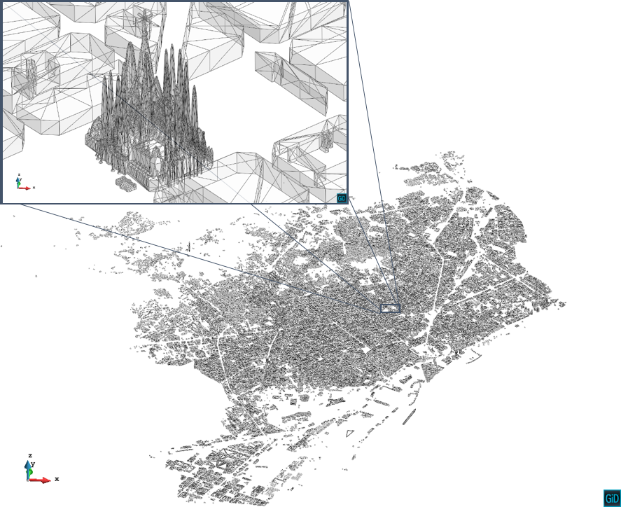
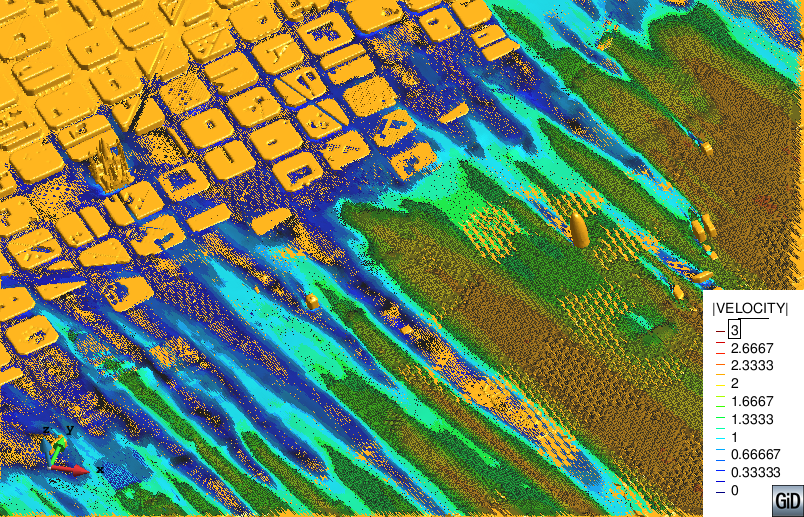

# 3D Wind over Barcelona

**Author:** Pooyan Dadvand

**Kratos version:** 5.0

## Case Specification

A very large 3d cfd simulation over Barcelona city. This case has been simmulated in framework of NUMEXAS project in order to to verify the scalability of the solver and its capability in dealing with large problems. It also verifies the robustness and capability of the entire solution pipeline. The figure below shows the model of Barcelona without terrain. It is easy to observe the complexity of the problem and point out the importance of having a robust solution for large problems.

The Barcelona model has been generated for visualization purposes. The terrain and buildings where in different archives and each had several micro gaps and overlaps. Moreover, the terrain and buildings were not correctly matched, which resulted in thousands of kinks and T junctions. 

The simulation has been performed over a (64x64x1 kilo meter) box which was aligned with the main-wind direction in order to simplify the boundary conditions.A sample vertical profile of the early morning wind was assigned as incoming wind (for simplicity, its values were considered to be constant during the time of the simulation). Slip condition were assigned to the roof and walls of the air box. The embedded boundary conditions of immersed buildings were also considered as slip condition in the solver.

Applying 4 meter mesh size to builidings and using an GiD octree mesher with 1:2 grow ratio results in a mesh with 340M unstructured tetrahedra elements. 

The following applications of Kratos are used:
* TrilinosApplication
* FluidDynamicsApplication

## Results
The problem stated above has been solved in HLRN machine using 3k cores. The obtained velocity field over a (+40m horizontal) cut surface are shown below.

