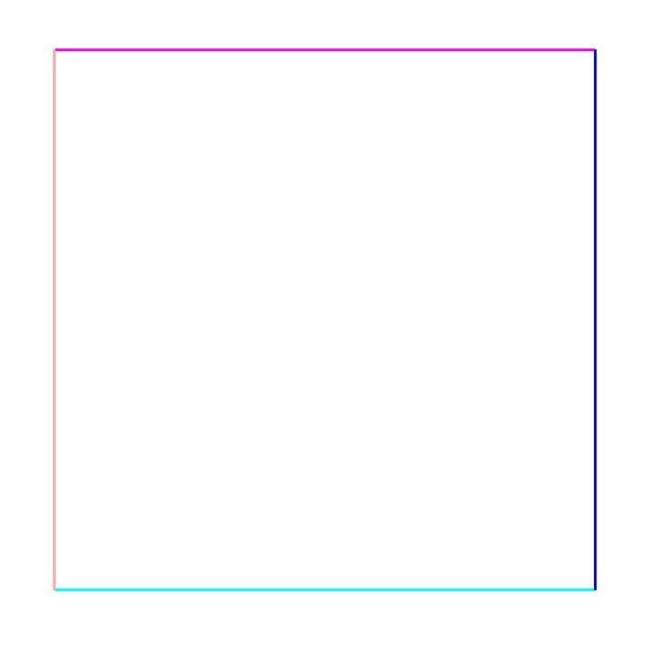

# Kelvin–Helmholtz instability - Example for usage of Periodic Boundary conditions

**Author:** Aditya Ghantasala

**Kratos version:** Current Head

**Source files:** [Kelvin–Helmholtz instability](https://github.com/KratosMultiphysics/Examples/tree/master/fluid_dynamics/use_cases/kelvin_helmholz_instability/source)

## Problem definition
To demonstrate the usage of periodic boundary conditions. The problem is a well known and documented natural phenomenon of Kelvin–Helmholtz instability. More information on the phenomenon can be found in this [Wikipedia page](https://en.wikipedia.org/wiki/Kelvin%E2%80%93Helmholtz_instability)

The problem setup consists of a unit square with two different velocities on the top and bottom halfs. This is illustrated in the Figure 1. The upper half (in Brown color) has a velocity in positive X direction with a magnitude of 3. The lower half (in Green color) has a velocity in negative X direction with a magnitude of 3.

_Fluid with two different speeds[1]_

The below figure shows different boundary condition applied on the unit square domain from Figure 1. The Left and Right edges (in Orange and Blue respectively) are choosen as periodic boundaries. A slip boundary condition is applied on Top and Bottom boundaries (in Pink and Green respecitively).

_Visualization of Boundary conditions [2]_

## Results

A simulation is performed with the above boundary conditions. The contours of Voriticity magnitude of the fluid are animated in the below figure.

_Vorticity Magnitude[3]_

The result of expected mixing of two fluids as in the Wikipedia page can be observed above.

