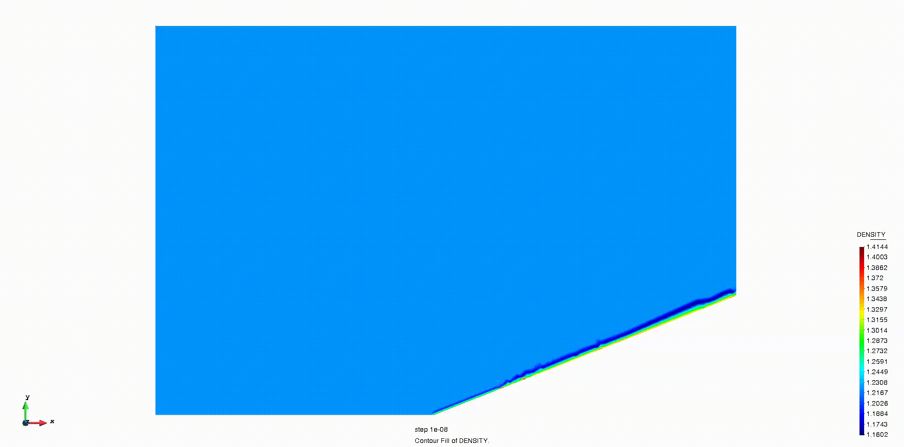
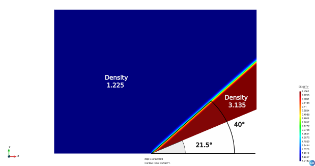

# Mach 3 Wedge

**Author:** [Marco Antonio Zuñiga Perez](https://github.com/marco1410)

**Kratos version:** 9.2

**Source files:** [Wedge](https://github.com/KratosMultiphysics/Examples/tree/master/fluid_dynamics/validation/compressible_Wedge/source)

## Case Specification
This is a classical 2D simulation of a supersonic flow over a wedge using the Euler equations.

The supersonic flow will create an oblique shock over the wedge that reach a stedy state very quickly.

The problem geometry consist of a Wedge with an angle of 21.5° in a rectangular domain. The Wedge and bottom boundaries are free-slip. The right and top boundaries are left open and the left boundary enforces same values as the initial conditions:
* Density (&rho;): 1.225 _kg/m3_
* Velocity (_v_): [1020.61, 0.0] _m/s_
* Temperature (_T_): 288.15 _K_

Concerning the material, a perfect fluid with the characteristic parameters listed below is used.
* Dynamic viscosity (&mu;): 0.0000178
* Thermal conductivity (&kappa;): 0.001
* Specific heat (_cp_): 717.25 _J/KgK_
* Heat capacity ratio (&gamma;): 1.4

An adaptive time step strategy based on the CFL and Fourier number is used.

## Results
The problem is solved with a Variational Multi-Scale stabilized compressible Navier-Stokes formulation written in conservative variables (1) with a physics-based shock capturing technique, described in (2). A Forth order Runge-Kutta time-scheme is used.

The computational domain is meshed with 27k linear triangular elements.

  

  

The values obtained are consistent with the analitical results.

## References

(1) Bayona Roa, C.A., Baiges, J. and Codina, R. (2016), Variational multi-scale finite element approximation of the compressible Navier-Stokes equations, International Journal of Numerical Methods for Heat & Fluid Flow, Vol. 26 No. 3/4, pp. 1240-1271. [https://doi.org/10.1108/HFF-11-2015-0483](https://doi.org/10.1108/HFF-11-2015-0483 )

(2) Fernandez, P., Nguyen, C., & Peraire, J. (2018), A physics-based shock capturing method for unsteady laminar and turbulent flows. In 2018 AIAA Aerospace Sciences Meeting (p. 0062). [https://doi.org/10.2514/6.2018-0062](https://doi.org/10.2514/6.2018-0062)
