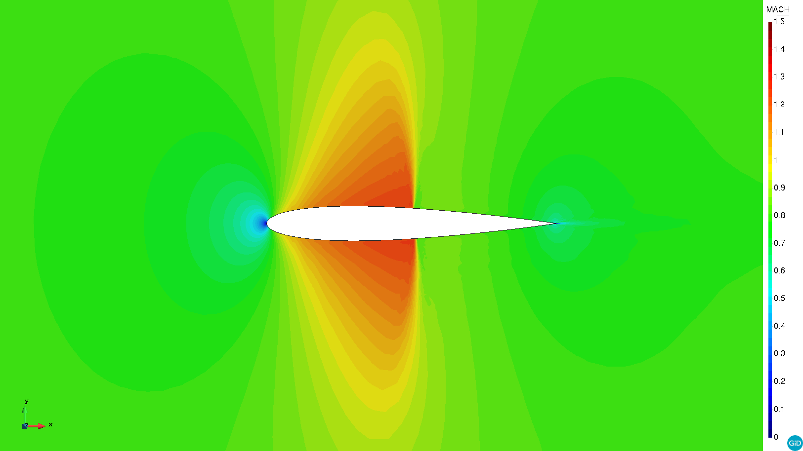
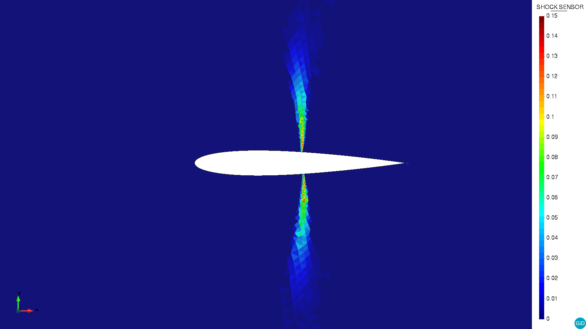

# Transonic flow around a NACA0012 profile

**Author:** [Rubén Zorrilla](https://github.com/rubenzorrilla)

**Kratos version:** 8.1

**Source files:** [Transonic flow around a NACA0012 profile](https://github.com/KratosMultiphysics/Examples/tree/master/fluid_dynamics/validation/compressible_naca_0012_Ma_0.8/source)

## Case Specification
This is a 2D simulation of a NACA0012 profile under transonic flow conditions (Ma = 0.8).

The problem geometry consists in a rectangular 20x25m channel with a 12.5m radius semicilinder attached to its left edge. The front tip of the unit length NACA0012 profile is located at the (0.0,0.0)m coordinates.

The normal component of the momentum is set to zero in the top, bottom and aerofoil walls. The momentum is also set to zero in the trailing edge of the NACA0012 profile. According to the transonic nature of the flow, the momentum, density and energy are fixed in the semicilinder inlet region to 266.67 _Kg/m2s_, 1 _Kg/m3_ and 232.7 _kJ_. A free stream condition is considered in the outlet.

Concerning the material, a Newtonian fluid with the characteristic parameters listed below is used.
* Dynamic viscosity (&mu;): 2E-05 _Kg/ms_
* Thermal conductivity (&kappa;): 0.024 _J/sKm_
* Specific heat (_cp_): 722.14 _J/KgK_
* Heat capacity ratio (&gamma;): 1.4

An adaptive time step strategy based on the CFL and Fourier numbers is used.

## Results
The problem is solved with a Variational Multi-Scale stabilized compressible Navier-Stokes formulation written in conservative variables (1). An explicit 4th order Runge-Kutta explicit strategy is used for the time discretization. The physics-based shock capturing technique described in (2) is also used. The solution from the resolution of an incompressible potential flow problem is used as initial condition.

The computational domain is meshed with 42k linear triangular elements. Below three snapshots depicting the Mach number, density and shock sensor fields are shown. As it can be observed, the expected symmetric solution and shocks are obtained.

## References
(1) Bayona Roa, C.A., Baiges, J. and Codina, R. (2016), Variational multi-scale finite element approximation of the compressible Navier-Stokes equations, International Journal of Numerical Methods for Heat & Fluid Flow, Vol. 26 No. 3/4, pp. 1240-1271. [https://doi.org/10.1108/HFF-11-2015-0483 ](https://doi.org/10.1108/HFF-11-2015-0483 )

(2) Fernandez, P., Nguyen, C., & Peraire, J. (2018), A physics-based shock capturing method for unsteady laminar and turbulent flows. In 2018 AIAA Aerospace Sciences Meeting (p. 0062). [https://doi.org/10.2514/6.2018-0062](https://doi.org/10.2514/6.2018-0062)

  

  3]." style="width: 600px;"/>

  

