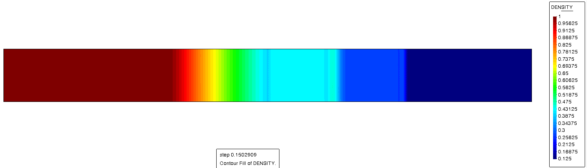
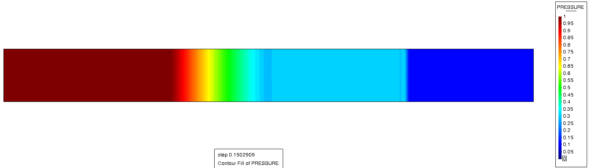

# Sod shock tube

**Author:** [Eduard Gómez](https://github.com/EduardGomezEscandell)

**Kratos version:** 9.2

**Source files:** [Sod shock tube](https://github.com/KratosMultiphysics/Examples/tree/master/fluid_dynamics/validation/compressible_sod_shock_tube/source)

## Case Specification
This is a 2D simulation of the classical Sod shock tube benchmark, using the Euler equations. This test case was popularized by Gary A. Sod (1).

The problem geometry consists in a rectangular domain, 1 meter long and 0.1 meters wide, with free-slip conditions on log sides and open boundaries on the sort sides. The Sod shock problem is one-dimensional, which coincides with the X-axis in this case. Hence, no variations along the Y-axis are obseeerved.

The initial condition is diferent on the left and right sides. The separation is located at x=0.5.

| Property      | Left side     | Right side    |
| ------------- | ------------- | ------------- |
| Density       | 1.0           | 0.125         |
| Pressure      | 1.0           | 0.1           |
| Velocity      | 0.0           | 0.0           |

Concerning the material, a perfect fluid with the characteristic parameters listed below is used.
* Dynamic viscosity (&mu;): 0
* Thermal conductivity (&kappa;): 0
* Specific heat (_cp_): 722.14 _J/KgK_
* Heat capacity ratio (&gamma;): 1.4

An adaptive time step strategy based on the CFL is used.

## Results
The problem is solved with a Variational Multi-Scale stabilized compressible Navier-Stokes formulation written in conservative variables (2). An explicit third order otal-variational-diminishing Runge-Kutta explicit strategy is used for the time discretization, see (3) for more details. The physics-based shock capturing technique described in (4) is also used.

The computational domain is meshed with 36k linear triangular elements. Below are three snapshots depicting the density, velocity and x-velocity profiles at t=0.15. This case's is interest is in the featuring of three compressible phenomena, from left to right: a rarefication, a contact discontinuity and a normal shock.

  

  

  

## References
(1) Sod, G. A. (1978). A survey of several finite difference methods for systems of nonlinear hyperbolic conservation laws. Journal of computational physics, 27(1), 1-31. https://doi.org/10.1016/0021-9991(78)90023-2

(2) Bayona Roa, C.A., Baiges, J. and Codina, R. (2016), Variational multi-scale finite element approximation of the compressible Navier-Stokes equations, International Journal of Numerical Methods for Heat & Fluid Flow, Vol. 26 No. 3/4, pp. 1240-1271. [https://doi.org/10.1108/HFF-11-2015-0483](https://doi.org/10.1108/HFF-11-2015-0483 )

(3) Gottlieb, S., & Shu, C. W. (1998). Total variation diminishing Runge-Kutta schemes. Mathematics of computation, 67(221), 73-85.[https://doi.org/10.1090/S0025-5718-98-00913-2](https://doi.org/10.1090/S0025-5718-98-00913-2).

(4) Fernandez, P., Nguyen, C., & Peraire, J. (2018), A physics-based shock capturing method for unsteady laminar and turbulent flows. In 2018 AIAA Aerospace Sciences Meeting (p. 0062). [https://doi.org/10.2514/6.2018-0062](https://doi.org/10.2514/6.2018-0062)
