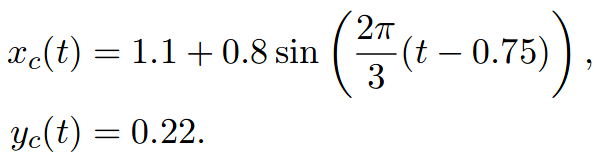
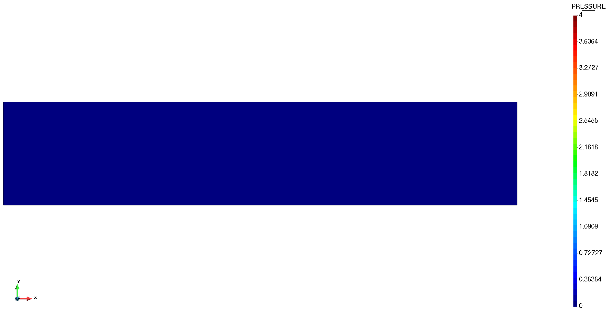
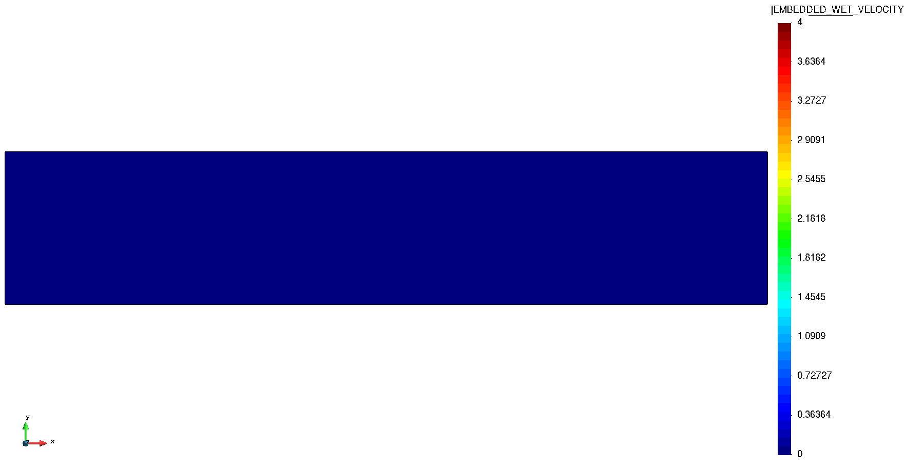

# Body-fitted 100 Re cylinder

**Author:** [Rubén Zorrilla](https://github.com/rubenzorrilla)

**Kratos version:** 7.0

**Source files:** [Embedded moving cylinder](https://github.com/KratosMultiphysics/Examples/tree/master/fluid_dynamics/validation/embedded_moving_cylinder/source)

## Case Specification
This is a 2D embedded CFD simulation of a moving cylinder inside a channel. The presented example was firstly proposed in "The Fixed-Mesh ALE approach for the numerical approximation of flows in moving domains" from Codina et. al. (2009).

The problem geometry consists in a 2.2 x 0.44 m channel inside which a moving cylinder is placed. The cylinder is assumed to be a rigid body and the initial coordinates of its center are (1.1,0.22) m while its radius is 0.1 m. The trajectory of the cylinder center point is described by the equation below.

  

The cylinder as well as the channel walls are considered to be no-slip. The pressure is fixed to zero along the right edge. Initially, the fluid is at rest. Note that there is no inlet wall. Thus, the fluid flow is only induced by the movement of the rigid cylinder.

Concerning the material, a Newtonian fluid with the characteristic parameters listed below is used. Taking into account the cylinder diameter and the fluid peak velocity when the cylinder is located in the center section of the channel, these properties lead to a Reynolds number around 300.
* Density (&rho;): 1 _Kg/m3_
* Dynamic viscosity (&mu;): 1E-03 _Kg/ms_

The time step is 0.05 seconds, while the total simulation time is 3.0 seconds, which represents a full period of oscillation.

## Results
The above stated problem has been solved using an embedded Navier-Stokes formulation with ASGS stabilization. A modified Nitsche formulation is used to weakly impose the no-slip boundary condition in the embedded boundary. On top of this, the Fixed-Mesh Arbitrary Lagrangian Eulerian (FM-ALE) algorithm is used to consistently handle the time derivatives approximation when the cylinder moves.

The mesh is similar to the reference publication one and is made up of around 10.2K linear triangular elements. The obtained velocity and pressure fields are shown in the animations below. As can be observed, the cylinder movement induces the fluid movement in the channel. By inspecting the reference results, it can be said that they are really similar to the obtained ones. Note that two output files are generated, one is the common output from the fluid solver and the other one shows the mesh displacement and velocity in the virtual mesh of the FM-ALE algorithm.

  

  

