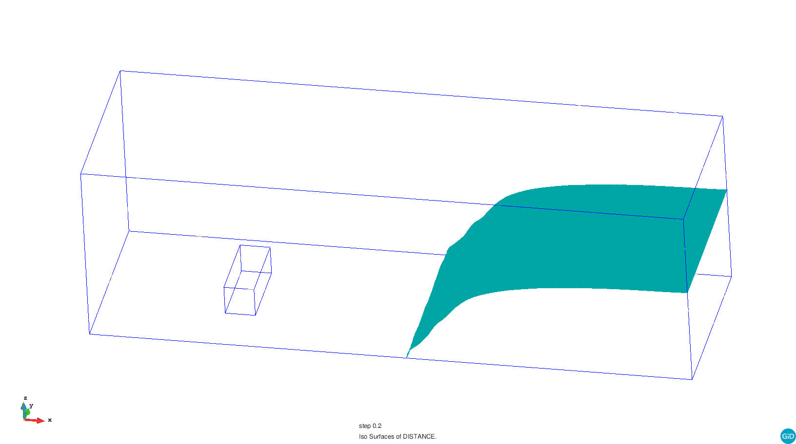
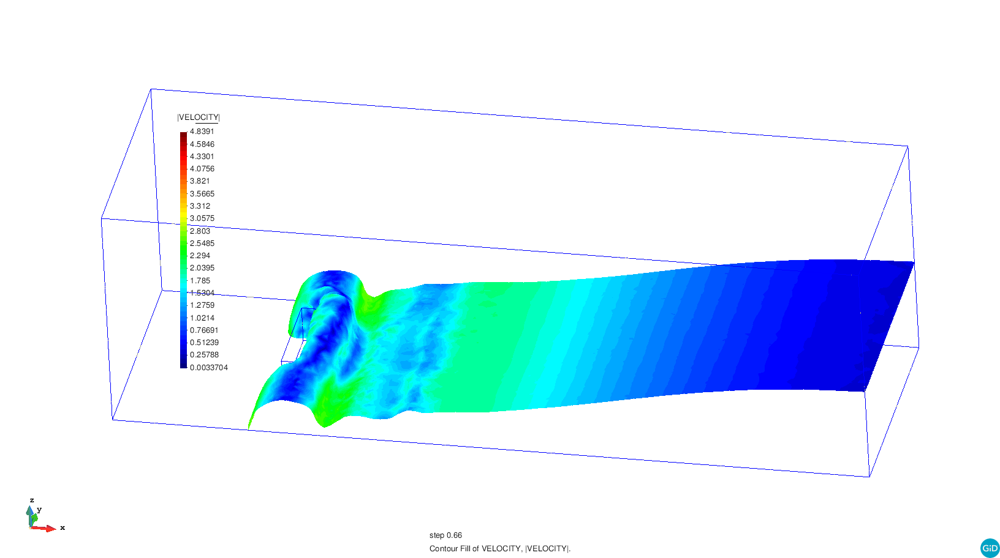

# Two-fluids dam break scenario

**Author:** [Simon von Wenczowski](https://github.com/swenczowski)

**Kratos version:** 7.0

**Source files:** [Two-fluids dam break scenario](https://github.com/KratosMultiphysics/Examples/tree/master/fluid_dynamics/validation/two_fluid_dam_break/source)

## Case Specification
A water-filled cuboid is positioned in one part of the domain. It is released at time 0.0 and the water spreads across the domain driven by gravity. The water hits an obstacle and splashes develop. Here, a strong dependency on the spatial resolution can be observed. Apart from the splashes, even a relatively coarse mesh resolution is able to achieve a good result. More details on the boundary conditions and problem settings can be found in Larese et. al. (2008).

Depending on the computational resources available, the user may wish for a higher resolution to better capture the splashes. To achieve this, the mesh can be redefined in GiD (without altering the names of the groups) to generate a new input *.mdpa file. Then the new *.mdpa file must be modified such that the first lines look like the following:

```
Begin ModelPartData
// VARIABLE_NAME value
End ModelPartData

Begin Properties 0
End Properties

Begin Properties 1
    DENSITY < value for your fluid >
    DYNAMIC_VISCOSITY < value for your fluid >
End Properties

Begin Properties 2
    DENSITY < value for your fluid >
    DYNAMIC_VISCOSITY < value for your fluid >
End Properties

Begin Nodes
1 0.0000000000 1.0000000000 0.0000000000
2 0.0240509017 0.9791931353 0.0320937254
...
```

Mesh size reference values:
- given case set-up: 100.000 elements (splashes are under-represented)
- case in pictures: 1.200.000 elements (splashes are well-represented)

## Results
The following pictures collect the obtained results with a 1.200.000 elements mesh

<p align="center">
  
</p>

<p align="center">
  
</p>

<p align="center">
  
</p>

<p align="center">
  
</p>

<p align="center">
  
</p>

## References
A. Larese, R. Rossi, E. Oñate, S.R. Idelsohn, (2008) "Validation of the particle finite element method (PFEM) for simulation of free surface flows", Engineering Computations, Vol. 25 Issue: 4, pp.385-425, [https://doi.org/10.1108/02644400810874976](https://doi.org/10.1108/02644400810874976)