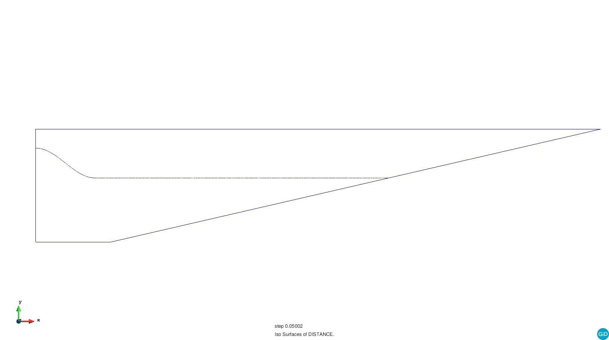
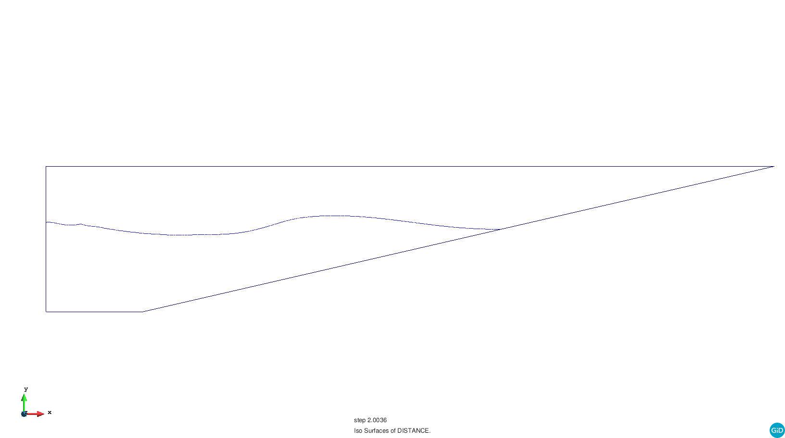
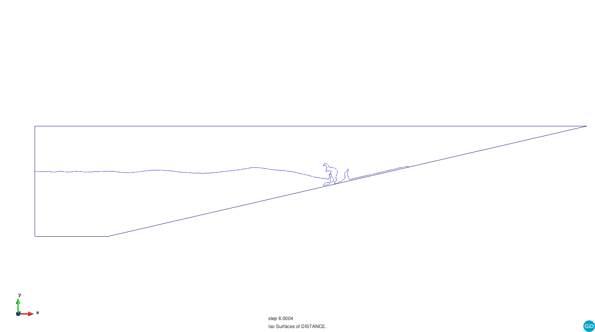
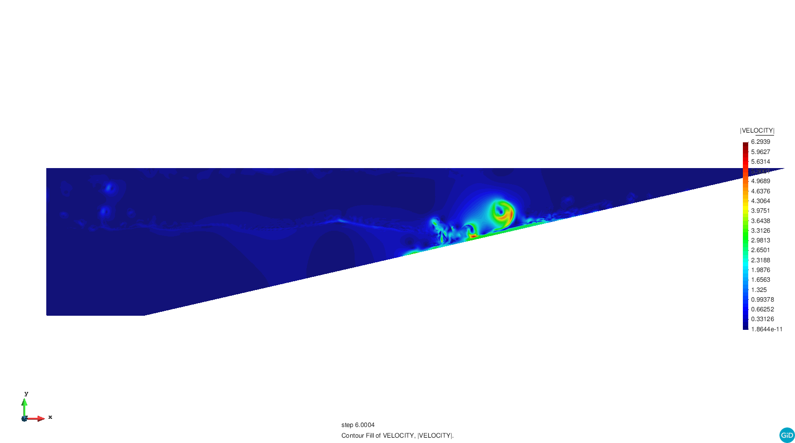
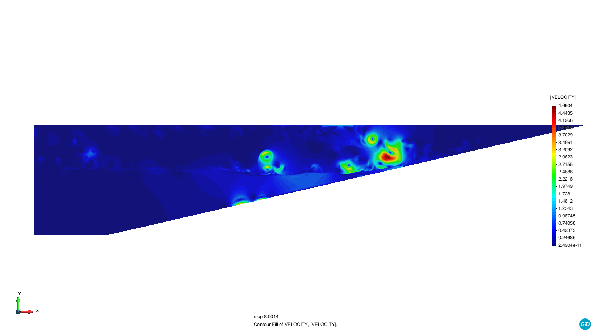

# Two-fluids wave propagation

**Author:** [Simon von Wenczowski](https://github.com/swenczowski)

**Kratos version:** 7.0

**Source files:** [Two-fluids wave propagation](https://github.com/KratosMultiphysics/Examples/tree/master/fluid_dynamics/validation/two_fluid_wave/source)

## Case Specification
A sine-shaped wave is generated by an artificial elevation of the water surface in the domain. The wave travels across the domain where the water height decreases steadily. Accordingly, the situation could be interpreted as a very simplified case of a wave approaching the beach.

Depending on the computational resources available, the user may wish for a higher resolution to better capture the splashes. To achieve this, the mesh can be redefined in GiD (without altering the names of the groups) to generate a new input *.mdpa file. Then the new *.mdpa file must be modified such that the first lines look like the following:

```
Begin ModelPartData
// VARIABLE_NAME value
End ModelPartData

Begin Properties 0
End Properties

Begin Properties 1
    DENSITY < value for your fluid >
    DYNAMIC_VISCOSITY < value for your fluid >
End Properties

Begin Properties 2
    DENSITY < value for your fluid >
    DYNAMIC_VISCOSITY < value for your fluid >
End Properties

Begin Nodes
1 0.0000000000 1.0000000000 0.0000000000
2 0.0240509017 0.9791931353 0.0320937254
...
```

Mesh size reference values:
- given case set-up: 5.000 elements (3-5 min on a laptop)
- case in pictures: 300.000 elements (splashes are well-represented)

## Results
The following pictures collect the obtained results obtained at several time steps using a 300.000 elements mesh

<p align="center">
  
</p>

<p align="center">
  
</p>

<p align="center">
  
</p>

<p align="center">
  
</p>

<p align="center">
  
</p>

<p align="center">
  
</p>

<p align="center">
  
</p>

<p align="center">
  
</p>

<p align="center">
  
</p>

<p align="center">
  
</p>
