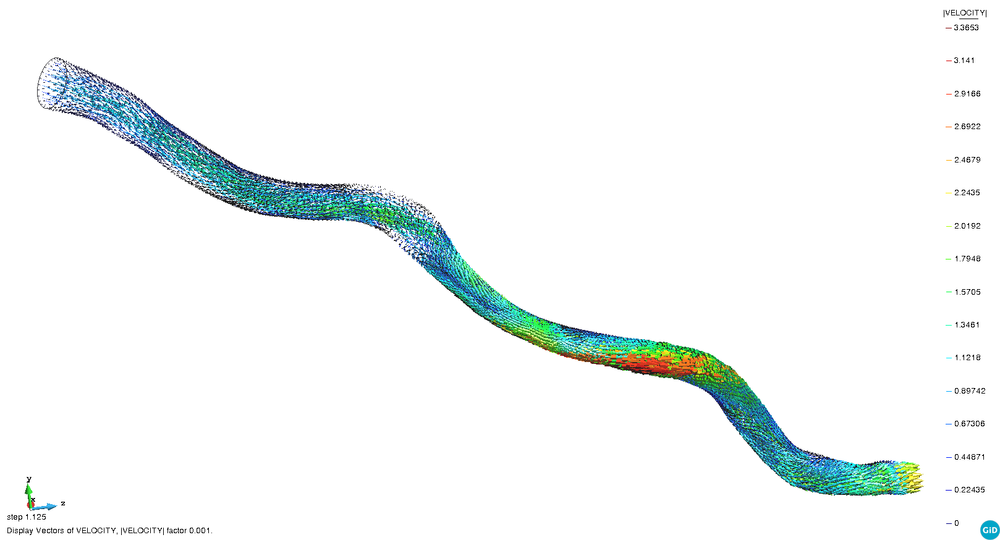
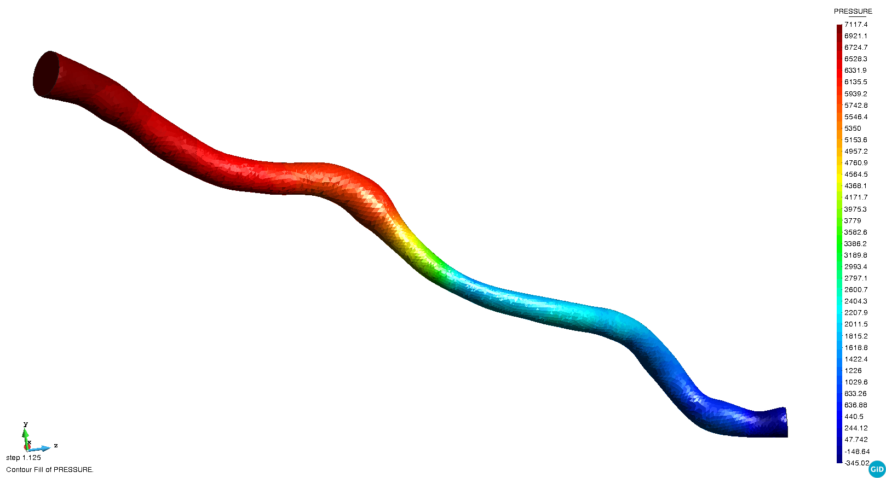

# Coronary artery

**Author:** [Rubén Zorrilla](https://github.com/rubenzorrilla) and [Eduardo Soudah](https://github.com/soudah)

**Kratos version:** 9.1

**Source files:** [Coronary](https://github.com/KratosMultiphysics/Examples/tree/master/fluid_dynamics_biomedical/validation/coronary/source)

## Case Specification
This is a 3D CFD simulation of a coronary artery.

The problem geometry consists in coronary artery section of approximately 6 cm lenght and 2 mm diameter with a narrowing in the mid part. A no-slip condition is imposed in the walls. The pressure is fixed to zero in the outlet region. A parabolic inlet function, which maximum is 1.0 m/s, is set in the inlet surface.

Concerning the material properties, a Newtonian constitutive law is used. The fluid characteristic parameters are:
* Density (&rho;): 1050 _Kg/m3_
* Dynamic viscosity (&mu;): 3.5E-03 _Kg/ms_

The time step is 0.005 seconds, while the total simulation time is 1.12 seconds. This is more than enough to reach a steady state solution.

## Results
The problem is solved using an incompressible Navier-Stokes formulation with ASGS stabilization. The mesh is made up of around 166K linear tetrahedral elements, including the boundary layer mesh. The obtained velocity and pressure fields are shown in the animations below. The results postprocess also includes the calculation of the Wall Shear Stress (WSS) related magnitudes.

  

  

