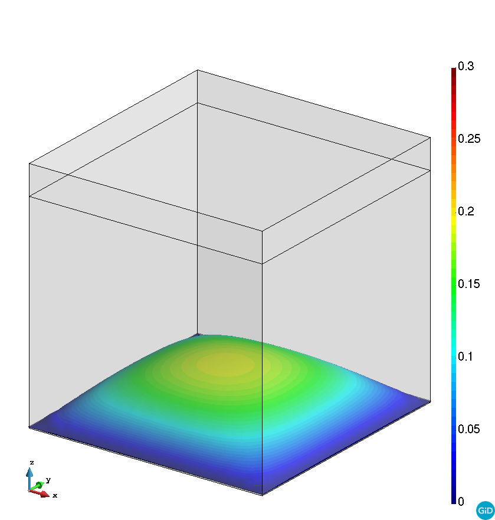
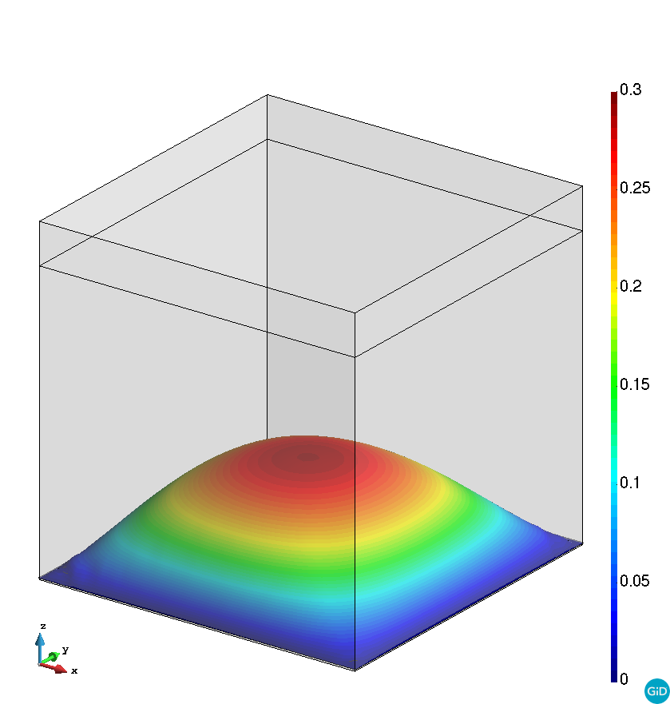

# FSI lid driven cavity

**Author:** [Rubén Zorrilla](https://github.com/rubenzorrilla)

**Kratos version:** 8.1

**Source files:** [FSI lid driven cavity (embedded)](https://github.com/KratosMultiphysics/Examples/tree/master/fluid_structure_interaction/validation/embedded_fsi_lid_driven_cavity/source)

## Case Specification
This case is a 3D version of the 2D example presented in [here](https://github.com/KratosMultiphysics/Examples/tree/master/fluid_structure_interaction/validation/fsi_lid_driven_cavity). The problem geometry is a unit cube with a flexible membrane placed in the bottom part of the cube. Note that, as the membrane is embedded, it effectively separates the fluid volume in two separated cavities. More details on the case set up, material settings and boundary conditions can be found in [here](https://doi.org/10.1016/j.cma.2020.113179).

## Results
The fluid domain is meshed with a 123k structured tetrahedra Q1P1 elements mesh. The bottom membrane 5.7k thriangular thin corotational shell elements. The problem is run for 70s in order to reproduce the solution periodic regime.

The obtained minimum and maximum displacement norms over the deformed geometry are shown below.

<figure>
  
  <figcaption>Min. displacement norm during periodic regime.</figcaption>
</figure>

<figure>
  
  <figcaption>Max. displacement norm during periodic regime.</figcaption>
</figure>

## References
R. Zorrilla, R. Rossi, R. Wüchner and E. Oñate, An embedded Finite Element framework for the resolution of strongly coupled Fluid–Structure Interaction problems. Application to volumetric and membrane-like structures, Computer Methods in Applied Mechanics and Engineering (368), [10.1016/j.cma.2020.113179](https://doi.org/10.1016/j.cma.2020.113179)
