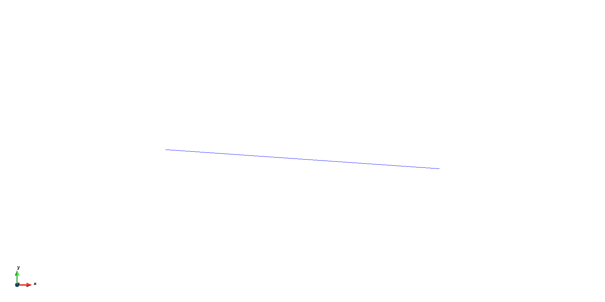

# Flexible membrane airfoil

**Author:** [Rubén Zorrilla](https://github.com/rubenzorrilla)

**Kratos version:** 9.5

**Source files:** [Flexible membrane airfoil](https://github.com/KratosMultiphysics/Examples/tree/master/fluid_structure_interaction/validation/embedded_fsi_membrane_airfoil/source)

## Case Specification
This example reproduces a reduced-scale experiment of a flexible membrane airfoil[1]. The embedded (i.e., CutFEM) framework for thin-walled bodies is applied in order to avoid the preprocessing and mesh entanglement issues appearing when using volumetric meshes around membrane-like bodies [2].

The problem set up consists in a 2D idealization of the flexible membrane airfoil at an angle of attack of 4º. The lenght and thickness of the membrane are 0.15m and 2e-4m, respectively, while the material parameters are a Young modulus of 250e3Pa and zero Poisson ration. The fluid properties are set such that Re=2500. The structure and fluid density ratio is 441.75. The inlet characteristic velocity is 2.5833m/s.

## Results
The fluid domain is meshed with a 144k P1P1 elements unstructured mesh. The membrane is meshed with 128 line elements implementing a simplified 2D non-linear membrane formulation. The problem is run with a ramp up function of 1s and for an extra second so to ensure that the membrane reaches the steady state.

The steady state velocity and pressure contour fields as well as the displacement vector field are shown below. The obtained results are in line with similar numerical experiments [3].

<figure>
  
  <figcaption>Velocity field and level set isosurface.</figcaption>
</figure>

<figure>
  
  <figcaption>Pressure field and level set isosurface.</figcaption>
</figure>

<figure>
  
  <figcaption>Pressure field and level set isosurface.</figcaption>
</figure>

## References
[1] P. Rojratsirikul, Z. Wang and I. Gursul, I, Unsteady Aerodynamics of Membrane Airfoils. Paper presented at 46th AIAA Aerospace Sciences Meeting and Exhibit, Reno, Nevada, 2008 [10.2514/6.2008-613](https://doi.org/10.2514/6.2008-613).

[2] R. Zorrilla, R. Rossi, R. Wüchner and E. Oñate, An embedded Finite Element framework for the resolution of strongly coupled Fluid–Structure Interaction problems. Application to volumetric and membrane-like structures, Computer Methods in Applied Mechanics and Engineering (368), 2020 [10.1016/j.cma.2020.113179](https://doi.org/10.1016/j.cma.2020.113179).

[3] R. E. Gordnier, High fidelity computational simulation of a membrane wing airfoil, Journal of Fluids and Structures (25), 2009, [10.1016/j.jfluidstructs.2009.03.004](https://doi.org/10.1016/j.jfluidstructs.2009.03.004).
