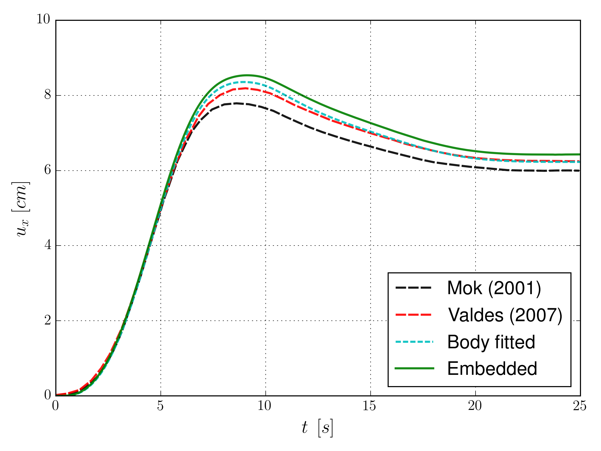

# Mok benchmark

**Author:** [Rubén Zorrilla](https://github.com/rubenzorrilla)

**Kratos version:** 7.0

**Source files:** [FSI-Mok](https://github.com/KratosMultiphysics/Examples/tree/master/fluid_structure_interaction/validation/embedded_fsi_mok/source)

## Case Specification

In this example we solve the Mok benchmark test. The problem geometry, material settings and boundary conditions are equal to the ones presented in [here](https://github.com/KratosMultiphysics/Examples/tree/master/fluid_structure_interaction/validation/fsi_mok/source). However, in this case we use an embedded CFD formulation in the fluid subdomain instead of the traditional body fitted one we use in the previous link example.

## Results
The problem stated above has been solved with a structured mesh with 4x100 divisions composed by linear quadrilateral total Lagrangian elements in the structural domain. In the fluid domain, a mesh composed by around 215k linear triangular elements has been used. The obtained velocity and pressure fields, together with the level set zero isosurface representing the deformed geometry, are shown below. Besides, a comparisons with literature reference solutions as wall as body fitted solver solution are depicted as well.

  

  

  

## References
D.P. Mok. Partitionierte Lösungsansätze in der Strukturdynamik und der Fluid−Struktur−Interaktion. PhD thesis: Institut für Baustatik, Universität Stuttgart, 2001. [https://www.ibb.uni-stuttgart.de/publikationen/fulltext_new/2001/mok_1-2001.pdf](https://www.ibb.uni-stuttgart.de/publikationen/fulltext_new/2001/mok_1-2001.pdf)

G. Valdés. Nonlinear Analysis of Orthotropic Membrane and Shell Structures Including Fluid-Structure Interaction. PhD thesis: Universitat Politècnica de Catalunya, 2007. [http://www.tdx.cat/handle/10803/6866](http://www.tdx.cat/handle/10803/6866)
