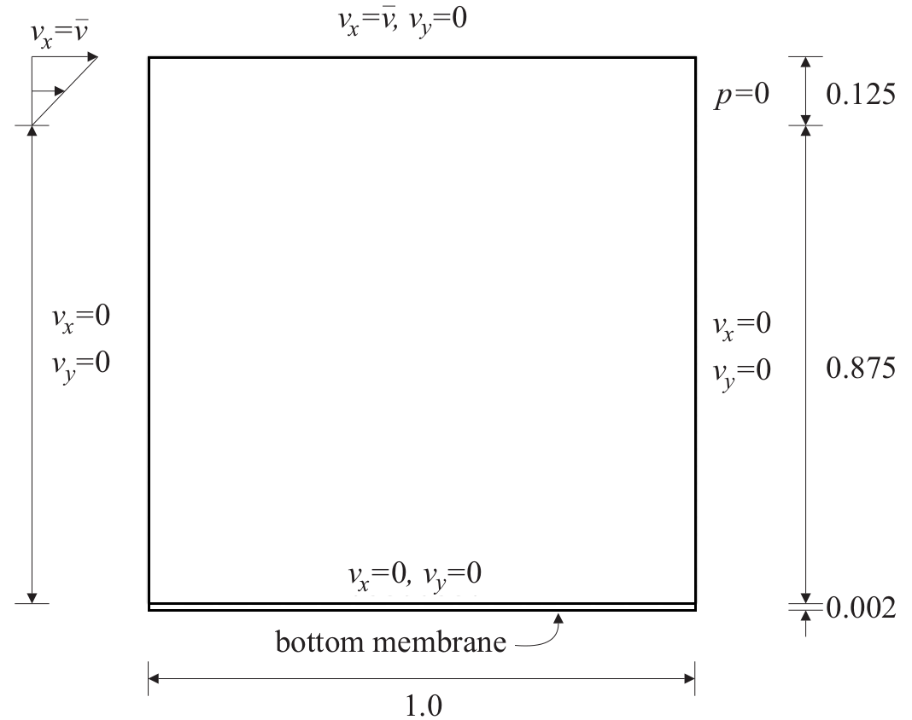
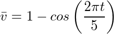
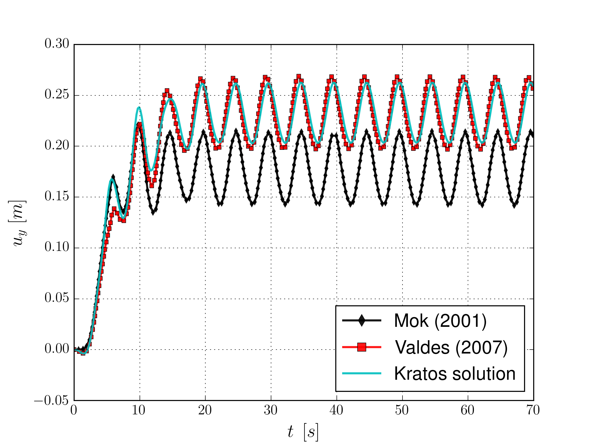

# FSI lid driven cavity

**Author:** Rubén Zorrilla

**Kratos version:** 5.2

**Source files:** [FSI-Lid driven cavity](https://github.com/KratosMultiphysics/Examples/tree/master/fluid_structure_interaction/validation/fsi_lid_driven_cavity/source)

## Case Specification

This is a 2D FSI simulation of the well-known lid-driven cavity flow benchmark. In this FSI adapted version, the fixed bottom wall is deformable meanwhile the originally constant top velocity is substituted by an oscillatory one. Besides, the inlet is extent to be not only the top corners but a region measuring 0.125 the cavity height. The reference solutions have been taken from  Mok (2001) and Valdés (2007). The following applications of Kratos are used:
* ALEApplication
* FSIApplication 
* FluidDynamicsApplication
* StructuralMechanicsApplication

The problem geometry as well as the boundary conditions are sketched below. 

  

Regarding the inlet velocity, the next linear velocity profile is imposed

  

A Newtonian constitutive law is considered in the fluid domain. The fluid characteristic parameters are:
* Density (&rho;): 1 _Kg/m3_
* Kinematic viscosity (&nu;): 1E-02 _m2/s_

On the other hand, a linear elastic plane stress constitutive law with unit thickness is considered in the structure domain. The structure characteristic parameters are
* Density (&rho;): 500 _Kg/m3_
* Elastic modulus (E):  250 _Pa_
* Poisson ratio (&nu;): 0.0 

The time step is 0.1 seconds, while the total simulation time is 70.0 seconds. 

## Results
The problem stated above has been solved using a total Lagrangian approach in the structural domain together with an incompressible Navier-Stokes formulation with ASGS stabilization in the fluid domain. Concerning the mesh, the structure is meshed with a 2x32 divisions structured meshed composed by linear quadrilateral elements. On the other hand, the fluid is meshed with a 32x32 divisions structured mesh composed by linear triangular elements. The obtained velocity and pressure fields, together with the deformed geometry, are shown below. Besides, some comparisons with the reference solutions are depicted as well. 

  

  

  

## References
D.P. Mok. Partitionierte Lösungsansätze in der Strukturdynamik und der Fluid−Struktur−Interaktion. PhD thesis: Institut für Baustatik, Universität Stuttgart, 2001. [https://www.ibb.uni-stuttgart.de/publikationen/fulltext_new/2001/mok_1-2001.pdf](https://www.ibb.uni-stuttgart.de/publikationen/fulltext_new/2001/mok_1-2001.pdf)

G. Valdés. Nonlinear Analysis of Orthotropic Membrane and Shell Structures Including Fluid-Structure Interaction. PhD thesis: Universitat Politècnica de Catalunya, 2007. [http://www.tdx.cat/handle/10803/6866](http://www.tdx.cat/handle/10803/6866)
