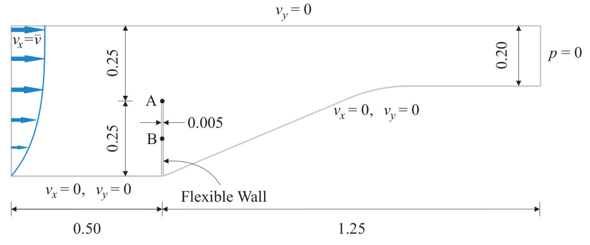
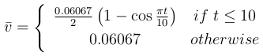
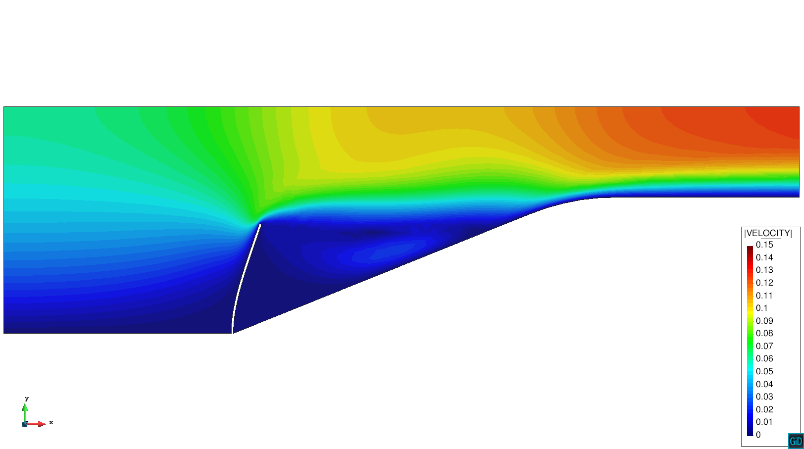
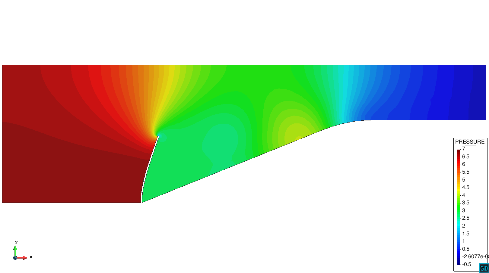
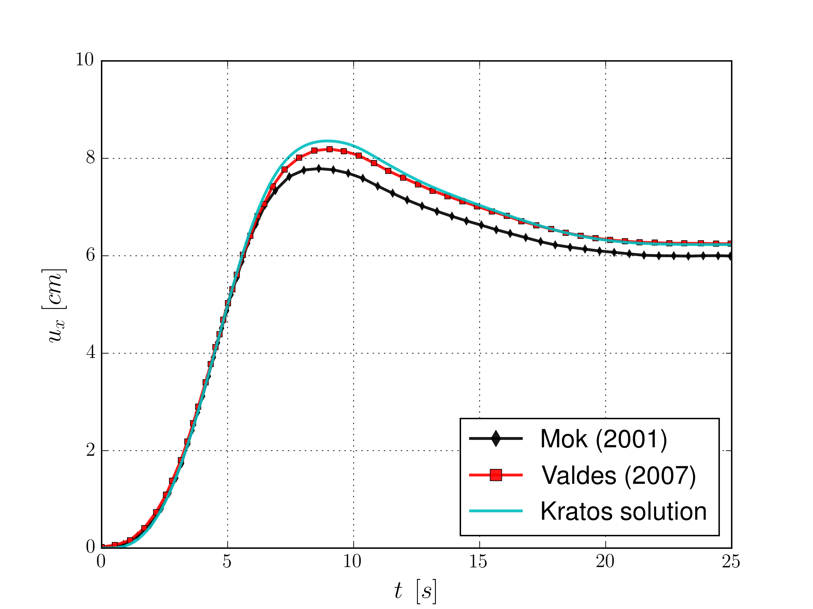

# Mok benchmark

**Author:** [Rubén Zorrilla](https://github.com/rubenzorrilla)

**Kratos version:** 7.0

**Source files:** [FSI-Mok](https://github.com/KratosMultiphysics/Examples/tree/master/fluid_structure_interaction/validation/fsi_mok/source)

## Case Specification

This is a 2D FSI simulation of the Mok benchmark test. It consists in a 2D convergent fluid channel that contains a flexible wall structure attached to its bottom wall. The main challenge of the test is that the densities of the fluid and the structure have similar order of magnitude, leading to a strongly coupled problem in where large interaction between the two fields appears. The reference solutions have been taken from  Mok (2001) and Valdés (2007). The following applications of Kratos are used:
* FSIApplication 
* MeshMovingApplication
* FluidDynamicsApplication
* StructuralMechanicsApplication

The problem geometry as well as the boundary conditions are sketched below. 

  

Regarding the inlet velocity, the next parabolic profile is imposed

  

where the time dependent reference velocity is defined as

  

A Newtonian constitutive law is considered in the fluid domain. The fluid characteristic parameters are:
* Density (&rho;): 956 _Kg/m3_
* Kinematic viscosity (&nu;): 1.51670E-04 _m2/s_

On the other hand, a linear elastic plane stress constitutive law with unit thickness is considered in the structure domain. The structure characteristic parameters are
* Density (&rho;): 1500 _Kg/m3_
* Elastic modulus (E):  2.30000E+06 _Pa_
* Poisson ratio (&nu;): 0.45 

The time step is 0.1 seconds, while the total simulation time is 25.0 seconds.

## Results
The problem stated above has been solved with a structured mesh with 4x100 divisions composed by linear quadrilateral total Lagrangian elements in the structural domain. In the fluid domain, a mesh composed by around 7000 linear triangular elements has been used. The obtained velocity and pressure fields, together with the deformed geometry, are shown below. Besides, some comparisons with the reference solutions are depicted as well. 

  

  

  

## References
D.P. Mok. Partitionierte Lösungsansätze in der Strukturdynamik und der Fluid−Struktur−Interaktion. PhD thesis: Institut für Baustatik, Universität Stuttgart, 2001. [https://www.ibb.uni-stuttgart.de/publikationen/fulltext_new/2001/mok_1-2001.pdf](https://www.ibb.uni-stuttgart.de/publikationen/fulltext_new/2001/mok_1-2001.pdf)

G. Valdés. Nonlinear Analysis of Orthotropic Membrane and Shell Structures Including Fluid-Structure Interaction. PhD thesis: Universitat Politècnica de Catalunya, 2007. [http://www.tdx.cat/handle/10803/6866](http://www.tdx.cat/handle/10803/6866)
