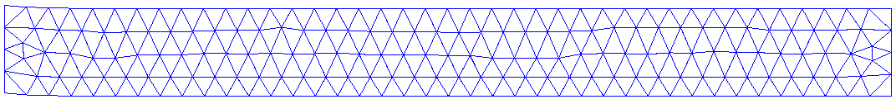
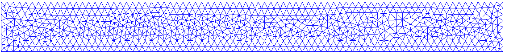
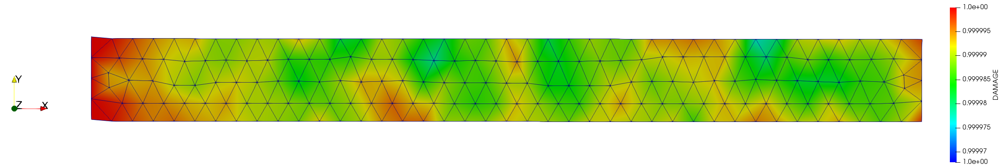
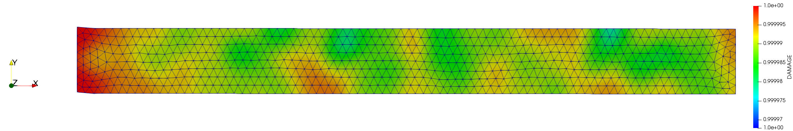
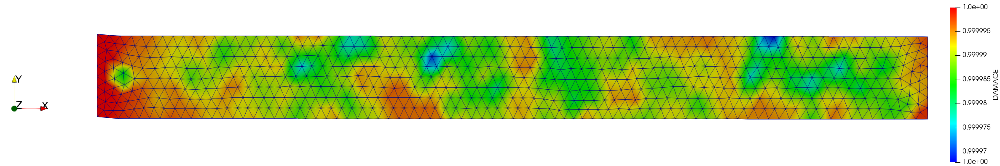

# Beam 2D Internal interpolation remeshing

**Author:** Vicente Mataix Ferrándiz

**Kratos version:** 5.2

**Source files:** [Beam 2D Internal interpolation](https://github.com/KratosMultiphysics/Examples/tree/master/mmg_remeshing_examples/use_cases/beam2D/source)

## Case Specification

In this test case, 

The following applications of Kratos are used:
- *SolidMechanicsApplication*
- *ConstitutiveModelsApplication*
- *MeshingApplication* with the *MMG* module

The problem corresponds with a steel cantilever 10x1 and considering as only load self-weight:

  

The simulation considers 10 time steps of 0.01s. The problem will be remeshed each ten steps considering the Hessian of the displacement. The initial mesh corresponds with:

  

Additionally the following properties have been considered for the **CL** *LargeStrainPlaneStrain2DLaw.VonMisesNeoHookeanPlasticityModel*:

~~~json
                "DENSITY"                     : 7850.0,
                "YOUNG_MODULUS"               : 206900000000.0,
                "POISSON_RATIO"               : 0.29,
                "YIELD_STRESS"                : 200.0,
                "KINEMATIC_HARDENING_MODULUS" : 100.0,
                "REFERENCE_HARDENING_MODULUS" : 233.0,
                "INFINITY_HARDENING_MODULUS"  : 100.0,
                "HARDENING_EXPONENT"          : 100.0,
                "C10"                         : 40096900000.0
~~~

## Results

The mesh obtained conrresponds with:

  

Having as final result the following plastic strain before remesh:

  

And just after remesh with *LST*:

  

And *CPT*:

  

## References
*Frédéric Alauzet*. Metric-Based Anisotropic Mesh Adaptation. Course material, CEA-EDF-INRIA Schools. Numerical Analysis Summer School.  [https://www.rocq.inria.fr/gamma/Frederic.Alauzet/cours/cirm.pdf](https://www.rocq.inria.fr/gamma/Frederic.Alauzet/cours/cirm.pdf)

*Pascal Tremblay* 2-D, 3-D and 4-D Anisotropic Mesh Adaptation for the Time-Continuous Space-Time Finite Element Method with Applications to the Incompressible Navier-Stokes Equations. PhD thesis Ottawa-Carleton Institute for Mechanical and Aerospace Engineering, Department of Mechanical Engineering, University of Ottawa. 2007. [http://aix1.uottawa.ca/~ybourg/thesis/PhDThesis_Pascal_Tremblay_Final.pdf](http://aix1.uottawa.ca/~ybourg/thesis/PhDThesis_Pascal_Tremblay_Final.pdf)

