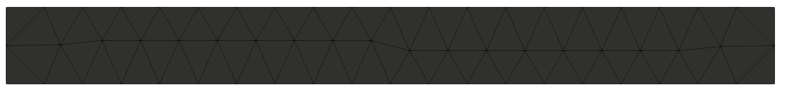
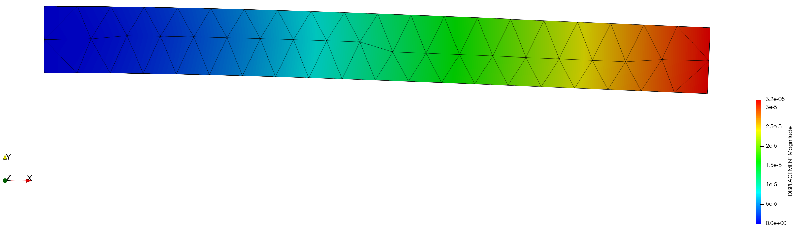
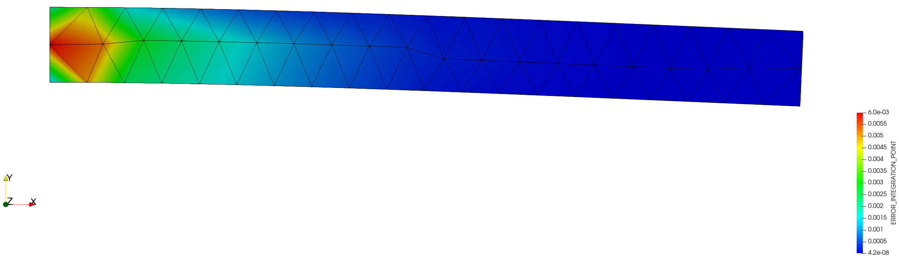
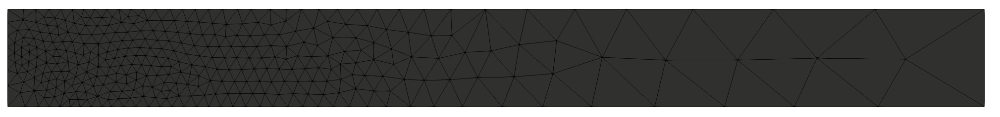
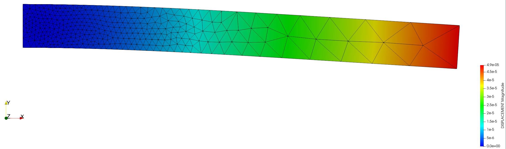
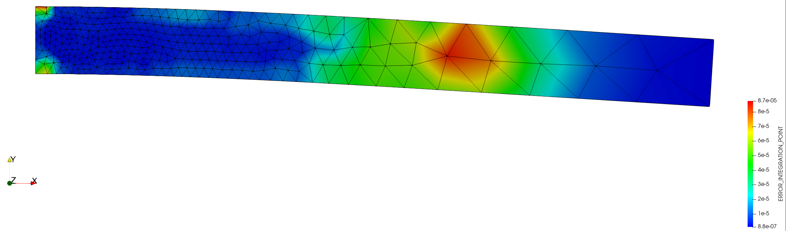

# Beam  SPR 2D remeshing

**Author:** Vicente Mataix Ferrándiz

**Kratos version:** Current head

**Source files:** [Beam SPR 2D](https://github.com/KratosMultiphysics/Examples/tree/master/mmg_remeshing_examples/use_cases/beam_spr/source)

## Case Specification

In this test case, 

The following applications of Kratos are used:
- *StructuralMechanicsApplication*
- *MeshingApplication* with the *MMG* module

## Case Specification

The problem consists in a cantilever beam 1x0.1 m in plane strain. The beam is remeshed considering a SPR error.

*The original mesh*:

  

*Displacement*:

  

*Error*:

  

		
## Results

*The resulting mesh*:

  

*Displacement*:

  

*Error*:

  

## References