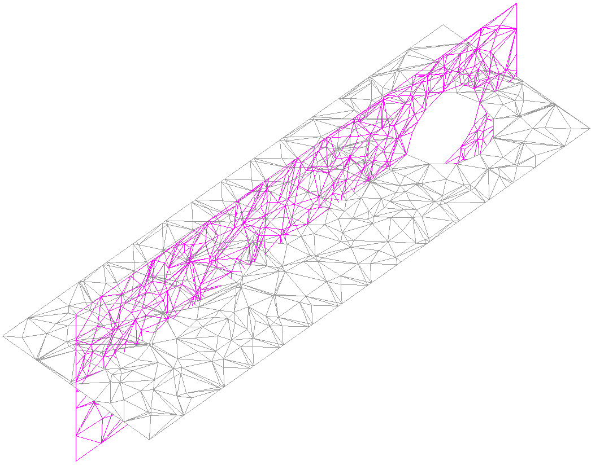
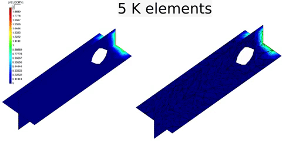

# Channel sphere 3D remeshing

**Author:** Vicente Mataix Ferrándiz

**Kratos version:** 7.1

**Source files:** [Channel sphere 3D](https://github.com/KratosMultiphysics/Examples/tree/master/mmg_remeshing_examples/use_cases/channel_sphere3D/source)

## Case Specification

In this test case, 

The following applications of Kratos are used:
- *FluidDynamicsApplication* with the *MMG* module
- *MeshingApplication* with the *MMG* module

Adaptative remeshing of 3D fluid channel with sphere using Hessian of velocity as metric measure. It consists in a channel 3x1x1, a sphere of 0.5 diameter and with a velocity of 1 m/s in the inlet an zero pressure in the outlet. The total time of simulation is *1.2s* with a time step of *0.01s*. The remeshing is performed each 20 steps.

  

 
The mesh corresponding before remeshing corresponds with:

  

## Results

The results obtained corresponds with the following:

  

[YouTube](https://youtu.be/HVNa5O6h4wM)

## References
*Frédéric Alauzet*. Metric-Based Anisotropic Mesh Adaptation. Course material, CEA-EDF-INRIA Schools. Numerical Analysis Summer School.  [https://www.rocq.inria.fr/gamma/Frederic.Alauzet/cours/cirm.pdf](https://www.rocq.inria.fr/gamma/Frederic.Alauzet/cours/cirm.pdf)

*Pascal Tremblay* 2-D, 3-D and 4-D Anisotropic Mesh Adaptation for the Time-Continuous Space-Time Finite Element Method with Applications to the Incompressible Navier-Stokes Equations. PhD thesis Ottawa-Carleton Institute for Mechanical and Aerospace Engineering, Department of Mechanical Engineering, University of Ottawa. 2007. [http://aix1.uottawa.ca/~ybourg/thesis/PhDThesis_Pascal_Tremblay_Final.pdf](http://aix1.uottawa.ca/~ybourg/thesis/PhDThesis_Pascal_Tremblay_Final.pdf)

