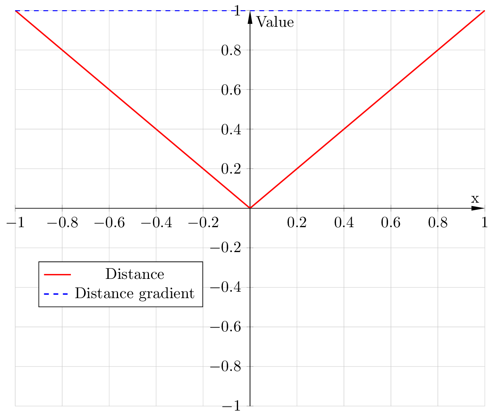
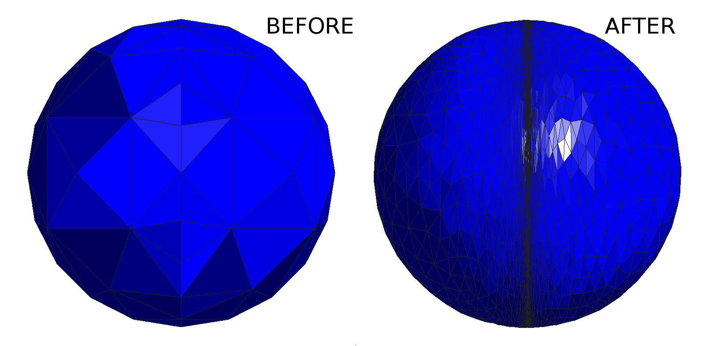

# Coarse sphere remeshing

**Author:** Vicente Mataix Ferrándiz

**Kratos version:** 7.1

**Source files:** [Coarse sphere](https://github.com/KratosMultiphysics/Examples/tree/master/mmg_remeshing_examples/use_cases/coarse_sphere/source)

## Case Specification

In this test case, 

The following applications of Kratos are used:
- *MeshingApplication* with the *MMG* module

This is a very simple remeshing test, where we remesh a coarse sphere with *MMG* library.

In this problem we remesh using the gradient of the distance function, which is the distance to the plane contained in the sphere center. The function can be seen in the following figure, corresponds with a linear distance and a constant gradient:

  

With the following result:

  

## References
*Frédéric Alauzet*. Metric-Based Anisotropic Mesh Adaptation. Course material, CEA-EDF-INRIA Schools. Numerical Analysis Summer School.  [https://www.rocq.inria.fr/gamma/Frederic.Alauzet/cours/cirm.pdf](https://www.rocq.inria.fr/gamma/Frederic.Alauzet/cours/cirm.pdf)

*Pascal Tremblay* 2-D, 3-D and 4-D Anisotropic Mesh Adaptation for the Time-Continuous Space-Time Finite Element Method with Applications to the Incompressible Navier-Stokes Equations. PhD thesis Ottawa-Carleton Institute for Mechanical and Aerospace Engineering, Department of Mechanical Engineering, University of Ottawa. 2007. [http://aix1.uottawa.ca/~ybourg/thesis/PhDThesis_Pascal_Tremblay_Final.pdf](http://aix1.uottawa.ca/~ybourg/thesis/PhDThesis_Pascal_Tremblay_Final.pdf)

