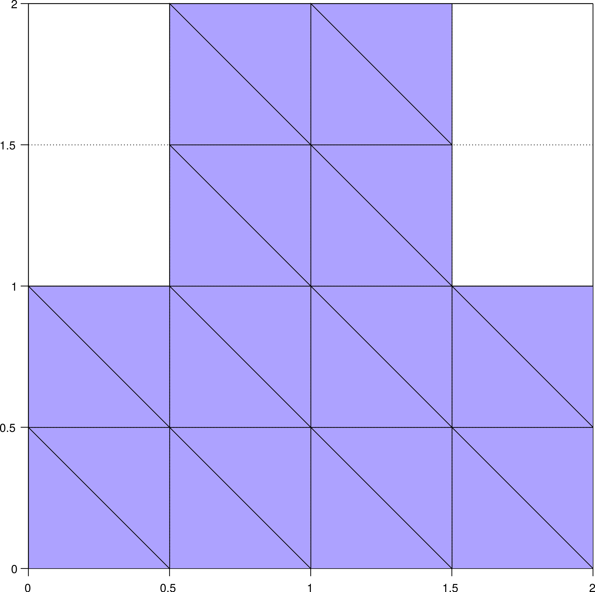
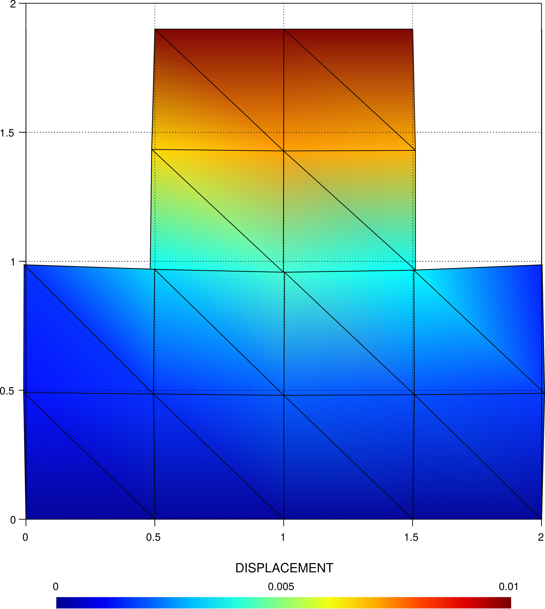
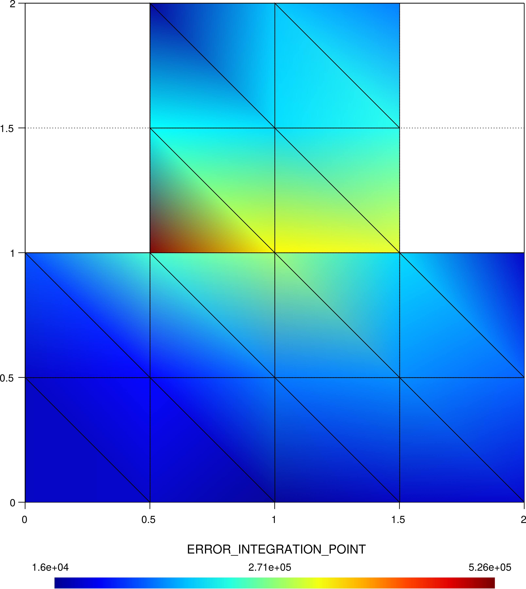
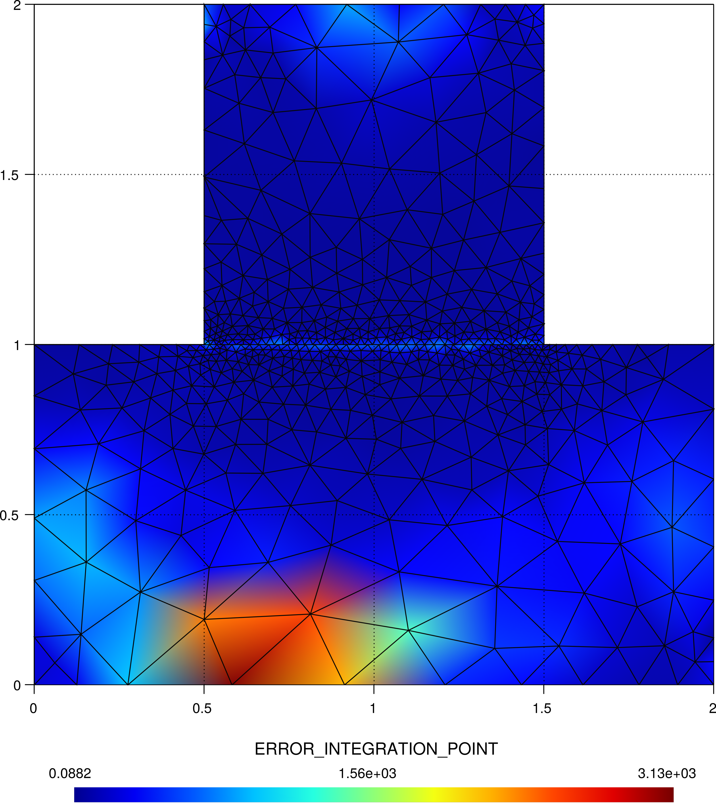
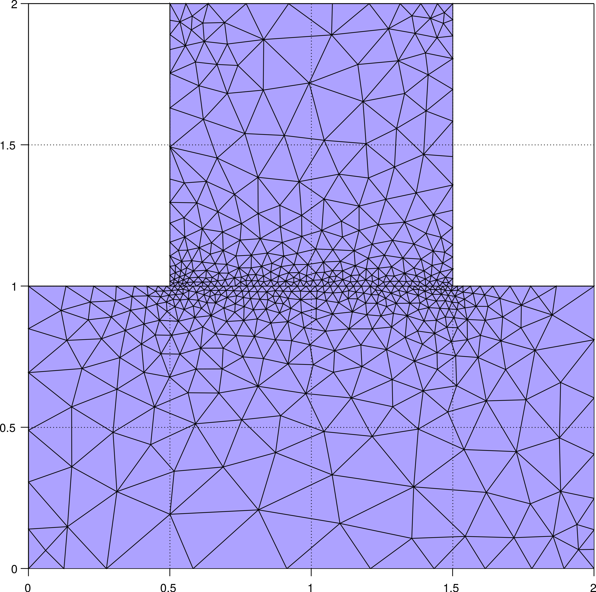
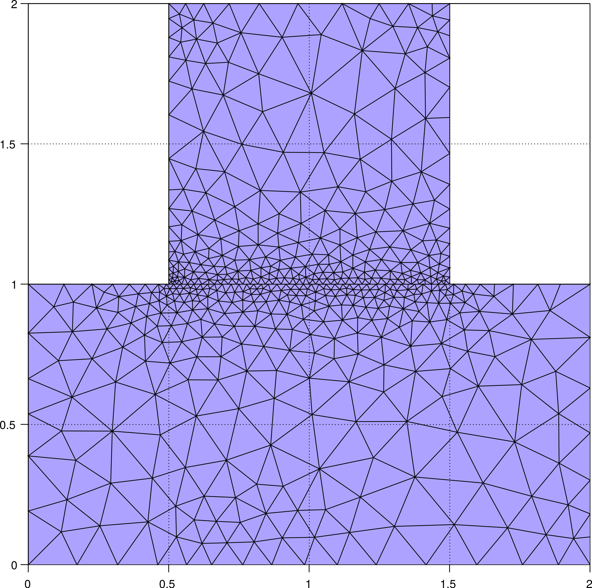
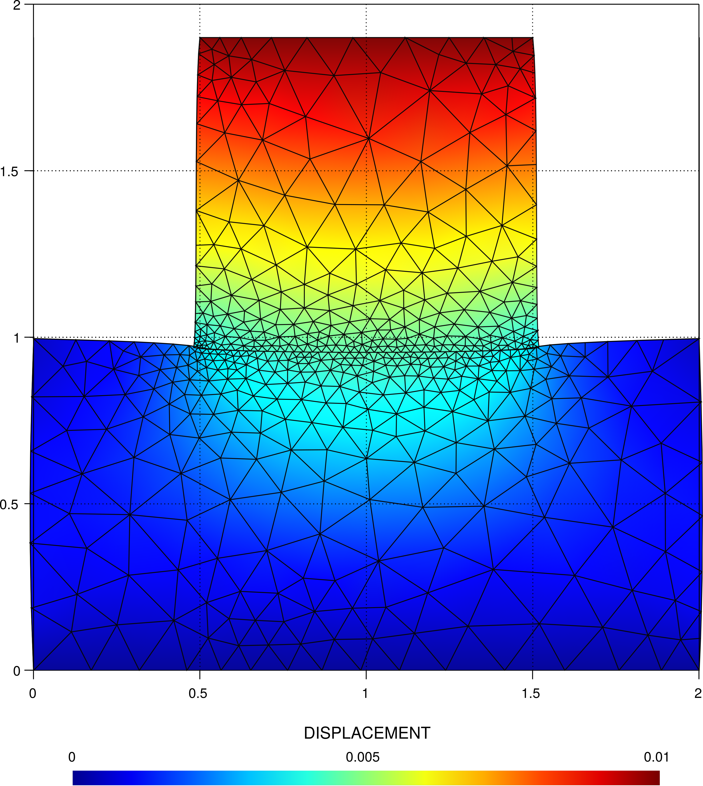
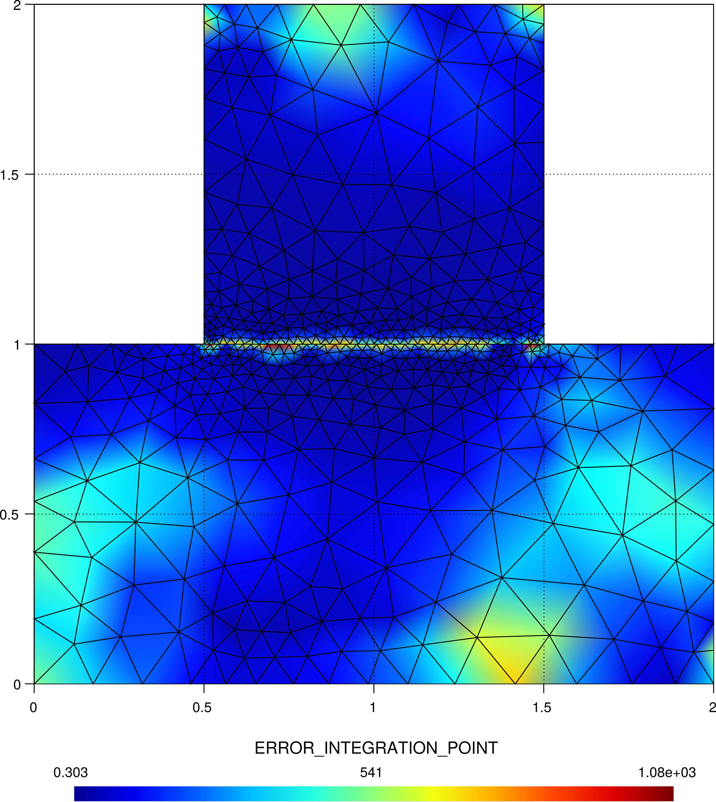

# Contact SPR 2D remeshing

**Author:** Vicente Mataix Ferrándiz

**Kratos version:** Current head

**Source files:** [Contact SPR 2D](https://github.com/KratosMultiphysics/Examples/tree/master/mmg_remeshing_examples/use_cases/contact_spr/source)

## Case Specification

In this test case, 

The following applications of Kratos are used:
- *StructuralMechanicsApplication*
- *ContactStructuralMechanicsApplication*
- *MeshingApplication* with the *MMG* module

## Case Specification

The problem consists in a simple patch test in plane strain. The problem is remeshed considering a SPR error.

*The original mesh*:

  

*Displacement*:

  

*Error*:

  

		
## Results

The evolution and reduction of the error can be appretiated in the following remeshing steps:

- Step 1:

*The resulting mesh*:

  

*Displacement*:

  

*Error*:

  

- Step 2:

*The resulting mesh*:

  

*Displacement*:

  

*Error*:

  

- Step 3:

*The resulting mesh*:

  

*Displacement*:

  

*Error*:

  

