# Contact Hertz Hessian 2D

**Author:** Vicente Mataix Ferrándiz

**Kratos version:** Current head

**Source files:** [Contact Hertz Hessian 2D](https://github.com/KratosMultiphysics/Examples/tree/master/mmg_remeshing_examples/use_cases/hertz_hessian/source)

## Case Specification

In this test case, 

The following applications of Kratos are used:
- *StructuralMechanicsApplication*
- *ContactStructuralMechanicsApplication*
- *MeshingApplication* with the *MMG* module

## Case Specification

The problem consists in a Hertz contact problem remeshing considering the Hessian of the VM stress and the contact pressure. There are 11 steps, and the remesh is executed each 3 steps starting in the 4th.

*The original mesh*:

  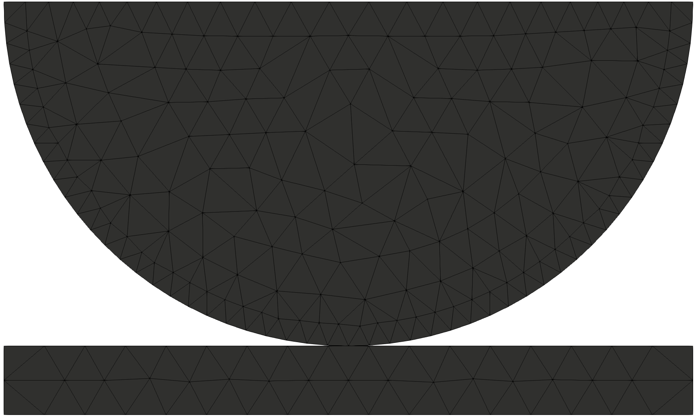

		
## Results

The evolution and reduction of the error can be appretiated in the following remeshing steps:

- Step 1:

*Displacement*:

  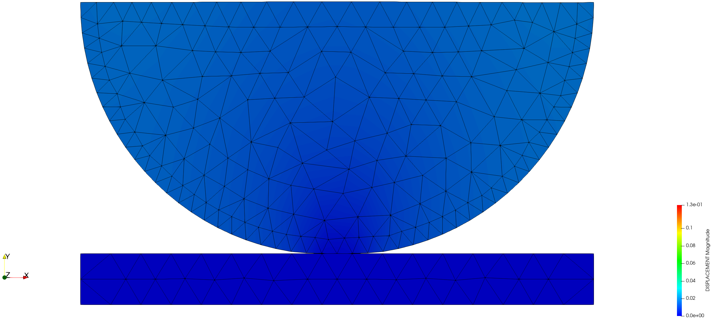

- Step 2:

*Displacement*:

  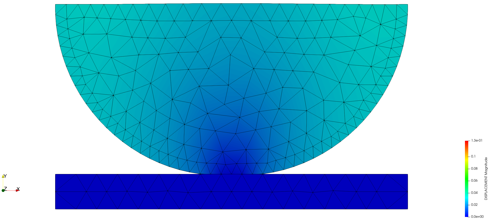

- Step 3:

*Displacement*:

  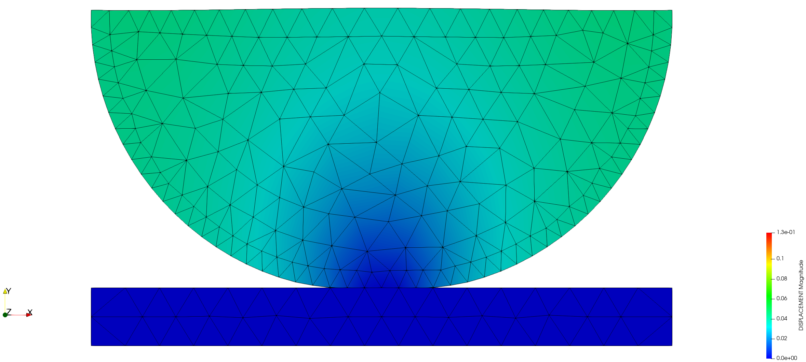

- Step 4:

*The resulting mesh*:

  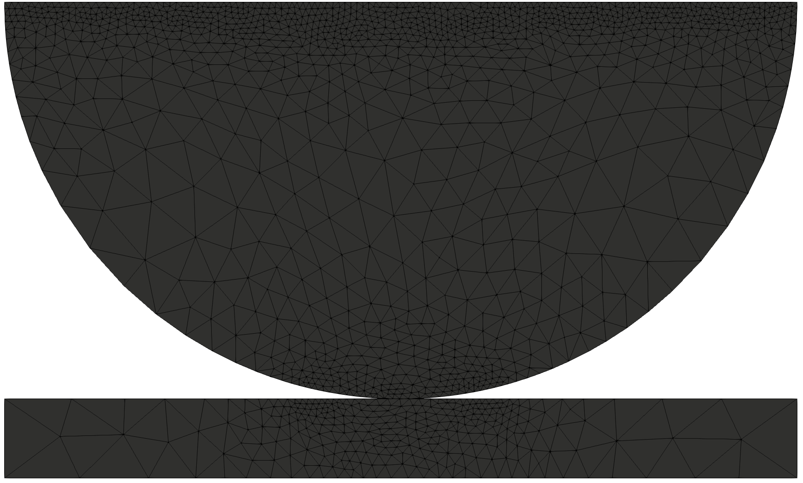

*Displacement*:

  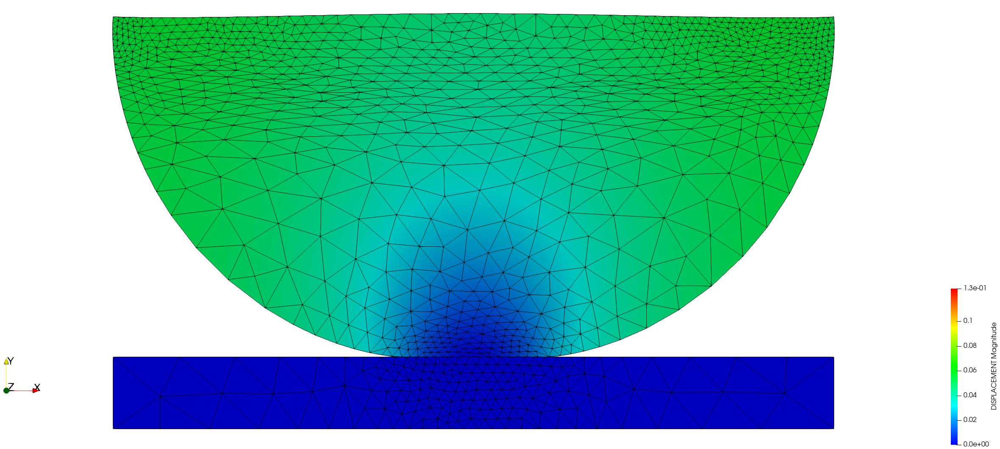

- Step 5:

*Displacement*:

  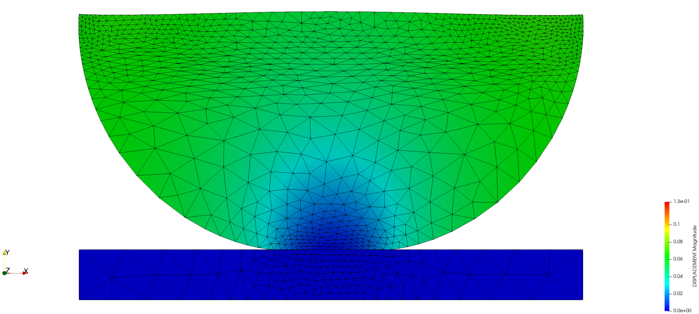

- Step 6:

*Displacement*:

  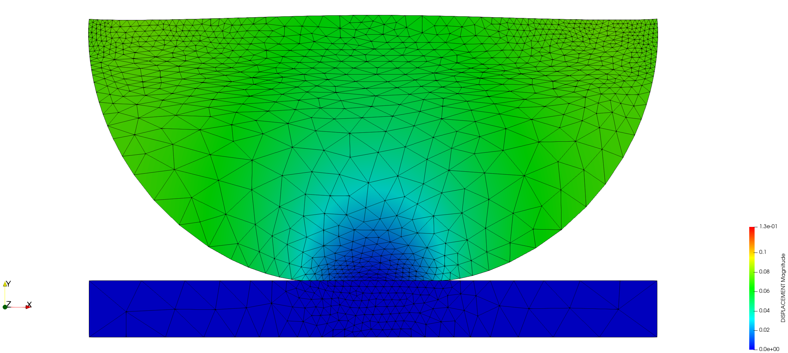

- Step 7:

*The resulting mesh*:

  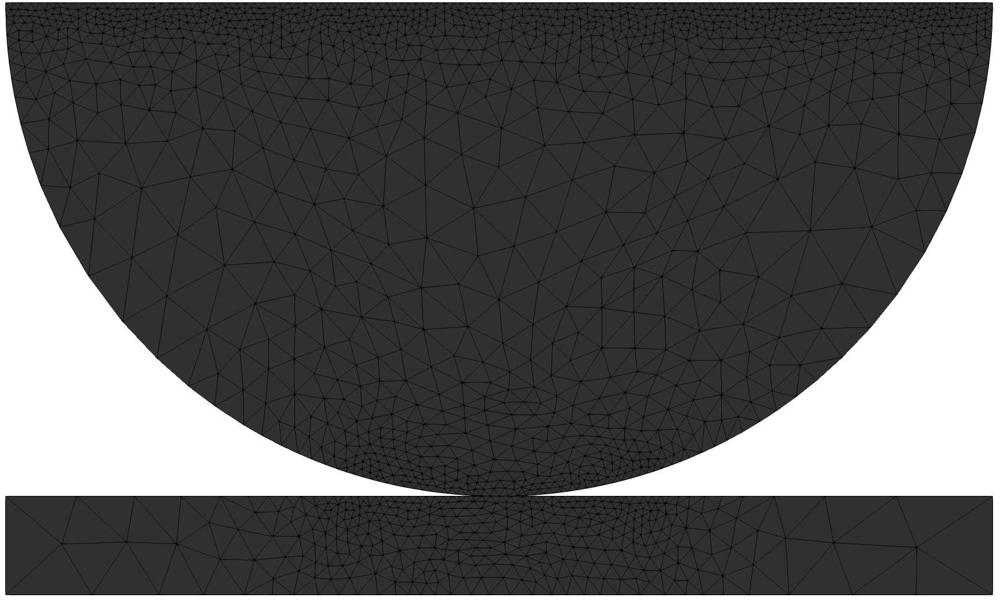

*Displacement*:

  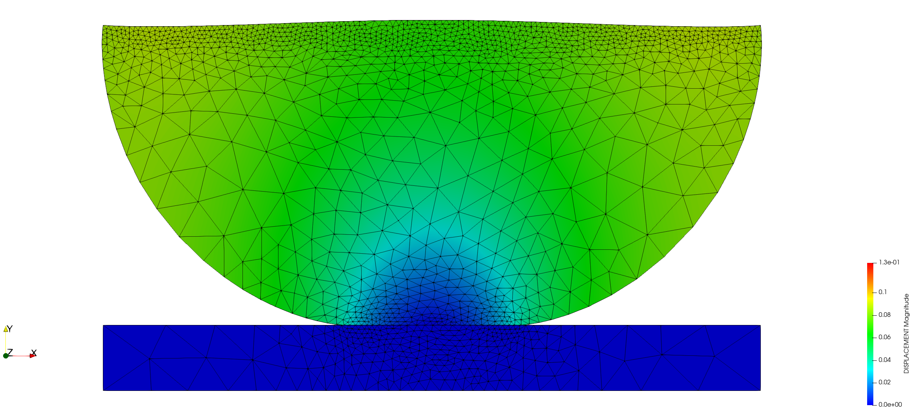

- Step 8:

*Displacement*:

  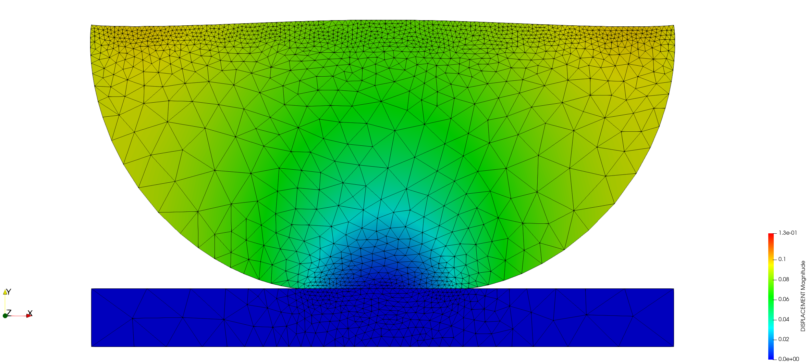

- Step 9:

*Displacement*:

  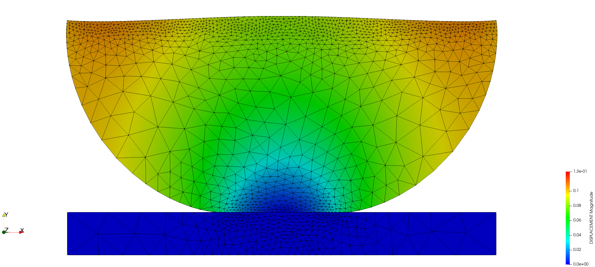

- Step 10:

*Displacement*:

  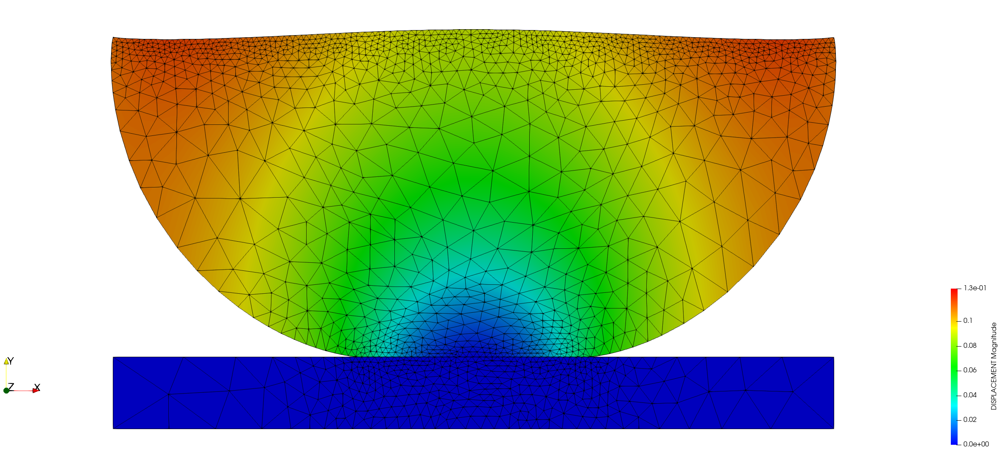

- Step 11:

*Displacement*:

  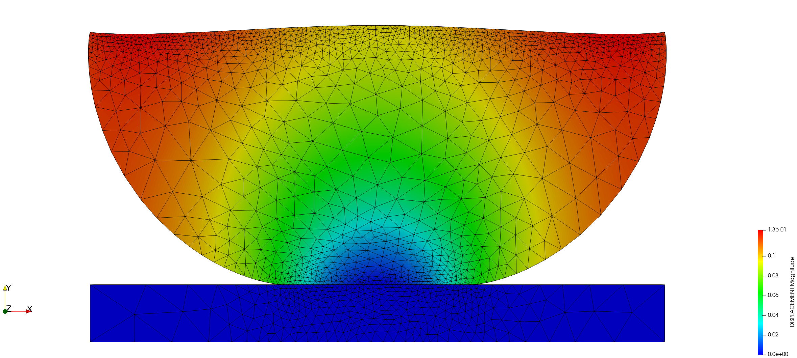

*VM stress*:

  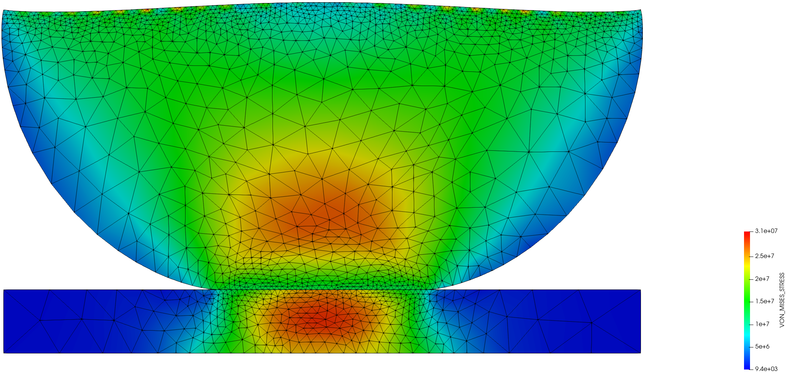

