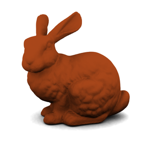
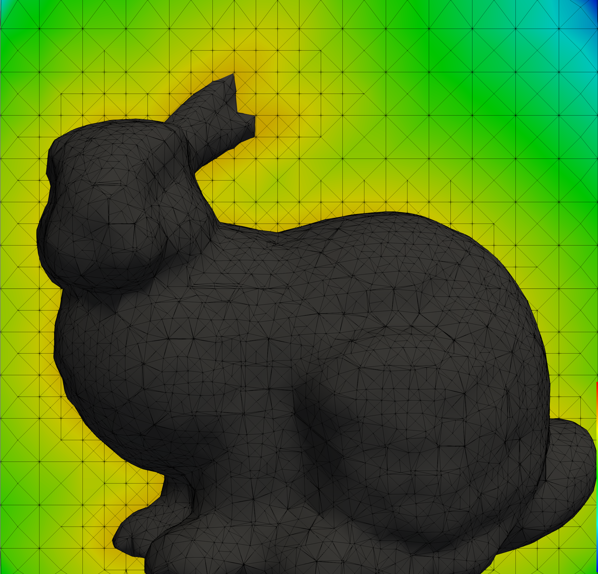
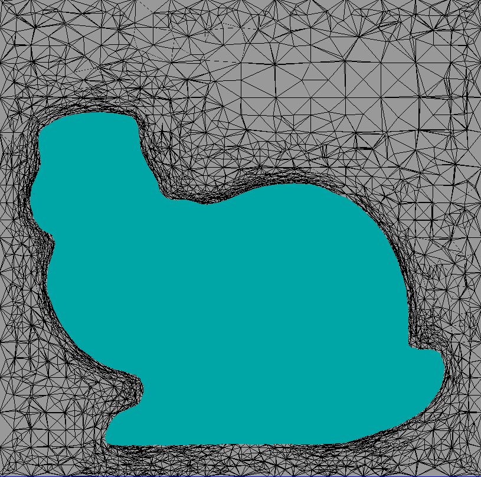
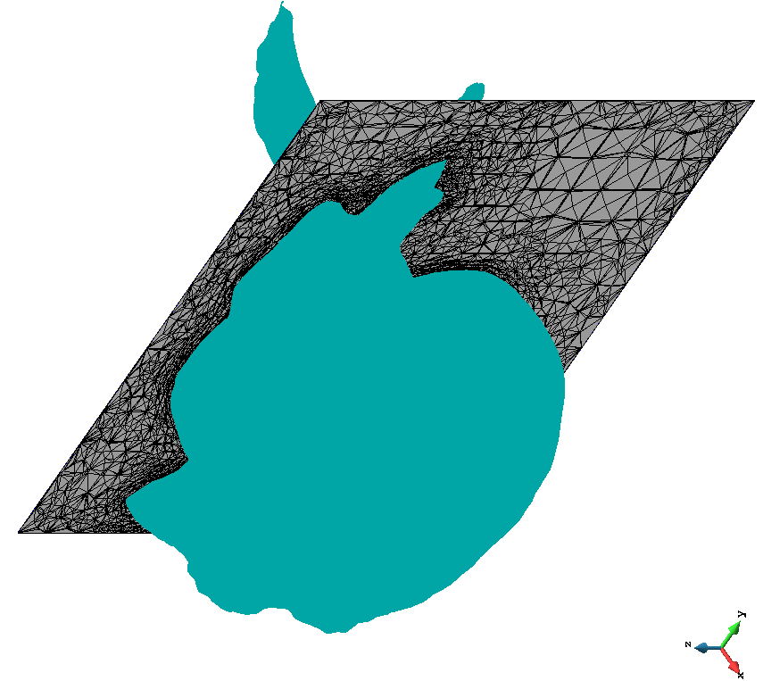
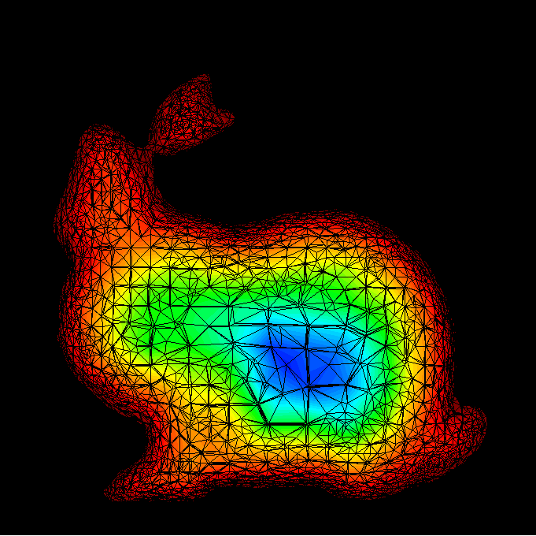
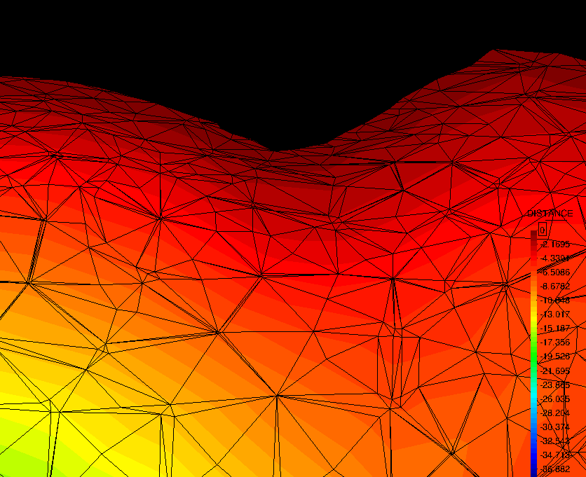
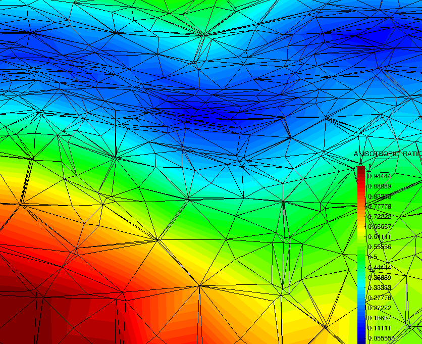

# Bunny remeshing

**Author:** Vicente Mataix Ferrándiz

**Kratos version:** 5.2

**Source files:** [Bunny](https://github.com/KratosMultiphysics/Examples/tree/master/mmg_remeshing_examples/validation/bunny/source)

## Case Specification

In this test case, 

The following applications of Kratos are used:
- *FluidDynamicsApplication*
- *MeshingApplication* with the *MMG* module

The problem  corresponds with the very known geometry of the [Standford bunny](https://en.wikipedia.org/wiki/Stanford_bunny). 

  

The challenge consists in meshing anisotropically the geometry using as error measure the gradient of the distance, measured previously with an octree mesher ([GiD](https://www.gidhome.com/)). The *STL* file used can be found [here](https://github.com/KratosMultiphysics/Examples/tree/master/mmg_remeshing_examples/validation/bunny/source/low-res-bunny.stl)
 
The mesh corresponding before remeshing corresponds with:

  

## Results

The results obtained after remeshing can be see in the following figures:

  

The corresponding isosurface to the distance:

  

The color map of the distance:

  

In detail:

  

The variation of the anisotropic ratio in the same region:

  

## References
*Frédéric Alauzet*. Metric-Based Anisotropic Mesh Adaptation. Course material, CEA-EDF-INRIA Schools. Numerical Analysis Summer School.  [https://www.rocq.inria.fr/gamma/Frederic.Alauzet/cours/cirm.pdf](https://www.rocq.inria.fr/gamma/Frederic.Alauzet/cours/cirm.pdf)

*Pascal Tremblay* 2-D, 3-D and 4-D Anisotropic Mesh Adaptation for the Time-Continuous Space-Time Finite Element Method with Applications to the Incompressible Navier-Stokes Equations. PhD thesis Ottawa-Carleton Institute for Mechanical and Aerospace Engineering, Department of Mechanical Engineering, University of Ottawa. 2007. [http://aix1.uottawa.ca/~ybourg/thesis/PhDThesis_Pascal_Tremblay_Final.pdf](http://aix1.uottawa.ca/~ybourg/thesis/PhDThesis_Pascal_Tremblay_Final.pdf)

The Stanford 3D Scanning Repository. [http://graphics.stanford.edu/data/3Dscanrep/](http://graphics.stanford.edu/data/3Dscanrep/)

