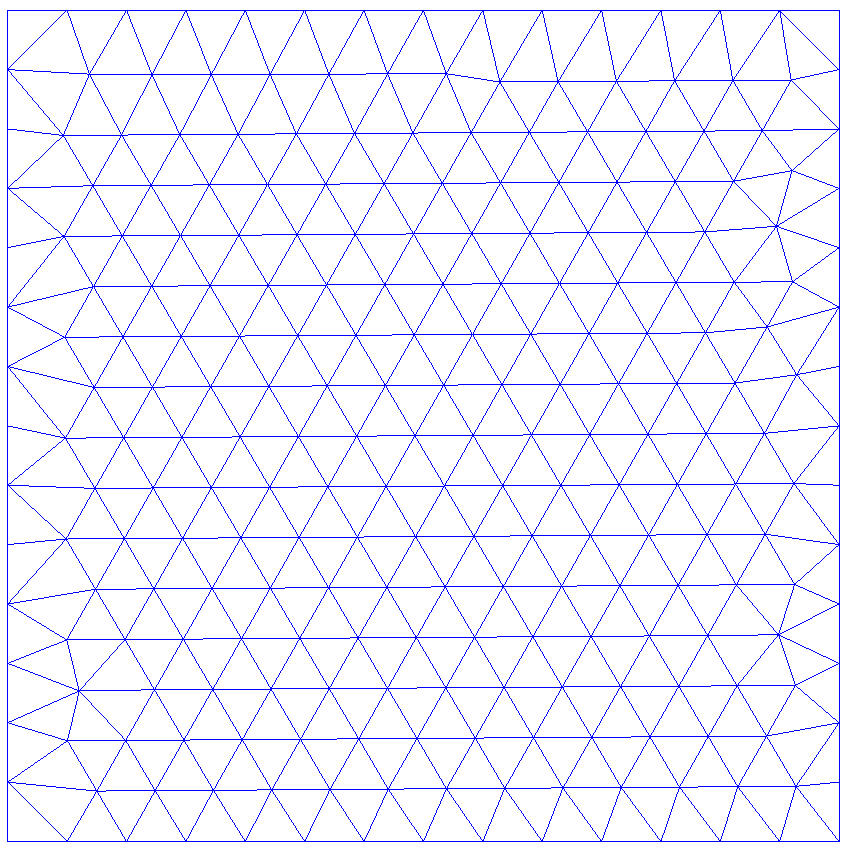
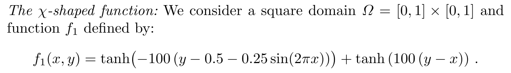
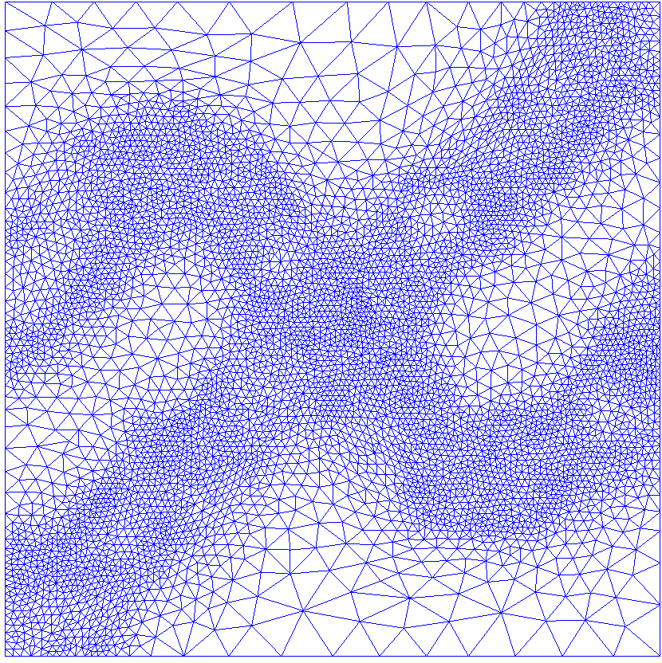

# Hessian 3D remeshing

**Author:** Vicente Mataix Ferrándiz

**Kratos version:** 5.2

**Source files:** [Hessian 3D](https://github.com/KratosMultiphysics/Examples/tree/master/mmg_remeshing_examples/use_cases/hessian3D/source)

## Case Specification

In this test case, 

The following applications of Kratos are used:
- *FluidDynamicsApplication*
- *MeshingApplication* with the *MMG* module

The problem corresponds with the  example proposed in [reference](https://www.rocq.inria.fr/gamma/Frederic.Alauzet/cours/cirm.pdf), translated to 3D. The  objective is to remesh the following unstructured mesh of a domain 1x1x0.1:

  

We want again adapt the mesh to the following test function :

  

The challenge consists in using the Hessian function of the test function as error measure and adapt the mesh in a proper manner. In this case the original mesh is coarse, so two remeshing steps will be necessaries.

## Results

The results obtained after remeshing can be see in the following figures:

- First iteration: 

  

- Second iteration: 

  

The color map of the test function:

  

In 3D:

  

## References
*Frédéric Alauzet*. Metric-Based Anisotropic Mesh Adaptation. Course material, CEA-EDF-INRIA Schools. Numerical Analysis Summer School.  [https://www.rocq.inria.fr/gamma/Frederic.Alauzet/cours/cirm.pdf](https://www.rocq.inria.fr/gamma/Frederic.Alauzet/cours/cirm.pdf)

*Pascal Tremblay* 2-D, 3-D and 4-D Anisotropic Mesh Adaptation for the Time-Continuous Space-Time Finite Element Method with Applications to the Incompressible Navier-Stokes Equations. PhD thesis Ottawa-Carleton Institute for Mechanical and Aerospace Engineering, Department of Mechanical Engineering, University of Ottawa. 2007. [http://aix1.uottawa.ca/~ybourg/thesis/PhDThesis_Pascal_Tremblay_Final.pdf](http://aix1.uottawa.ca/~ybourg/thesis/PhDThesis_Pascal_Tremblay_Final.pdf)

