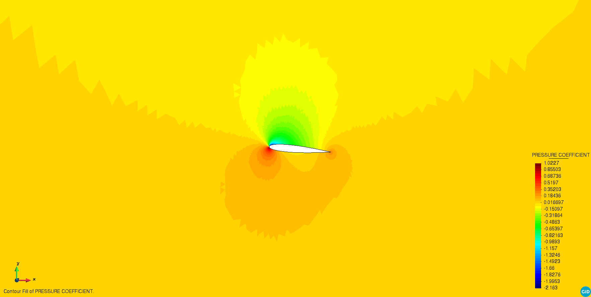

# Compressible Potential Flow problem

**Author:** [Riccardo Tosi](https://github.com/riccardotosi)

**Kratos version:** 8.0

**XMC version:** 2.0

**PyCOMPSs version:** 2.7

**Source files:** [Asynchronous Monte Carlo and Asynchronous Multilevel Monte Carlo](source)

**Applications dependencies:** `CompressiblePotentialFlowApplication`, `MappingApplication`, `MeshingApplication`, `MultilevelMonteCarloApplication`

## Case Specification
We solve the [compressible potential flow problem](https://github.com/KratosMultiphysics/Kratos/blob/master/applications/CompressiblePotentialFlowApplication/python_scripts/potential_flow_analysis.py) around an airfoil NACA0012. The problem is characterized by stochastic angle of attack  and stochastic Mach number .

The problem can be run with four different algorithms:

* Synchronous Monte Carlo (SMC),
* Asynchronous Monte Carlo (AMC),
* Synchronous Multilevel Monte Carlo (SMLMC),
* Asynchronous Multilevel Monte Carlo (AMLMC),

and by default AMC and AMLMC are selected. If one is interested in running SMC or SMLMC, it is needed to select `asynchronous = false` in the solver wrapper settings.

The Quantities of Interest of the problem are the lift coefficient and the pressure coefficient. Statistical convergence is assessed for the lift coefficient.

Similar settings are employed for Monte Carlo and Multilevel Monte Carlo. We refer, for example, to: deterministic number of samples estimation, deterministic number of indices estimation, maximum number of iterations, tolerance, confidence, etc. Such settings can be observed in the corresponding configuration file of each algorithm, located inside the `problem_settings` folder.

To run the examples, the user should go inside the folder-algorithm of interest and run the `run_mc/mlmc_Kratos.py` Python file. In case one wants to use PyCOMPSs, the user should execute `run_runcompss.sh` from inside the folder of interest.

## Results

The pressure coefficient for the problem is shown next.

The power sums and the h-statistics of both the lift coefficient and the pressure coefficient can be found [here](source/power_sums_outputs).
The lift coefficient expected value is consistent with literature results [M. Davari, R. Rossi, P. Dadvand, I. López, R. W. (2019). A cut finite element method for the solution of the full-potential equation with an embedded wake. Comput Mech, 63(5), 821–833. https://doi.org/https://doi.org/10.1007/s00466-018-1624-3].
