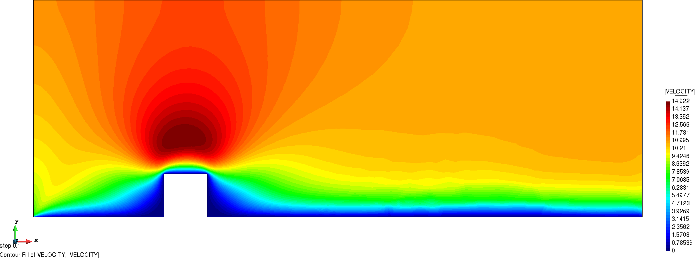

# Fluid dynamics building problem

**Author:** [Riccardo Tosi](https://github.com/riccardotosi)

**Kratos version:** 8.1

**XMC version:** 2.0

**PyCOMPSs version:** 2.7

**Source files:** [Asynchronous Monte Carlo and Asynchronous Multilevel Monte Carlo](source)

**Application dependencies:** `FluidDynamicsApplication`, `MappingApplication`, `MeshingApplication`, `MultilevelMonteCarloApplication`

## Case Specification
We solve the [fluid dynamics problem](https://github.com/KratosMultiphysics/Kratos/tree/master/applications/FluidDynamicsApplication) of a fluid passing through a bluff body. The problem is characterized by stochastic wind inlet velocity, which follows a power law. Uncertainty is provided by the mean velocity  and a exponent of the law .

The problem can be run with four different algorithms:

* Synchronous Monte Carlo (SMC),
* Asynchronous Monte Carlo (AMC),
* Synchronous Multilevel Monte Carlo (SMLMC),
* Asynchronous Multilevel Monte Carlo (AMLMC),

and by default AMC and AMLMC are selected. If one is interested in running SMC or SMLMC, it is needed to select `asynchronous = false` in the solver wrapper settings.

The Quantities of Interest of the problem are the drag force and the pressure field. Statistical convergence is assessed for the drag force.

Similar settings are employed for Monte Carlo and Multilevel Monte Carlo. We refer, for example, to: deterministic number of samples estimation, deterministic number of indices estimation, maximum number of iterations, tolerance, confidence, etc. Such settings can be observed in the corresponding configuration file of each algorithm, located inside the `problem_settings` folder.

To run the examples, the user should go inside the folder-algorithm of interest and run the `run_mc/mlmc_Kratos.py` Python file. In case one wants to use PyCOMPSs, the user should execute `run_runcompss.sh` from inside the source folder.

## Results

The velocity field evolution for the problem is shown next.

The power sums and the h-statistics of both the drag force and the pressure field can be found [here](source/power_sums_outputs).
