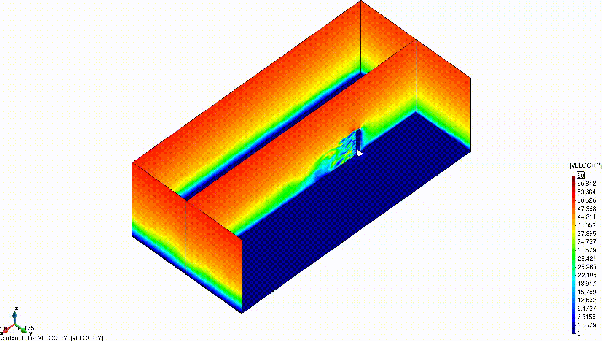
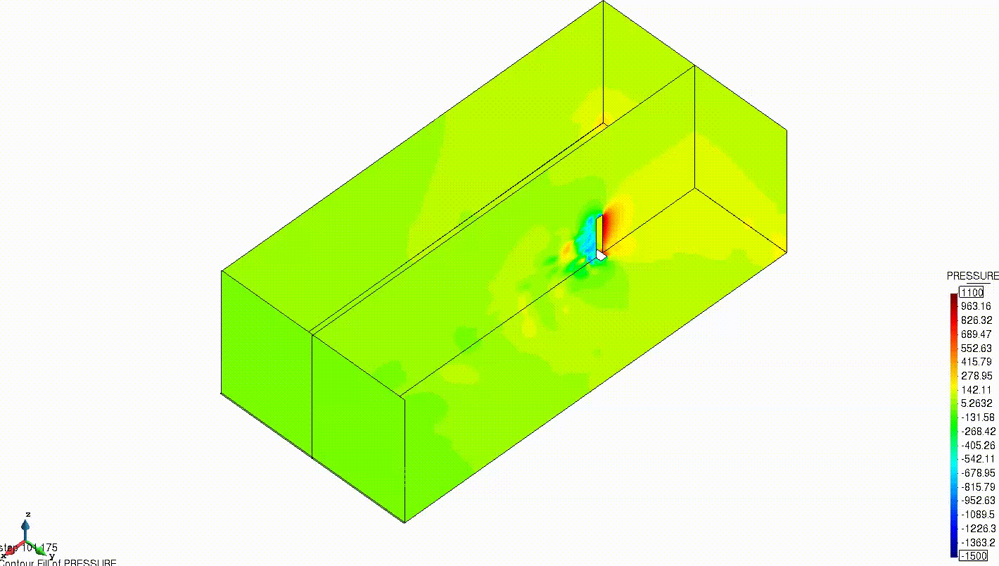

# Deterministic wind engineering CAARC problem with ensemble average approach

**Author:** [Riccardo Tosi](https://github.com/riccardotosi) and [Marc Núñez](https://github.com/marcnunezc) and [Brendan Keith](https://brendankeith.github.io/)

**Kratos version:** 8.0

**XMC version:** 2.0

**PyCOMPSs version:** 2.7

**Source files:** [Ensemble average - Asynchronous and Synchronous Monte Carlo](source)

## Case Specification
We solve the [fluid dynamics problem](https://github.com/KratosMultiphysics/Kratos/tree/master/applications/FluidDynamicsApplication) of a fluid passing through a building, namely the Commonwealth Advisory Aeronautical Council (CAARC) [Braun, A. L., & Awruch, A. M. (2009). Aerodynamic and aeroelastic analyses on the CAARC standard tall building model using numerical simulation. Computers and Structures, 87(9–10), 564–581. https://doi.org/10.1016/j.compstruc.2009.02.002].

The problem presents a deterministic wind inlet velocity profile, which follows a logarithmic profile. Therefore, there is no uncertainty. To reduce the time to solution, ensemble average (see [Makarashvili, V., Merzari, E., Obabko, A., Siegel, A., & Fischer, P. (2017). A performance analysis of ensemble averaging for high fidelity turbulence simulations at the strong scaling limit. Computer Physics Communications. https://doi.org/10.1016/j.cpc.2017.05.023] and [Krasnopolsky, B. I. (2018). Optimal Strategy for Modelling Turbulent Flows with Ensemble Averaging on High Performance Computing Systems. Lobachevskii Journal of Mathematics. https://doi.org/10.1134/S199508021804008X]) is applied, exploiting XMC. Therefore, both asynchronous or synchronous Monte Carlo can be applied.

The problem can be run with two different algorithms:

* Synchronous Monte Carlo (SMC),
* Asynchronous Monte Carlo (AMC),

and by default AMC is selected. If one is interested in running SMC, it is needed to select `asynchronous = false` in the solver wrapper settings.

The Quantities of Interest of the problem are the drag force, the base moment and the pressure field. Statistical convergence is assessed for the drag force.

All settings can be observed in the corresponding configuration file of the algorithm, located inside the `problem_settings` folder.

To run the examples, the user should go inside the source folder and run the `run_mc_Kratos.py` Python file. In case one wants to use PyCOMPSs, the user should execute `run.sh` from inside the source folder.

## Results

The velocity and pressure fields evolution of the problem are shown next.

  

  

An example of power sums and h-statistics of both time averaged and time series drag force, base moment and pressure field can be found [here](source/power_sums_outputs).

In addition,a literature comparison with respect to [Obasaju, E. D. (1992). Measurement of forces and base overturning moments on the CAARC tall building model in a simulated atmospheric boundary layer. Journal of Wind Engineering and Industrial Aerodynamics. https://doi.org/10.1016/0167-6105(92)90361-D], [Braun, A. L., & Awruch, A. M. (2009). Aerodynamic and aeroelastic analyses on the CAARC standard tall building model using numerical simulation. Computers and Structures, 87(9–10), 564–581. https://doi.org/10.1016/j.compstruc.2009.02.002] and [Huang, S., Li, Q. S., & Xu, S. (2007). Numerical evaluation of wind effects on a tall steel building by CFD. Journal of Constructional Steel Research. https://doi.org/10.1016/j.jcsr.2006.06.033] has been performed, to show the correctness and accuracy of our solution. Such comparison is very similar to [Apostolatos, A. (2020). D7.2 Finalization of “deterministic” verifcation and validation tests.], and we refer to it for details.
