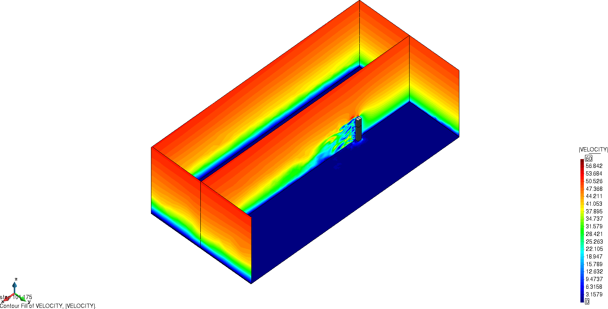
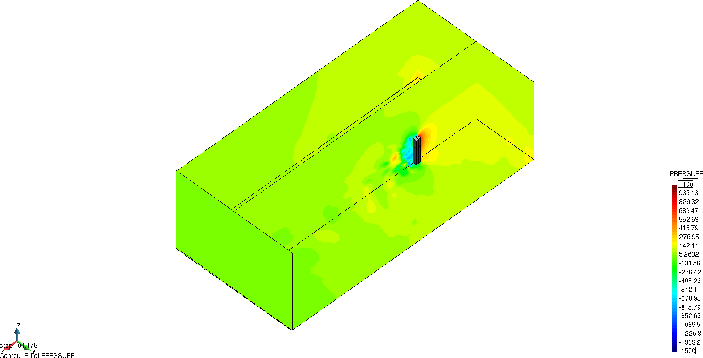

# Steady inlet wind engineering CAARC problem

**Author:** [Riccardo Tosi](https://github.com/riccardotosi) and [Marc Núñez](https://github.com/marcnunezc) and [Brendan Keith](https://brendankeith.github.io/)

**Kratos version:** 8.1

**XMC version:** Kratos default version

**PyCOMPSs version:** Kratos default version to run in serial, >2.8 to run with `runcompss`

**Source files:** [Asynchronous and Synchronous Monte Carlo](source)

**Application dependencies:** `ConvectionDiffusionApplication`, `ExaquteSandboxApplication`, `FluidDynamicsApplication`, `LinearSolversApplications`, `MappingApplication`, `MeshingApplication`, `MultilevelMonteCarloApplication`, `StatisticsApplication`

## Case Specification
We solve the [fluid dynamics problem](https://github.com/KratosMultiphysics/Kratos/tree/master/applications/FluidDynamicsApplication) of a fluid passing through a building, namely the Commonwealth Advisory Aeronautical Council (CAARC) [1]. The problem is characterized by a logarithmic and constant in time wind inlet velocity, in agreement with engineering specifications. Two different problems can be solved:

* constant in time deterministic inlet boundary conditions,
* constant in time stochastic inlet boundary conditions: reference velocity and/or roughness height are random.

To reduce the time to solution, ensemble average (see [2]) can be applied to each realization with fixed boundary conditions.

The problem can be run with two different algorithms:

* Synchronous Monte Carlo (SMC),
* Asynchronous Monte Carlo (AMC),

and by default AMC is selected. If one is interested in running SMC, it is needed to select `asynchronous = false` in the XMC settings (in `problem_settings/parameters_xmc.json`). To change the inlet boundary condition, you can set true or false the keys `random_reference_velocity` and `random_roughness_height` of Kratos settings (in `problem_settings/ProjectParametersCAARC_MC_steadyInlet.json`). Please observe that for running you may want to increase the number of realizations per level, the time horizon of each realization and the burn-in time (initial transient we discard when computing statistics to discard dependencies from initial conditions). All settings can be observed in the corresponding configuration file [of the problem](source/problem_settings/ProjectParametersCAARC_MC_steadyInlet.json) and [of the algorithm](source/problem_settings/parameters_xmc.json).

The Quantities of Interest of the problem are the drag force, the base moment and the pressure field on the building surface and their time-averaged counterparts. Statistical convergence is assessed for the time-averaged drag force.

To run the examples, the user should go inside the source folder and run the `run_mc_Kratos.py` Python file. In case one wants to use PyCOMPSs, the user should execute `run.sh` from inside the source folder.

## Results

The velocity and pressure fields evolution of the problem are shown next.

  

  

An example of power sums and h-statistics of both time averaged and time series drag force, base moment and pressure field can be found [here](source/power_sums_outputs).

We comment that a literature comparison with respect to [1] has been performed, to ensure the correctness and accuracy of our solution.

## Refrences

[1] Braun, A. L., & Awruch, A. M. (2009). Aerodynamic and aeroelastic analyses on the CAARC standard tall building model using numerical simulation. Computers and Structures, 87(9–10), 564–581. https://doi.org/10.1016/j.compstruc.2009.02.002

[2] Makarashvili, V., Merzari, E., Obabko, A., Siegel, A., & Fischer, P. (2017). A performance analysis of ensemble averaging for high fidelity turbulence simulations at the strong scaling limit. Computer Physics Communications. https://doi.org/10.1016/j.cpc.2017.05.023